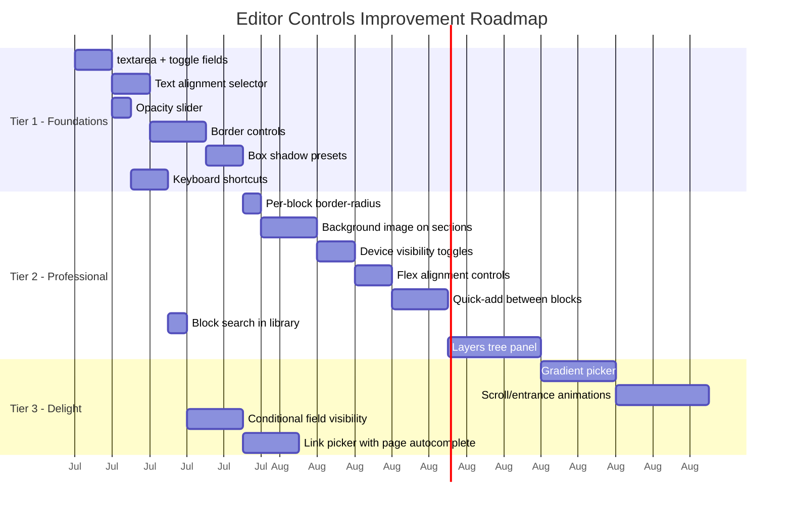

# Editor Controls & Customizability Audit

> Benchmark: Shopify Online Store 2.0 Theme Editor · Wix Editor / Wix Studio  
> Scope: Inspector field types, block toolbar, canvas controls, per-block design options

---

## 1 — Current State Inventory

### Inspector Field Types (7 total)
| Type | Renders As | Used By |
|---|---|---|
| `text` | Single-line `<input>` | Nearly every block (headline, URL, label…) |
| `color` | Native `<input type="color">` + hex readout | Background, divider color, text color |
| `range` | Slider | Padding, thickness, spacer height, margin |
| `number` | Numeric input | Column count, product limit, page size |
| `select` | `<select>` dropdown | Object fit, provider, aspect ratio, variant |
| `media` | Image preview + "Choose Image" | Image src, avatar |
| `repeater` | Collapsible card list with sub-fields | FAQ items, pricing plans, form fields, products |

### Block Toolbar Actions (7 total)
Move up · Move down · Duplicate · Copy · Paste · Wrap in column · Delete (with confirm)

### Topbar Controls
Undo/redo · Device preview (Desktop / Tablet / Mobile) · Save state indicator · Live link · Page switcher · Sidebar toggle

### Sidebar Panels
Content inspector · Block library (blocks + presets) · Pages list · Navigation settings

### Global Theme System
6 CSS variables: `--theme-primary`, `--theme-secondary`, `--theme-bg`, `--theme-text`, `--theme-border-radius`, `--theme-font-heading`, `--theme-font-body`

---

## 2 — Gap Analysis vs Shopify & Wix

### 2.1 Inspector Field Gaps

| Capability | Shopify | Wix | Web-Builder | Gap |
|---|---|---|---|---|
| **Textarea / multi-line text** | ✅ `textarea` input type | ✅ Text areas in panels | ❌ Only single-line `<input>` | Descriptions, long body copy are awkward in a single-line field |
| **Toggle / checkbox** | ✅ `checkbox` schema type | ✅ Toggle switches | ❌ Uses `select` with Yes/No options | Clumsy; boolean props need a proper toggle |
| **Link / URL picker** | ✅ `url` type with autocomplete | ✅ Internal page picker + external URL | ❌ Plain text input for URLs | No internal page linking, no validation |
| **Color with opacity** | ✅ `color_background` with gradient support | ✅ Full RGBA + gradient panel | ⚠️ Only opaque hex via `<input type="color">` | Cannot set semi-transparent colors or gradients |
| **Font selector** | ✅ `font_picker` type | ✅ Full font browser with weights | ❌ Only global theme fonts | No per-block font override |
| **Alignment selector** | ✅ Custom alignment radio buttons | ✅ Visual alignment toolbar | ❌ Not exposed in any block | Text alignment is hardcoded per block |
| **Spacing (margin)** | ✅ Exposed per-section via style settings | ✅ Full margin + padding box model | ⚠️ Only padding via range slider | No margin control; no per-side control |
| **Conditional visibility (`visible_if`)** | ✅ Settings can show/hide based on other settings | ✅ Contextual panels based on element state | ❌ All fields always visible | Inspector is cluttered for blocks with many options |

### 2.2 Block-Level Design Controls

| Capability | Shopify | Wix | Web-Builder | Gap |
|---|---|---|---|---|
| **Border** | ✅ Width, color, style, per-side | ✅ Width, color, opacity, style, per-side, per-corner | ❌ None | No way to add borders to any block |
| **Border radius (per-block)** | ✅ Via custom settings | ✅ Per-corner radius controls | ⚠️ Only on ImageBlock as free-text | No visual slider; other blocks use theme default only |
| **Box shadow** | ✅ Via custom CSS or settings | ✅ Inner/outer shadow with angle, distance, blur, size, opacity | ❌ None | Major gap — shadows are a key design tool |
| **Opacity** | ✅ Range slider | ✅ Opacity slider on design panel | ❌ None | Cannot fade blocks; critical for overlays and layering |
| **Text alignment** | ✅ Select setting | ✅ Left/center/right/justify toolbar | ❌ Hardcoded per block (e.g., HeroBlock = `text-center`) | Users cannot change alignment |
| **Background image / gradient** | ✅ `image_picker` + gradient color | ✅ Full gradient editor with multiple stops | ❌ Only solid color | Huge gap for hero sections and visual impact |
| **Hover states / transitions** | ⚠️ Limited to theme CSS | ✅ Full hover state editor (color, scale, shadow) | ⚠️ Only ButtonBlock has CSS hover | No configurable hover effects |
| **Scroll / entrance animations** | ❌ Not built-in | ✅ Entrance, loop, scroll, and hover animations with power/duration/delay controls | ❌ None | Blocks appear static; no motion design |
| **Device-specific visibility** | ✅ "Hide on mobile" checkbox in some themes | ✅ Per-breakpoint show/hide | ❌ None | Cannot hide blocks on specific devices |
| **Max-width constraint** | ⚠️ Section-level `max-width` setting | ✅ Per-element width constraints | ❌ None (canvas max-width only) | Content always stretches to container |

### 2.3 Layout & Structural Controls

| Capability | Shopify | Wix | Web-Builder | Gap |
|---|---|---|---|---|
| **Vertical alignment** | ✅ Section-level flex alignment | ✅ Full flexbox controls | ❌ Not exposed | Cannot vertically center children in a column |
| **Horizontal alignment / justify** | ✅ Content justification settings | ✅ Justify content options | ❌ Not exposed | Grid children always start-aligned |
| **Layout direction (row vs column)** | ✅ Via section templates | ✅ Toggle flex direction | ❌ LayoutGrid is always CSS grid | Cannot flip to horizontal flex layout |
| **Section full-width / boxed toggle** | ✅ Section-level width setting | ✅ Strip width: full/auto | ❌ Not available | Cannot create full-bleed vs boxed sections |
| **Minimum height** | ✅ Range setting | ✅ Per-element min-height | ❌ Not available | Hero sections can't have a guaranteed minimum height |

### 2.4 Canvas & Toolbar Gaps

| Capability | Shopify | Wix | Web-Builder | Gap |
|---|---|---|---|---|
| **Inline text editing** | ❌ Text edited in sidebar | ✅ Direct on-canvas WYSIWYG | ⚠️ Only RichTextBlock has tiptap inline editing | HeroBlock, FeatureBlock, AtomicText edit only via sidebar |
| **Block-to-block copy/paste across pages** | ✅ New Horizon feature | ✅ Cross-page copy | ⚠️ Copy/paste works only within same page | Cannot copy a section from Page A to Page B |
| **Keyboard shortcuts** | ✅ Standard shortcuts documented | ✅ Full keyboard shortcut set | ⚠️ Undo/redo only via topbar buttons | No Ctrl+Z, Ctrl+C, Ctrl+V, Delete keyboard support |
| **Quick add between blocks** | ✅ "Add section" dividers between sections | ✅ Plus button between elements | ❌ Must use sidebar block library | No in-canvas "insert here" affordance |
| **Block search in library** | ✅ Search bar in section picker | ✅ Search in add panel | ❌ No search | With 20+ blocks, finding the right one takes scrolling |
| **Layers / structure tree** | ⚠️ Sidebar section list with expand | ✅ Full layer panel with nesting tree | ❌ None | Cannot see or navigate block nesting hierarchy |

---

## 3 — Prioritized Recommendations

### 🔴 Tier 1 — High Impact, Foundational (Do First)

These are missing basics that Shopify and Wix both have, and that users will expect immediately.

| # | Enhancement | Inspector Type | Effort | Blocks Affected |
|---|---|---|---|---|
| 1 | **`textarea` field type** | New inspector type | Low | FeatureBlock body, FAQBlock answers, ContactFormBlock successMessage, any long-text prop |
| 2 | **`toggle` / boolean field type** | New inspector type (renders switch) | Low | PricingTableBlock `isPopular`, ContactFormBlock `required`, future show/hide flags |
| 3 | **Text alignment selector** | New `alignment` inspector type (visual radio: L/C/R/J) | Medium | HeroBlock, AtomicText, FeatureBlock, TestimonialBlock — add `textAlign` prop |
| 4 | **Border controls** | `border` composite field (width + color + style) or 3 separate fields | Medium | All blocks — add `borderWidth`, `borderColor`, `borderStyle` to `RenderNode.vue` wrapper |
| 5 | **Box shadow control** | `shadow` composite field or `select` with presets (none/sm/md/lg/xl) | Medium | All blocks — apply via `RenderNode.vue` |
| 6 | **Opacity slider** | `range` field (0–100) | Low | All blocks — add `opacity` prop, apply in `RenderNode.vue` |
| 7 | **Keyboard shortcuts** | Canvas-level `@keydown` handler | Medium | Global — Ctrl+Z, Ctrl+Y, Del, Ctrl+C/V |

### 🟡 Tier 2 — High Value, Medium Effort

These close the gap with Wix and make the editor feel professional.

| # | Enhancement | Notes | Effort |
|---|---|---|---|
| 8 | **Per-block border radius** | Add `borderRadius` range slider to all blocks (not just ImageBlock) via `RenderNode.vue` | Low |
| 9 | **Background image on sections** | New `backgroundImage` media field + `backgroundSize` select on LayoutGrid/LayoutColumn | Medium |
| 10 | **Device-specific visibility** | Add `hideOnMobile`, `hideOnTablet`, `hideOnDesktop` toggle fields; `RenderNode.vue` adds `display:none` classes | Medium |
| 11 | **Vertical & horizontal alignment** | Add `alignItems` and `justifyContent` selects to LayoutGrid and LayoutColumn | Medium |
| 12 | **Min-height control** | Add `minHeight` text/range field to LayoutGrid, LayoutColumn, HeroBlock | Low |
| 13 | **Quick-add "+" between blocks** | Render a `+` insert button between `RenderNode` elements in the canvas | Medium |
| 14 | **Block search in library** | Add a text filter input above the block library grid | Low |
| 15 | **Layers / tree panel** | New sidebar section that renders a collapsible tree of the block AST; click to select | High |

### 🟢 Tier 3 — Differentiation & Polish

These move beyond parity and into "delightful" territory.

| # | Enhancement | Notes | Effort |
|---|---|---|---|
| 16 | **Gradient background picker** | Extend the `color` field with a gradient mode (direction + 2 color stops) | High |
| 17 | **Scroll/entrance animations** | Add `animation` select field (none/fade-in/slide-up/zoom-in) + CSS `@keyframes` on `RenderNode` | High |
| 18 | **Hover state configuration** | Add `hoverScale`, `hoverShadow`, `hoverOpacity` fields to interactive blocks | Medium |
| 19 | **Conditional field visibility** | Add `visible_if` to `InspectorField` schema so fields hide/show based on sibling props | Medium |
| 20 | **Link/URL picker with page autocomplete** | New `link` inspector type that offers a dropdown of tenant pages + free-text external URL | Medium |
| 21 | **Cross-page block clipboard** | Store copied block tree in `sessionStorage` keyed by tenant; paste on any page | Medium |
| 22 | **Full-width / boxed section toggle** | Add `sectionWidth` select (boxed=max-width/full=100vw) to LayoutGrid | Low |
| 23 | **Font override per-block** | New `font` inspector type with Google Fonts browser, falling back to theme font | High |
| 24 | **Margin controls** | Add `marginTop` and `marginBottom` range sliders alongside existing padding | Low |

---

## 4 — Inspector Field Types to Add (Summary)

The following new inspector field types would unlock the majority of the above improvements:

```
Current:  text | color | range | number | select | media | repeater
Proposed: text | textarea | color | range | number | select | media
          | repeater | toggle | alignment | shadow | link | border
```

| New Type | Renders As | Enables |
|---|---|---|
| `textarea` | Multi-line `<textarea>` | Long text content (descriptions, body copy) |
| `toggle` | Switch `<input type="checkbox">` | Boolean props (is_popular, required, show/hide) |
| `alignment` | Visual radio group (icons: ← ↔ →) | `textAlign` on all text-bearing blocks |
| `shadow` | Preset dropdown or composite (blur, spread, color, offset) | Per-block box shadows |
| `link` | Text input with internal page autocomplete dropdown | URL props with page-aware linking |
| `border` | Composite: width (range) + color + style (select) | Per-block borders |

---

## 5 — RenderNode.vue as Universal Design Wrapper

> [!IMPORTANT]  
> Many of these controls (border, shadow, opacity, margin, border-radius, device visibility, animation) should be **applied in [RenderNode.vue](file:///c:/Users/Z.BOOK/Desktop/things/code/web-builder/resources/js/components/BuilderBlocks/RenderNode.vue)**, not in each individual block. This is the same pattern already used for `padding` and `backgroundColor`. Centralizing design props in the wrapper means every block gets these controls automatically without modifying 20+ `.vue` files.

Proposed `RenderNode.vue` style bindings expansion:

```js
// Current
{
  padding: (node.props?.padding ?? 0) + 'px',
  backgroundColor: resolvedBgColor,
}

// Proposed
{
  padding: (node.props?.padding ?? 0) + 'px',
  backgroundColor: resolvedBgColor,
  marginTop: (node.props?.marginTop ?? 0) + 'px',
  marginBottom: (node.props?.marginBottom ?? 0) + 'px',
  borderRadius: node.props?.borderRadius ?? 'inherit',
  border: buildBorderString(node.props),
  boxShadow: resolveShadow(node.props?.shadow),
  opacity: (node.props?.opacity ?? 100) / 100,
  minHeight: node.props?.minHeight || 'auto',
  textAlign: node.props?.textAlign || 'inherit',
}
```

These "universal design props" would be defined once in `config/blocks.php` and appended to every block's `inspectorFields` automatically (or via a shared `commonDesignFields` array that gets merged server-side).

---

## 6 — Suggested Implementation Order



---

## 7 — Quick Wins (< 1 day each)

These require minimal code changes and immediately improve the editor experience:

1. **Add `textarea` inspector type** — ~30 lines in [ContentInspector.vue](file:///c:/Users/Z.BOOK/Desktop/things/code/web-builder/resources/js/components/Editor/ContentInspector.vue) + update [blockRegistry.ts](file:///c:/Users/Z.BOOK/Desktop/things/code/web-builder/resources/js/lib/blockRegistry.ts) type union
2. **Add `toggle` inspector type** — ~15 lines in ContentInspector + styled switch component
3. **Add opacity to RenderNode** — 1 range slider in config, 1 line in RenderNode style binding
4. **Add block search filter** — 1 text input + computed filter in [BlockLibrary.vue](file:///c:/Users/Z.BOOK/Desktop/things/code/web-builder/resources/js/components/Editor/BlockLibrary.vue)
5. **Add margin-top/bottom ranges** — 2 fields in config + 2 lines in RenderNode style binding
6. **Convert `ButtonBlock` variant to `select`** — Already a text field, just change type to `select` with options in [blocks.php](file:///c:/Users/Z.BOOK/Desktop/things/code/web-builder/config/blocks.php)
7. **Convert `ButtonBlock` size to `select`** — Same as above
