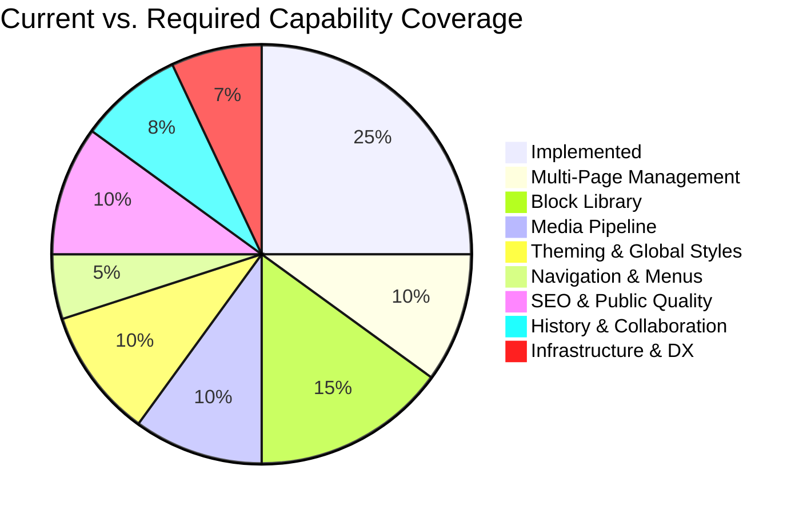

# Web Builder — Gap Analysis & Full-Experience Roadmap

> Based on the [Ground-Truth Specification](file:///c:/Users/Z.BOOK/Desktop/things/code/web-builder/spec.md) reverse-engineered from the active codebase.
> Every gap listed here was verified against the implemented code — not aspirational docs.

---

## Executive Summary

The current codebase implements a **solid multi-tenant foundation** with a working drag-and-drop canvas, draft/publish lifecycle, and robust auth. However, it is functionally a **single-page, single-block-palette proof-of-concept**. To reach a production-grade website builder, 8 major capability gaps must be addressed across 4 implementation phases.



---

## Gap 1 — Multi-Page Management

### What's Implemented

- The `pages` table supports multiple slugs per tenant (`unique(tenant_id, slug)`)
- The public site route `/{slug?}` can already serve any slug
- Tests confirm sub-page routing works (e.g., `/about`)

### What's Missing

The editor is **hardcoded to the `home` page**. There is no UI or API to create, list, rename, delete, or switch between pages.

**Evidence**: [TenantEditorController::edit](file:///c:/Users/Z.BOOK/Desktop/things/code/web-builder/app/Http/Controllers/TenantEditorController.php#L19) calls `$tenant->pages()->firstOrCreate(['slug' => 'home'], ...)` — only ever loads the home page.

### What to Build

#### 1.1 — Page CRUD API

| Route | Method | Controller | Purpose |
|---|---|---|---|
| `/editor/pages` | `GET` | `TenantPageController::index` | List all pages for the tenant |
| `/editor/pages` | `POST` | `TenantPageController::store` | Create a new page (validate unique slug) |
| `/editor/pages/{page}` | `PATCH` | `TenantPageController::update` | Rename page slug/title |
| `/editor/pages/{page}` | `DELETE` | `TenantPageController::destroy` | Delete page (prevent deleting `home`) |

All routes should sit inside the existing `Route::prefix('editor')` group with `auth` middleware.

#### 1.2 — Page Metadata on the `pages` Table

Add a migration:

```php
Schema::table('pages', function (Blueprint $table) {
    $table->string('title')->nullable()->after('slug');
    $table->boolean('is_homepage')->default(false)->after('published_config');
    $table->integer('sort_order')->default(0)->after('is_homepage');
});
```

This enables page titles separate from slugs (e.g., title: "About Us", slug: "about"), a designatable homepage, and ordered page lists in navigation.

#### 1.3 — Editor Page Switcher UI

Modify [Editor.vue](file:///c:/Users/Z.BOOK/Desktop/things/code/web-builder/resources/js/pages/Tenant/Editor.vue) to:

- Accept a `pages` prop (list of `{id, slug, title}`) from the controller
- Render a page selector in the sidebar (dropdown or tab bar)
- On page switch: force-save current draft, then `router.visit` to `/editor?page={slug}` (Inertia visit)
- Update `TenantEditorController::edit` to accept a `?page=` query param and load the correct page

#### 1.4 — "Set as Homepage" Action

Allow any page to be designated as the homepage. The public site controller should resolve the homepage via `is_homepage = true` instead of hardcoding `slug = 'home'`.

---

## Gap 2 — Block Library Expansion

### What's Implemented

5 block types: `HeroBlock`, `FeatureBlock`, `AtomicText`, `LayoutGrid`, `LayoutColumn`.

### What's Missing

A production website builder needs **15-25+ block types** to be useful. The current palette lacks images, buttons, videos, forms, dividers, embeds, lists, testimonials, pricing, FAQ, and more.

Additionally, there is **no block schema registry** — block definitions are scattered between Vue components, the editor's `addBlock()` function, and the Blade partial. Adding a new block requires editing 3+ files.

### What to Build

#### 2.1 — Centralized Block Schema Registry

Create a single source-of-truth registry that both the Vue editor and the Blade renderer consume:

**Frontend** (`resources/js/lib/blockRegistry.ts`):

```typescript
export interface BlockDefinition {
  type: string;
  label: string;
  category: 'content' | 'layout' | 'media' | 'interactive' | 'commerce';
  icon: string;
  defaultProps: Record<string, unknown>;
  defaultChildren?: BlockNode[];
  inspectorFields: InspectorField[];
}

export const blockDefinitions: BlockDefinition[] = [
  {
    type: 'HeroBlock',
    label: 'Hero Section',
    category: 'content',
    icon: 'Layout',
    defaultProps: { padding: 40, backgroundColor: '#ffffff', headline: 'Your Headline', subheadline: 'Your subheadline' },
    inspectorFields: [
      { key: 'headline', label: 'Headline', type: 'text' },
      { key: 'subheadline', label: 'Subheadline', type: 'text' },
      // ... shared style fields
    ],
  },
  // ... all other blocks
];
```

This eliminates the massive `if/else if` chains in both `addBlock()` and the inspector sidebar. The inspector becomes data-driven.

**Backend** — refactor [block.blade.php](file:///c:/Users/Z.BOOK/Desktop/things/code/web-builder/resources/views/partials/block.blade.php) to use a `@switch($block['type'])` with dedicated Blade partials per block type in a `partials/blocks/` directory, instead of one monolithic file.

#### 2.2 — Priority Block Types to Implement

| Priority | Block Type | Category | Key Props | Notes |
|---|---|---|---|---|
| **P0** | `ImageBlock` | media | `src`, `alt`, `width`, `height`, `objectFit`, `borderRadius` | Requires media pipeline (Gap 3) |
| **P0** | `ButtonBlock` | interactive | `label`, `href`, `variant`, `size`, `target` | Link target, open in new tab |
| **P0** | `DividerBlock` | layout | `thickness`, `color`, `style` (solid/dashed/dotted), `marginY` | Simple horizontal rule |
| **P0** | `SpacerBlock` | layout | `height` | Vertical whitespace control |
| **P1** | `RichTextBlock` | content | `html` | Requires inline WYSIWYG (TipTap or similar) |
| **P1** | `VideoEmbedBlock` | media | `url`, `provider` (YouTube/Vimeo), `aspectRatio` | Parse embed URLs, render iframe |
| **P1** | `IconBlock` | media | `icon` (Lucide name), `size`, `color` | Pick from Lucide icon set |
| **P1** | `ListBlock` | content | `items[]`, `ordered`, `iconType` | Bulleted/numbered/icon lists |
| **P2** | `TestimonialBlock` | content | `quote`, `author`, `role`, `avatarSrc` | Social proof block |
| **P2** | `PricingTableBlock` | commerce | `plans[]` with title/price/features/ctaUrl | Grid of pricing cards |
| **P2** | `FAQBlock` | content | `items[]` with question/answer | Accordion-style Q&A |
| **P2** | `ContactFormBlock` | interactive | `fields[]`, `submitAction`, `recipientEmail` | Requires form submission backend (new endpoint) |
| **P2** | `MapEmbedBlock` | media | `embedUrl` or `lat/lng`, `zoom` | Google Maps/OpenStreetMap iframe |
| **P3** | `CodeBlock` | content | `code`, `language` | Syntax-highlighted code snippet |
| **P3** | `CountdownBlock` | interactive | `targetDate`, `labelFormat` | JS-powered countdown timer |
| **P3** | `SocialLinksBlock` | interactive | `links[]` with platform/url | Row of social media icons |

#### 2.3 — Block Toolbar (In-Canvas Actions)

Currently, blocks only have a `:::Move` drag handle. Add an in-canvas floating toolbar on hover/select:

- **Duplicate** — clone the selected block (deep copy children)
- **Delete** — remove with confirmation
- **Move up / Move down** — reorder within parent
- **Copy / Paste** — clipboard buffer for cross-page block copying
- **Wrap in Container** — wrap a leaf block inside a new `LayoutColumn`

This should be a shared `<BlockToolbar>` component rendered by `RenderNode.vue`.

#### 2.4 — Block Templates / Presets

Pre-designed combinations of blocks (e.g., "Pricing Section" = LayoutGrid + 3 LayoutColumns with pre-styled content). These are inserted as a group rather than one block at a time.

---

## Gap 3 — Media & Asset Pipeline

### What's Implemented

**Nothing.** There is no file upload, no media library, no image handling anywhere in the codebase. The `filesystems.php` config exists but is entirely default/unused.

### What to Build

#### 3.1 — Media Model & Storage

**Migration** — `create_media_table`:

```php
Schema::create('media', function (Blueprint $table) {
    $table->id();
    $table->foreignId('tenant_id')->constrained()->onDelete('cascade');
    $table->string('filename');
    $table->string('disk')->default('public');    // 'public' or 's3'
    $table->string('path');                        // relative storage path
    $table->string('mime_type');
    $table->unsignedBigInteger('size_bytes');
    $table->unsignedInteger('width')->nullable();  // image dimensions
    $table->unsignedInteger('height')->nullable();
    $table->string('alt_text')->nullable();
    $table->timestamps();

    $table->index('tenant_id');
});
```

**Model** — `App\Models\Media`:
- `belongsTo(Tenant)`
- Apply `TenantScope` (same pattern as `Page`)
- Accessor for `url` that generates the full public URL via `Storage::disk($this->disk)->url($this->path)`

#### 3.2 — Upload API

| Route | Method | Controller | Purpose |
|---|---|---|---|
| `/editor/media` | `GET` | `TenantMediaController::index` | List tenant's media (paginated) |
| `/editor/media` | `POST` | `TenantMediaController::store` | Upload file(s) — validate type, max size |
| `/editor/media/{media}` | `DELETE` | `TenantMediaController::destroy` | Delete media file |
| `/editor/media/{media}` | `PATCH` | `TenantMediaController::update` | Update alt text |

**Validation**: Allow `image/jpeg`, `image/png`, `image/webp`, `image/svg+xml`, `image/gif`. Max size: 5MB per file. Enforce per-tenant storage quota (e.g., 100MB free tier).

**Storage Strategy**: Use `Storage::disk('public')` for local dev, with an S3-compatible disk for production. Store files under `tenants/{tenant_id}/media/{uuid}.{ext}`.

#### 3.3 — Media Picker Component

A modal/drawer Vue component (`<MediaPicker>`) that:

- Shows the tenant's uploaded media in a grid
- Supports drag-and-drop upload directly into the picker
- Returns the selected media URL + metadata to the calling block inspector
- Used by `ImageBlock`, `TestimonialBlock` (avatar), and any future block needing images

#### 3.4 — Image Optimization

Integrate server-side image processing (e.g., via Intervention Image or Spatie Media Library):

- Auto-generate thumbnails (150px, 600px, 1200px)
- Convert uploads to WebP
- Serve responsive `srcset` attributes in the Blade public renderer

---

## Gap 4 — Site-Wide Settings & Theming

### What's Implemented

**Nothing.** The `Tenant` model has only `user_id` and `subdomain`. There are no tenant-level settings, no site title config, no global color palette, no font selection.

### What to Build

#### 4.1 — Tenant Settings Schema

**Migration** — add columns to `tenants` or create a `tenant_settings` table:

```php
Schema::table('tenants', function (Blueprint $table) {
    $table->string('site_name')->nullable()->after('subdomain');
    $table->string('tagline')->nullable();
    $table->string('favicon_path')->nullable();
    $table->string('logo_path')->nullable();
    $table->string('custom_domain')->nullable()->unique();
    $table->json('theme_config')->nullable();   // Global design tokens
    $table->json('social_links')->nullable();   // {twitter, github, linkedin, ...}
    $table->json('seo_defaults')->nullable();   // Default meta title template, og:image
    $table->json('analytics_config')->nullable(); // GA tracking ID, etc.
});
```

#### 4.2 — Theme Configuration System

The `theme_config` JSON should store design tokens that cascade to all pages:

```json
{
  "colors": {
    "primary": "#4f46e5",
    "secondary": "#0ea5e9",
    "accent": "#f59e0b",
    "background": "#ffffff",
    "surface": "#f8fafc",
    "text": "#0f172a",
    "textMuted": "#64748b"
  },
  "typography": {
    "headingFont": "Inter",
    "bodyFont": "Inter",
    "baseSize": "16px",
    "scaleRatio": 1.25
  },
  "spacing": {
    "sectionPadding": "4rem",
    "containerMaxWidth": "1200px"
  },
  "borderRadius": "0.75rem",
  "shadows": "md"
}
```

**Rendering**: Inject these tokens as CSS custom properties in the `<head>` of both the editor canvas and the public Blade view. Blocks reference `var(--color-primary)` instead of hardcoded hex values.

#### 4.3 — Site Settings Editor Page

A new Vue page at `/editor/settings` (or a panel within the editor sidebar) with tabs:

| Tab | Controls |
|---|---|
| **General** | Site name, tagline, favicon upload, logo upload |
| **Design** | Color palette picker, font selector (Google Fonts), border radius, shadow preset |
| **SEO** | Default meta title template, og:image, robots.txt directives |
| **Social** | Social media links |
| **Analytics** | Google Analytics / Plausible tracking ID |
| **Domain** | Custom domain setup instructions + CNAME verification |

#### 4.4 — Google Fonts Integration

Expose a curated font picker (or search against the Google Fonts API). The selected fonts are loaded in the Blade `<head>` via `<link>` tags and in the editor canvas.

---

## Gap 5 — Navigation System

### What's Implemented

**Nothing.** There is no site navigation, no header, no footer, no menu system. The public Blade view renders raw blocks inside a `<main>` tag with no surrounding chrome.

### What to Build

#### 5.1 — Navigation Model

Either store navigation in the `tenant_settings` / `theme_config` JSON or as a dedicated `navigation_items` table:

```json
{
  "header": {
    "logo": true,
    "items": [
      { "label": "Home", "slug": "home", "type": "internal" },
      { "label": "About", "slug": "about", "type": "internal" },
      { "label": "Blog", "href": "https://blog.example.com", "type": "external" },
    ],
    "ctaButton": { "label": "Contact", "slug": "contact" }
  },
  "footer": {
    "columns": [
      { "heading": "Company", "links": [...] },
      { "heading": "Legal", "links": [...] }
    ],
    "copyright": "© 2026 {{site_name}}"
  }
}
```

#### 5.2 — Navigation Editor UI

A dedicated section in the editor sidebar or a separate `/editor/navigation` page where users can:

- Add/remove/reorder navigation items
- Link to internal pages (auto-populated from the page list) or external URLs
- Toggle logo visibility
- Configure a CTA button
- Edit footer columns and copyright text

#### 5.3 — Navigation Blade Rendering

Add `<header>` and `<footer>` partials to [tenant-public.blade.php](file:///c:/Users/Z.BOOK/Desktop/things/code/web-builder/resources/views/tenant-public.blade.php):

```blade
<body>
    @include('partials.tenant-header', ['nav' => $tenant->navigation, 'tenant' => $tenant])

    <main>
        @foreach($blocks as $block)
            @include('partials.block', ['block' => $block])
        @endforeach
    </main>

    @include('partials.tenant-footer', ['nav' => $tenant->navigation, 'tenant' => $tenant])
</body>
```

The header and footer are **outside** the block tree — they're site-wide chrome that wraps every page.

---

## Gap 6 — SEO & Public Site Quality

### What's Implemented

The public Blade view has a hardcoded `<title>` tag using `$tenant->name` (derived from subdomain). There is no meta description, no Open Graph tags, no structured data, no `robots.txt`, no `sitemap.xml`, no `<html lang>` attribute.

### What to Build

#### 6.1 — Per-Page SEO Metadata

Add to the `pages` table:

```php
$table->string('meta_title')->nullable();
$table->string('meta_description')->nullable();
$table->string('og_image_path')->nullable();
$table->boolean('is_indexed')->default(true); // noindex control
```

#### 6.2 — SEO-Aware Blade `<head>`

```blade
<head>
    <meta charset="UTF-8">
    <meta name="viewport" content="width=device-width, initial-scale=1.0">

    <title>{{ $page->meta_title ?? $page->title ?? $tenant->site_name }}</title>
    <meta name="description" content="{{ $page->meta_description ?? $tenant->tagline ?? '' }}">

    @if(!$page->is_indexed)
        <meta name="robots" content="noindex, nofollow">
    @endif

    <!-- Open Graph -->
    <meta property="og:title" content="{{ $page->meta_title ?? $page->title }}">
    <meta property="og:description" content="{{ $page->meta_description ?? '' }}">
    <meta property="og:image" content="{{ $page->og_image_url ?? $tenant->og_image_url ?? '' }}">
    <meta property="og:type" content="website">
    <meta property="og:url" content="{{ request()->url() }}">

    <!-- Canonical URL -->
    <link rel="canonical" href="{{ request()->url() }}">

    <!-- Favicon -->
    @if($tenant->favicon_path)
        <link rel="icon" href="{{ Storage::url($tenant->favicon_path) }}">
    @endif

    <!-- Google Fonts -->
    @if($tenant->theme_config['typography']['headingFont'] ?? false)
        <link href="https://fonts.googleapis.com/css2?family={{ urlencode($tenant->theme_config['typography']['headingFont']) }}&display=swap" rel="stylesheet">
    @endif

    <!-- Theme CSS Custom Properties -->
    <style>
        :root {
            --color-primary: {{ $tenant->theme_config['colors']['primary'] ?? '#4f46e5' }};
            /* ... all tokens ... */
        }
    </style>

    @vite(['resources/css/app.css'])
</head>
```

#### 6.3 — Auto-Generated Sitemap

Create an endpoint at `/{tenant}.domain.localhost/sitemap.xml`:

```php
Route::get('/sitemap.xml', [TenantSitemapController::class, 'show'])->name('tenant.sitemap');
```

The controller queries all published pages for the tenant and generates a valid XML sitemap.

#### 6.4 — Robots.txt per Tenant

```php
Route::get('/robots.txt', function () {
    $tenant = app('currentTenant');
    return response("User-agent: *\nAllow: /\nSitemap: " . route('tenant.sitemap'), 200)
        ->header('Content-Type', 'text/plain');
})->name('tenant.robots');
```

#### 6.5 — Public Site Responsive Design

The current [tenant-public.blade.php](file:///c:/Users/Z.BOOK/Desktop/things/code/web-builder/resources/views/tenant-public.blade.php) wraps all content in a fixed `<main class="mx-auto my-12 p-6 bg-white rounded-xl shadow">` container. This is not responsive and doesn't look like a real website. The public view needs:

- Full-bleed sections (hero should span full width)
- Proper responsive breakpoints for grid layouts
- Mobile-friendly typography scaling
- No artificial shadow/rounded container — the site should feel like a standalone website, not an embedded card

---

## Gap 7 — Version History & Collaboration

### What's Implemented

- Client-side undo/redo stack (in-memory, lost on page refresh)
- No server-side versioning
- No collaboration features
- No audit trail

### What to Build

#### 7.1 — Page Revision History

**Migration** — `create_page_revisions_table`:

```php
Schema::create('page_revisions', function (Blueprint $table) {
    $table->id();
    $table->foreignId('page_id')->constrained()->onDelete('cascade');
    $table->foreignId('user_id')->constrained()->onDelete('cascade');
    $table->json('config');           // Snapshot of draft_config at save time
    $table->string('label')->nullable(); // Optional user label ("Before redesign")
    $table->string('trigger');           // 'auto_save', 'publish', 'manual'
    $table->timestamps();

    $table->index(['page_id', 'created_at']);
});
```

**Strategy**: Don't save a revision on every 400ms debounce. Instead:

- Save a revision **on publish** (always)
- Save a revision **periodically** (e.g., every 5 minutes of active editing)
- Save a revision **on manual request** (user clicks "Save Checkpoint")
- Cap at ~50 revisions per page, auto-prune oldest

#### 7.2 — Revision History UI

A sidebar panel or modal that shows:

- Timeline of revisions with timestamps and trigger labels
- "Preview" — renders the revision's config in a read-only canvas
- "Restore" — replaces current `draft_config` with the selected revision

#### 7.3 — Publish Diff Summary

Before publishing, show the user what changed between the current published state and the new draft — count of blocks added/removed/modified.

---

## Gap 8 — Infrastructure, Testing & Developer Experience

### What's Implemented

- 10 feature tests covering auth, tenant isolation, save, publish, and public rendering
- `UserFactory` with `withTwoFactor()` state
- Basic `DatabaseSeeder`
- Pest v4 + Larastan

### What's Missing

#### 8.1 — Missing Factories

No factories exist for `Tenant` or `Page`. Tests manually create these with `Tenant::create(...)`, which is fragile. Create:

- `TenantFactory` with states like `->withHomePage()`, `->withPublishedSite()`
- `PageFactory` with states like `->published()`, `->withBlocks(count: 5)`

#### 8.2 — Missing Test Coverage

| Area | Current Tests | Gaps |
|---|---|---|
| Registration + Tenant creation | 1 test | Doesn't test subdomain validation (reserved words, format) |
| Multi-page management | 0 | No page CRUD tests (will be needed for Gap 1) |
| Public site SEO | 0 | No tests for meta tags, sitemap, robots.txt |
| Media upload | 0 | Will be needed for Gap 3 |
| Editor block operations | 0 | No frontend integration tests for add/delete/duplicate |
| Cross-tenant data leakage | 2 tests | Good, but add tests for media and settings isolation |

#### 8.3 — `draft_config` Validation

Currently, `POST /editor/save` validates `draft_config` as `'required|array'` — **no structural validation**. A malicious user could save arbitrary JSON. Add a recursive block-tree validation rule:

```php
'draft_config' => ['required', 'array'],
'draft_config.*.type' => ['required', 'string', Rule::in(array_keys($allowedBlockTypes))],
'draft_config.*.id' => ['required', 'string'],
'draft_config.*.props' => ['required', 'array'],
'draft_config.*.children' => ['sometimes', 'array'],
```

Consider a custom validation rule `ValidBlockTree` that recursively validates the tree depth and structure.

#### 8.4 — Block Prop Schema Inconsistency

There is a **prop naming inconsistency** between the registration controller and the editor controller:

| Source | Schema |
|---|---|
| [CentralRegisteredUserController](file:///c:/Users/Z.BOOK/Desktop/things/code/web-builder/app/Http/Controllers/Auth/CentralRegisteredUserController.php#L70-L85) | Uses `styles` and `content` as separate sub-objects |
| [TenantEditorController](file:///c:/Users/Z.BOOK/Desktop/things/code/web-builder/app/Http/Controllers/TenantEditorController.php#L22-L28) | Uses a flat `props` object |
| [Editor.vue](file:///c:/Users/Z.BOOK/Desktop/things/code/web-builder/resources/js/pages/Tenant/Editor.vue#L30-L43) | Uses a flat `props` object with `children` |

The registration controller seeds blocks with `styles`/`content` sub-keys, but the editor creates blocks with flat `props`. This means the initial page created at registration has a different schema than pages edited in the editor. **Normalize to the flat `props` format everywhere.**

#### 8.5 — Error Handling & User Feedback

The editor has minimal error feedback:

- Auto-save failures are silently swallowed (`console.warn`)
- No toast/notification system in the editor (vue-sonner is installed but unused in Editor.vue)
- Publish success shows a temporary text message, not a proper toast
- No offline detection or reconnection handling

Add vue-sonner toasts for: save success (subtle), save failure (error), publish success, publish failure, network disconnection warning.

#### 8.6 — SQLite to Production Database

The current default database is **SQLite**, which is unsuitable for production multi-tenant workloads (file-level locking, no concurrent writes under load). Plan the migration to MySQL/PostgreSQL:

- Audit all raw queries and `json` column usage for dialect compatibility
- The `DB::transaction` in publish uses SQLite's default `DEFERRED` mode — verify this works correctly under PostgreSQL's `READ COMMITTED`
- Add a MySQL/PostgreSQL connection config to `.env.example` with documentation

---

## Target Entity Relationship Diagram (Post-Gaps)

```mermaid
erDiagram
    User ||--o| Tenant : "owns"
    Tenant ||--o{ Page : "has many"
    Tenant ||--o{ Media : "has many"
    Page ||--o{ PageRevision : "has many"

    User {
        bigint id PK
        string name
        string email UK
        string password
    }

    Tenant {
        bigint id PK
        bigint user_id FK_UK
        string subdomain UK
        string site_name
        string tagline
        string favicon_path
        string logo_path
        string custom_domain UK
        json theme_config
        json navigation_config
        json social_links
        json seo_defaults
        json analytics_config
    }

    Page {
        bigint id PK
        bigint tenant_id FK
        string slug
        string title
        boolean is_homepage
        integer sort_order
        json draft_config
        json published_config
        string meta_title
        string meta_description
        string og_image_path
        boolean is_indexed
    }

    Media {
        bigint id PK
        bigint tenant_id FK
        string filename
        string disk
        string path
        string mime_type
        bigint size_bytes
        integer width
        integer height
        string alt_text
    }

    PageRevision {
        bigint id PK
        bigint page_id FK
        bigint user_id FK
        json config
        string label
        string trigger
    }
```

---

## Phased Implementation Roadmap

### Phase 1 — Foundation Fixes (Week 1-2)

> Prerequisite fixes and structural improvements that unblock all later work.

- [ ] **Normalize block prop schema** — Fix the `styles/content` vs `props` inconsistency between registration seeder and editor (Gap 8.4)
- [ ] **Create `TenantFactory` and `PageFactory`** — Required for all future test development (Gap 8.1)
- [ ] **Add `draft_config` structural validation** — Security hardening for the save endpoint (Gap 8.3)
- [ ] **Add editor toast notifications** — Wire vue-sonner into Editor.vue for save/publish/error feedback (Gap 8.5)
- [ ] **Build centralized block schema registry** (`blockRegistry.ts`) — Single source-of-truth for block definitions (Gap 2.1)
- [ ] **Refactor inspector sidebar to be data-driven** — Eliminate per-block `v-if` branches, use registry metadata (Gap 2.1)

### Phase 2 — Multi-Page & Core Blocks (Week 3-5)

> The minimum feature set that makes this a "real" website builder.

- [ ] **Multi-page CRUD API** — Page listing, creation, renaming, deletion endpoints (Gap 1.1)
- [ ] **Page metadata migration** — title, is_homepage, sort_order (Gap 1.2)
- [ ] **Editor page switcher UI** — Page selector, page switch with save-before-navigate (Gap 1.3)
- [ ] **Block library expansion (P0)** — ImageBlock (placeholder), ButtonBlock, DividerBlock, SpacerBlock (Gap 2.2)
- [ ] **Block toolbar** — Duplicate, delete, move up/down, wrap in container (Gap 2.3)
- [ ] **Public site responsive redesign** — Remove card wrapper, add full-bleed sections, responsive grids (Gap 6.5)

### Phase 3 — Media, Theming & Navigation (Week 6-9)

> The visual polish and asset management layer.

- [ ] **Media model + upload API** — File upload, storage, listing, deletion (Gap 3.1, 3.2)
- [ ] **Media picker component** — Modal UI for browsing/uploading/selecting images (Gap 3.3)
- [ ] **Image optimization pipeline** — Thumbnails, WebP conversion, srcset (Gap 3.4)
- [ ] **ImageBlock with real uploads** — Connect to media picker (Gap 2.2)
- [ ] **Tenant settings schema** — site_name, tagline, theme_config, social_links, favicon, logo (Gap 4.1)
- [ ] **Theme configuration system** — CSS custom properties, color palette picker, font selector (Gap 4.2, 4.3)
- [ ] **Navigation system** — Navigation JSON config, editor UI, Blade header/footer partials (Gap 5)
- [ ] **Per-page SEO metadata** — meta_title, meta_description, og:image in editor and Blade (Gap 6.1, 6.2)
- [ ] **Sitemap + robots.txt** — Auto-generated per tenant (Gap 6.3, 6.4)

### Phase 4 — History, Advanced Blocks & Scale (Week 10-14)

> Production-grade reliability and advanced features.

- [ ] **Page revision history** — Model, auto-save checkpoints, restore UI (Gap 7.1, 7.2)
- [ ] **Block library expansion (P1-P2)** — RichTextBlock, VideoEmbedBlock, ListBlock, FAQBlock, TestimonialBlock, PricingTableBlock, ContactFormBlock (Gap 2.2)
- [ ] **Block presets/templates** — Pre-designed multi-block combinations (Gap 2.4)
- [ ] **Form submission backend** — Endpoint for ContactFormBlock submissions, email notifications (Gap 2.2)
- [ ] **Custom domain support** — CNAME verification, SSL provisioning (Gap 4.1)
- [ ] **Production database migration** — MySQL/PostgreSQL compatibility audit (Gap 8.6)
- [ ] **Google Fonts integration** — Font picker + dynamic loading (Gap 4.4)
- [ ] **Publish diff summary** — Show changes before publishing (Gap 7.3)

---

## Architectural Decisions

### Extend vs. Refactor

| Decision | Recommendation | Rationale |
|---|---|---|
| Block registry | **Refactor** — create centralized registry | Current scattered definitions (3 files per block) won't scale past 10 blocks |
| Inspector sidebar | **Refactor** — make data-driven | The 200+ line `v-if` chain in Editor.vue is unmaintainable |
| Public Blade view | **Refactor** — split into partials per block type | The monolithic `block.blade.php` is already 80 lines and growing |
| Page model | **Extend** — add columns via migration | Schema is clean and extensible |
| Tenant model | **Extend** — add settings columns | Simpler than a separate `tenant_settings` table for now |
| Editor layout | **Extend** — add page switcher, settings panel | Existing sidebar architecture supports additional panels |
| Auth system | **Keep** — no changes needed | Fortify + Passkeys setup is comprehensive |
| Routing architecture | **Keep** — no changes needed | Central/tenant domain split is sound |

### Key Technical Risks

| Risk | Mitigation |
|---|---|
| **Dual rendering drift** — Vue blocks and Blade partials diverge as block count grows | Centralized registry generates both Vue component list and Blade partial list. Automated snapshot tests compare editor preview to Blade output for each block type. |
| **JSON config size** — Complex pages with many blocks could produce large `draft_config` payloads | Monitor average payload size. If >500KB, consider compressing at rest or splitting into page sections. SQLite has a 1GB blob limit; PostgreSQL JSONB is unlimited. |
| **Cross-subdomain session issues in production** — Wildcard cookies may not work with custom domains | For custom domains, use a separate session cookie or token-based auth with a redirect handshake from the central domain. |
| **Image storage costs** — Tenant media can grow unbounded | Enforce per-tenant storage quotas. Show usage in the dashboard. Compress aggressively with WebP. |
