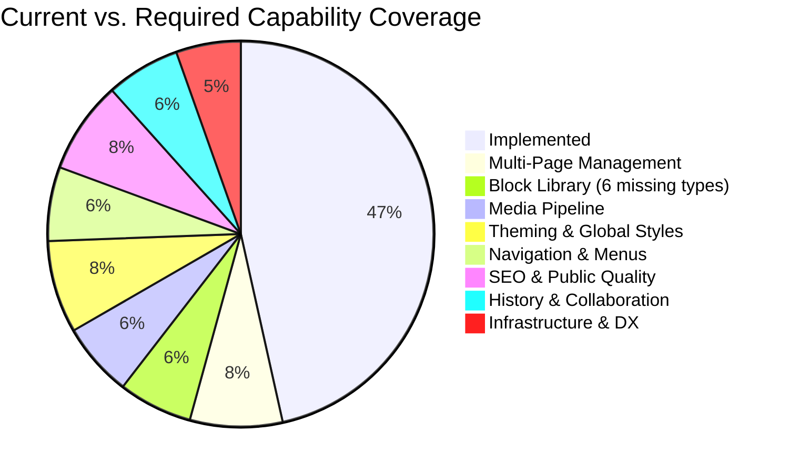

# Web Builder — Gap Analysis & Full-Experience Roadmap

> Based on the [Ground-Truth Specification](file:///c:/Users/Z.BOOK/Desktop/things/code/web-builder/spec.md) reverse-engineered from the active codebase.
> Every gap listed here was verified against the implemented code — not aspirational docs.

---

## Executive Summary

The current codebase implements a **multi-tenant website builder** with 15 block types, a drag-and-drop canvas, draft/publish lifecycle, multi-page management, media pipeline (upload + thumbnails), navigation system, theme engine, contact form handling, block presets, and robust auth. The core building blocks are in place, but several production-grade features remain.



---

## Gap 1 — Multi-Page Management

### What's Implemented

- The `pages` table supports multiple slugs per tenant (`unique(tenant_id, slug)`)
- The public site route `/{slug?}` can already serve any slug
- Tests confirm sub-page routing works (e.g., `/about`)

### What's Missing

The editor is **hardcoded to the `home` page**. There is no UI or API to create, list, rename, delete, or switch between pages.

**Evidence**: [TenantEditorController::edit](file:///c:/Users/Z.BOOK/Desktop/things/code/web-builder/app/Http/Controllers/TenantEditorController.php#L19) calls `$tenant->pages()->firstOrCreate(['slug' => 'home'], ...)` — only ever loads the home page.

### What to Build

#### 1.1 — Page CRUD API

| Route | Method | Controller | Purpose |
|---|---|---|---|
| `/editor/pages` | `GET` | `TenantPageController::index` | List all pages for the tenant |
| `/editor/pages` | `POST` | `TenantPageController::store` | Create a new page (validate unique slug) |
| `/editor/pages/{page}` | `PATCH` | `TenantPageController::update` | Rename page slug/title |
| `/editor/pages/{page}` | `DELETE` | `TenantPageController::destroy` | Delete page (prevent deleting `home`) |

All routes should sit inside the existing `Route::prefix('editor')` group with `auth` middleware.

#### 1.2 — Page Metadata on the `pages` Table

Add a migration:

```php
Schema::table('pages', function (Blueprint $table) {
    $table->string('title')->nullable()->after('slug');
    $table->boolean('is_homepage')->default(false)->after('published_config');
    $table->integer('sort_order')->default(0)->after('is_homepage');
});
```

This enables page titles separate from slugs (e.g., title: "About Us", slug: "about"), a designatable homepage, and ordered page lists in navigation.

#### 1.3 — Editor Page Switcher UI

Modify [Editor.vue](file:///c:/Users/Z.BOOK/Desktop/things/code/web-builder/resources/js/pages/Tenant/Editor.vue) to:

- Accept a `pages` prop (list of `{id, slug, title}`) from the controller
- Render a page selector in the sidebar (dropdown or tab bar)
- On page switch: force-save current draft, then `router.visit` to `/editor?page={slug}` (Inertia visit)
- Update `TenantEditorController::edit` to accept a `?page=` query param and load the correct page

#### 1.4 — "Set as Homepage" Action

Allow any page to be designated as the homepage. The public site controller should resolve the homepage via `is_homepage = true` instead of hardcoding `slug = 'home'`.

---

## Gap 2 — Block Library Expansion

### What's Implemented

15 block types: `HeroBlock`, `FeatureBlock`, `AtomicText`, `LayoutGrid`, `LayoutColumn`, `ButtonBlock`, `DividerBlock`, `SpacerBlock`, `ImageBlock`, `RichTextBlock`, `VideoEmbedBlock`, `FAQBlock`, `TestimonialBlock`, `PricingTableBlock`, `ContactFormBlock`.

### What's Still Missing (from original gap)

A production website builder needs **20+ block types** to be comprehensive. The current palette has 15 types. The remaining gaps are mostly lower-priority specialized blocks:

- P1: `IconBlock`, `ListBlock`
- P2: `MapEmbedBlock`
- P3: `CodeBlock`, `CountdownBlock`, `SocialLinksBlock`

The centralized block schema registry (`blockRegistry.ts`) and data-driven inspector have been built (see Phase 1). Adding a new block now requires updating only `config/blocks.php` (definitions + nesting) and adding a Vue component + registry mapping — the process is documented in `AGENTS.md`.

### Newly Discovered Gap: Nesting Matrix Synchronization [RESOLVED]

Previously, adding a new block type required updating every parent's nesting list in both `config/blocks.php` and `blockRegistry.ts` manually, which could lead to sync failures and 422 errors on save.

**Resolution**: The frontend has been refactored (`RenderNode.vue` and `Editor.vue`) to dynamically load and enforce nesting rules from the backend shared via Inertia's `blocksConfig` prop (originating from `config/blocks.php`). The client and server validation are now automatically unified under a single source of truth.

### What to Build

#### 2.1 — Centralized Block Schema Registry

Create a single source-of-truth registry that both the Vue editor and the Blade renderer consume:

**Frontend** (`resources/js/lib/blockRegistry.ts`):

```typescript
export interface BlockDefinition {
  type: string;
  label: string;
  category: 'content' | 'layout' | 'media' | 'interactive' | 'commerce';
  icon: string;
  defaultProps: Record<string, unknown>;
  defaultChildren?: BlockNode[];
  inspectorFields: InspectorField[];
}

export const blockDefinitions: BlockDefinition[] = [
  {
    type: 'HeroBlock',
    label: 'Hero Section',
    category: 'content',
    icon: 'Layout',
    defaultProps: { padding: 40, backgroundColor: '#ffffff', headline: 'Your Headline', subheadline: 'Your subheadline' },
    inspectorFields: [
      { key: 'headline', label: 'Headline', type: 'text' },
      { key: 'subheadline', label: 'Subheadline', type: 'text' },
      // ... shared style fields
    ],
  },
  // ... all other blocks
];
```

This eliminates the massive `if/else if` chains in both `addBlock()` and the inspector sidebar. The inspector becomes data-driven.

**Backend** — refactor [block.blade.php](file:///c:/Users/Z.BOOK/Desktop/things/code/web-builder/resources/views/partials/block.blade.php) to use a `@switch($block['type'])` with dedicated Blade partials per block type in a `partials/blocks/` directory, instead of one monolithic file.

#### 2.2 — Block Types: Implemented vs Remaining

| Status | Priority | Block Type | Category | Key Props | Notes |
|---|---|---|---|---|---|
| ✅ Done | P0 | `HeroBlock` | content | `headline`, `subheadline`, `padding`, `backgroundColor` | Original block, uses theme CSS vars |
| ✅ Done | P0 | `FeatureBlock` | content | `title`, `body`, `padding`, `backgroundColor` | Original block, uses theme CSS vars |
| ✅ Done | P0 | `AtomicText` | content | `content`, `fontSize`, `color`, `padding`, `backgroundColor` | Defaults `color` to `--theme-text` |
| ✅ Done | P0 | `LayoutGrid` | layout | `columns`, `gap`, `padding`, `backgroundColor` | Auto-creates 3 LayoutColumn children |
| ✅ Done | P0 | `LayoutColumn` | layout | `span`, `padding`, `width`, `height`, `gap`, `backgroundColor` | Container for nested blocks |
| ✅ Done | P0 | `ButtonBlock` | content | `label`, `variant`, `url`, `size` | Uses `--theme-primary`/`--theme-secondary` |
| ✅ Done | P0 | `DividerBlock` | content | `thickness` (1-8), `color`, `margin` | |
| ✅ Done | P0 | `SpacerBlock` | content | `height` (4-200) | |
| ✅ Done | P0 | `ImageBlock` | media | `src`, `alt`, `objectFit`, `borderRadius`, `width`, `height` | Connected to media picker |
| ✅ Done | P1 | `RichTextBlock` | content | `html`, `padding`, `backgroundColor` | ⚠️ Renders raw HTML; WYSIWYG editor (TipTap) not yet integrated |
| ✅ Done | P1 | `VideoEmbedBlock` | media | `url`, `provider` (youtube/vimeo/loom/raw), `aspectRatio` | Parses embed URLs, renders iframe |
| ✅ Done | P2 | `FAQBlock` | content | `items[]` (question/answer), `padding`, `backgroundColor` | Accordion-style via repeater |
| ✅ Done | P2 | `TestimonialBlock` | content | `quote`, `authorName`, `authorRole`, `avatarSrc` | Social proof with avatar picker |
| ✅ Done | P2 | `PricingTableBlock` | content | `plans[]`, `padding`, `backgroundColor` | Repeater-based pricing cards |
| ✅ Done | P2 | `ContactFormBlock` | content | `fields[]`, `submitLabel`, `successMessage` | Submits to `POST /contact` (rate-limited 5/min) |
| ❌ Missing | P1 | `IconBlock` | media | `icon` (Lucide name), `size`, `color` | Pick from Lucide icon set |
| ❌ Missing | P1 | `ListBlock` | content | `items[]`, `ordered`, `iconType` | Bulleted/numbered/icon lists |
| ❌ Missing | P2 | `MapEmbedBlock` | media | `embedUrl` or `lat/lng`, `zoom` | Google Maps/OpenStreetMap iframe |
| ❌ Missing | P3 | `CodeBlock` | content | `code`, `language` | Syntax-highlighted code snippet |
| ❌ Missing | P3 | `CountdownBlock` | interactive | `targetDate`, `labelFormat` | JS-powered countdown timer |
| ❌ Missing | P3 | `SocialLinksBlock` | interactive | `links[]` with platform/url | Row of social media icons |

**15 block types implemented** across 5 original + 10 new additions. 6 block types remain unimplemented.

#### 2.3 — Block Toolbar (In-Canvas Actions) ✅ Done

Blocks now have an in-canvas floating toolbar on hover/select rendered by `BlockToolbar.vue` inside `RenderNode.vue`:

- **Duplicate** — deep clones the block tree with new IDs, inserts after original
- **Delete** — two-click confirmation (button turns red, click again to confirm, auto-resets after 3s)
- **Move up / Move down** — reorder within parent array
- **Copy / Paste** — clipboard buffer (`copiedBlock` ref) persists across blocks; paste button shows green when buffer is populated
- **Wrap in Container** — wraps the block inside a new `LayoutColumn` container (preserves block as child)
- **Drag handle** — the entire toolbar area doubles as the vuedraggable `.drag-handle` for reordering

All actions are provided via `provide('blockActions', ...)` from `Editor.vue` and consumed via `inject` in `RenderNode.vue` / `BlockToolbar.vue`. Tree manipulation helpers (`findParent`, `generateNewIds`, `deleteBlockById`, `duplicateBlock`, `moveBlock`, `copyBlock`, `pasteBlock`, `wrapInContainer`) are centralized in `Editor.vue`.

#### 2.4 — Block Templates / Presets ✅ Done

Pre-designed combinations of blocks (e.g., "Pricing Section" = LayoutGrid + 3 LayoutColumns with pre-styled content). These are inserted as a group rather than one block at a time.

3 presets implemented in [blockPresets.ts](file:///c:/Users/Z.BOOK/Desktop/things/code/web-builder/resources/js/lib/blockPresets.ts):

| Preset | Blocks | Description |
|---|---|---|
| **Hero with CTA** | LayoutGrid → 2× LayoutColumn → HeroBlock + ButtonBlock / ImageBlock | Split section with headline, CTA, and hero image |
| **Features Grid** | LayoutGrid → 3× LayoutColumn → FeatureBlock | Three-column feature card row |
| **FAQ Accordion Row** | LayoutGrid → LayoutColumn → HeroBlock + FAQBlock | Headline + accordion Q&A |

Presets appear in the editor sidebar Block Library under a "Presets" tab, rendered by `BlockLibrary.vue`. Inserted via `addPreset()` which clones blocks with new IDs and appends to the root block tree.

---

## Gap 3 — Media & Asset Pipeline

### What's Implemented

A complete media management pipeline has been built:

| Component | Implementation |
|---|---|
| **Database** | `media` table with `tenant_id`, `filename`, `disk`, `path`, `mime_type`, `size`, `width`, `height`, `thumb_path` + `TenantScope` |
| **Model** | `App\Models\Media` — `belongsTo(Tenant)`, `url` and `thumb_url` accessors via `Storage::disk()->url()` |
| **Upload API** | `POST /editor/media` — validates file (image, max 5MB, jpeg/png/gif/webp/svg), stores under `public/media/{tenant_id}/`, dispatches `OptimizeMediaJob` |
| **List API** | `GET /editor/media` — returns all tenant media newest first with computed URLs |
| **Delete API** | `DELETE /editor/media/{media}` — removes file, thumbnail, and record with double ownership guard |
| **Image Optimization** | `OptimizeMediaJob` — detects dimensions via `getimagesize()`, generates 150×150 cover-style JPEG thumbnail using GD with transparency preservation. Queued after upload. |
| **Media Picker** | `MediaPicker.vue` modal — displays uploaded media grid, supports drag-and-drop / file-select upload, returns selected URL |
| **Block Integration** | `ImageBlock` and `TestimonialBlock` (avatar) connect to the media picker via `'media'`-type inspector field; `ContentInspector.vue` renders preview + "Choose Image" button |

### What to Build (Remaining)

- [ ] **Per-tenant storage quota enforcement** (e.g., 100MB free tier cap)
- [ ] **S3-compatible storage adapter** for production deployments
- [ ] **Responsive `srcset` generation** (600px, 1200px variants) — currently only 150px thumbnail
- [ ] **WebP format conversion** — currently stores originals as-is; `OptimizeMediaJob` only generates JPEG thumbnails
- [ ] **`PATCH /editor/media/{media}` endpoint** for updating alt text or metadata

---

## Gap 4 — Site-Wide Settings & Theming

### What's Implemented

- **Database schema**: `theme_config` JSON column added to `tenants` table; `Tenant` model casts it to array and includes it in `$fillable`.
- **Theme save API**: `TenantThemeController` with validated `PATCH /theme` endpoint (hex colors, curated fonts, radius presets), ownership-guarded.
- **Dashboard theme UI**: CentralDashboard.vue has a Theme Settings panel with 4 preset palette buttons, individual color pickers + hex inputs, heading/body font dropdowns, and border radius selector.
- **CSS variable injection**: `useTheme()` composable in `resources/js/lib/theme.ts` watches heading/body fonts, injects a Google Font `<link>` tag, and exposes a `cssVars` computed with `--theme-primary`, `--theme-secondary`, `--theme-bg`, `--theme-text`, `--theme-border-radius`, `--theme-font-heading`, `--theme-font-body`. Applied to `.canvas-runtime` in Editor.vue and root wrapper in PublicPage.vue.
- **Leaf block theme integration**: ButtonBlock uses `var(--theme-primary)` / `var(--theme-secondary)` for variant colors and `var(--theme-border-radius)` for corner rounding. HeroBlock and FeatureBlock use `var(--theme-text)` for text colors and `var(--theme-font-heading)` for heading font. AtomicText default color changed to `--theme-text` so new blocks inherit the theme text color.

### What to Build

#### 4.1 — Tenant Settings Schema

**Migration** — add columns to `tenants` or create a `tenant_settings` table:

```php
Schema::table('tenants', function (Blueprint $table) {
    $table->string('site_name')->nullable()->after('subdomain');
    $table->string('tagline')->nullable();
    $table->string('favicon_path')->nullable();
    $table->string('logo_path')->nullable();
    $table->string('custom_domain')->nullable()->unique();
    $table->json('theme_config')->nullable();   // Global design tokens
    $table->json('social_links')->nullable();   // {twitter, github, linkedin, ...}
    $table->json('seo_defaults')->nullable();   // Default meta title template, og:image
    $table->json('analytics_config')->nullable(); // GA tracking ID, etc.
});
```

#### 4.2 — Theme Configuration System

The `theme_config` JSON should store design tokens that cascade to all pages:

```json
{
  "colors": {
    "primary": "#4f46e5",
    "secondary": "#0ea5e9",
    "accent": "#f59e0b",
    "background": "#ffffff",
    "surface": "#f8fafc",
    "text": "#0f172a",
    "textMuted": "#64748b"
  },
  "typography": {
    "headingFont": "Inter",
    "bodyFont": "Inter",
    "baseSize": "16px",
    "scaleRatio": 1.25
  },
  "spacing": {
    "sectionPadding": "4rem",
    "containerMaxWidth": "1200px"
  },
  "borderRadius": "0.75rem",
  "shadows": "md"
}
```

**Rendering**: Inject these tokens as CSS custom properties in the `<head>` of both the editor canvas and the public Blade view. Blocks reference `var(--color-primary)` instead of hardcoded hex values.

#### 4.3 — Site Settings Editor Page

A new Vue page at `/editor/settings` (or a panel within the editor sidebar) with tabs:

| Tab | Controls |
|---|---|
| **General** | Site name, tagline, favicon upload, logo upload |
| **Design** | Color palette picker, font selector (Google Fonts), border radius, shadow preset |
| **SEO** | Default meta title template, og:image, robots.txt directives |
| **Social** | Social media links |
| **Analytics** | Google Analytics / Plausible tracking ID |
| **Domain** | Custom domain setup instructions + CNAME verification |

#### 4.4 — Google Fonts Integration

Expose a curated font picker (or search against the Google Fonts API). The selected fonts are loaded in the Blade `<head>` via `<link>` tags and in the editor canvas.

---

## Gap 5 — Navigation System

### What's Implemented

A complete navigation configuration system has been built:

| Component | Implementation |
|---|---|
| **Storage** | `navigation_config` JSON column on `tenants` table, cast to array via `Tenant` model |
| **Save API** | `PATCH /editor/navigation` via `TenantNavigationController` — validates `header` and `footer` required keys, ownership-guarded |
| **Editor UI** | `NavigationSettings.vue` sidebar panel — add/remove/reorder nav items, link to internal pages (auto-populated), toggle logo visibility, configure CTA button, edit footer copyright |
| **Editor Canvas Rendering** | `SiteHeader.vue` and `SiteFooter.vue` render inside the editor canvas (above and below the draggable block tree) |
| **Public Site Rendering** | `SiteHeader.vue` and `SiteFooter.vue` render on `PublicPage.vue` wrapping the block output |

The navigation config shape stored on `tenants.navigation_config`:

```json
{
  "header": {
    "showLogo": true,
    "items": [
      { "label": "Home", "slug": "home", "type": "internal" }
    ],
    "ctaButton": { "show": false, "label": "Contact", "slug": "home" }
  },
  "footer": {
    "copyright": "© 2026 My Workspace"
  }
}
```

The header and footer are **outside** the block tree — they're site-wide chrome that wraps every page.

### What to Build (Remaining)

- [ ] **Multi-column footer** with heading + links structure (currently single copyright line)
- [ ] **External URL support** in nav items (currently internal page slugs only)
- [ ] **Custom domain-aware navigation** — resolve slugs to correct URLs when using custom domains
- [ ] **Active/highlighted state** for current page in navigation

---

## Gap 6 — SEO & Public Site Quality

### What's Implemented

The public Blade view has a hardcoded `<title>` tag using `$tenant->name` (derived from subdomain). There is no meta description, no Open Graph tags, no structured data, no `robots.txt`, no `sitemap.xml`, no `<html lang>` attribute.

### What to Build

#### 6.1 — Per-Page SEO Metadata

Add to the `pages` table:

```php
$table->string('meta_title')->nullable();
$table->string('meta_description')->nullable();
$table->string('og_image_path')->nullable();
$table->boolean('is_indexed')->default(true); // noindex control
```

#### 6.2 — SEO-Aware Blade `<head>`

```blade
<head>
    <meta charset="UTF-8">
    <meta name="viewport" content="width=device-width, initial-scale=1.0">

    <title>{{ $page->meta_title ?? $page->title ?? $tenant->site_name }}</title>
    <meta name="description" content="{{ $page->meta_description ?? $tenant->tagline ?? '' }}">

    @if(!$page->is_indexed)
        <meta name="robots" content="noindex, nofollow">
    @endif

    <!-- Open Graph -->
    <meta property="og:title" content="{{ $page->meta_title ?? $page->title }}">
    <meta property="og:description" content="{{ $page->meta_description ?? '' }}">
    <meta property="og:image" content="{{ $page->og_image_url ?? $tenant->og_image_url ?? '' }}">
    <meta property="og:type" content="website">
    <meta property="og:url" content="{{ request()->url() }}">

    <!-- Canonical URL -->
    <link rel="canonical" href="{{ request()->url() }}">

    <!-- Favicon -->
    @if($tenant->favicon_path)
        <link rel="icon" href="{{ Storage::url($tenant->favicon_path) }}">
    @endif

    <!-- Google Fonts -->
    @if($tenant->theme_config['typography']['headingFont'] ?? false)
        <link href="https://fonts.googleapis.com/css2?family={{ urlencode($tenant->theme_config['typography']['headingFont']) }}&display=swap" rel="stylesheet">
    @endif

    <!-- Theme CSS Custom Properties -->
    <style>
        :root {
            --color-primary: {{ $tenant->theme_config['colors']['primary'] ?? '#4f46e5' }};
            /* ... all tokens ... */
        }
    </style>

    @vite(['resources/css/app.css'])
</head>
```

#### 6.3 — Auto-Generated Sitemap

Create an endpoint at `/{tenant}.domain.localhost/sitemap.xml`:

```php
Route::get('/sitemap.xml', [TenantSitemapController::class, 'show'])->name('tenant.sitemap');
```

The controller queries all published pages for the tenant and generates a valid XML sitemap.

#### 6.4 — Robots.txt per Tenant

```php
Route::get('/robots.txt', function () {
    $tenant = app('currentTenant');
    return response("User-agent: *\nAllow: /\nSitemap: " . route('tenant.sitemap'), 200)
        ->header('Content-Type', 'text/plain');
})->name('tenant.robots');
```

#### 6.5 — Public Site Responsive Design

The current [tenant-public.blade.php](file:///c:/Users/Z.BOOK/Desktop/things/code/web-builder/resources/views/tenant-public.blade.php) wraps all content in a fixed `<main class="mx-auto my-12 p-6 bg-white rounded-xl shadow">` container. This is not responsive and doesn't look like a real website. The public view needs:

- Full-bleed sections (hero should span full width)
- Proper responsive breakpoints for grid layouts
- Mobile-friendly typography scaling
- No artificial shadow/rounded container — the site should feel like a standalone website, not an embedded card

---

## Gap 7 — Version History & Collaboration

### What's Implemented

- Client-side undo/redo stack (in-memory, lost on page refresh)
- No server-side versioning
- No collaboration features
- No audit trail

### What to Build

#### 7.1 — Page Revision History

**Migration** — `create_page_revisions_table`:

```php
Schema::create('page_revisions', function (Blueprint $table) {
    $table->id();
    $table->foreignId('page_id')->constrained()->onDelete('cascade');
    $table->foreignId('user_id')->constrained()->onDelete('cascade');
    $table->json('config');           // Snapshot of draft_config at save time
    $table->string('label')->nullable(); // Optional user label ("Before redesign")
    $table->string('trigger');           // 'auto_save', 'publish', 'manual'
    $table->timestamps();

    $table->index(['page_id', 'created_at']);
});
```

**Strategy**: Don't save a revision on every 400ms debounce. Instead:

- Save a revision **on publish** (always)
- Save a revision **periodically** (e.g., every 5 minutes of active editing)
- Save a revision **on manual request** (user clicks "Save Checkpoint")
- Cap at ~50 revisions per page, auto-prune oldest

#### 7.2 — Revision History UI

A sidebar panel or modal that shows:

- Timeline of revisions with timestamps and trigger labels
- "Preview" — renders the revision's config in a read-only canvas
- "Restore" — replaces current `draft_config` with the selected revision

#### 7.3 — Publish Diff Summary

Before publishing, show the user what changed between the current published state and the new draft — count of blocks added/removed/modified.

---

## Gap 8 — Infrastructure, Testing & Developer Experience

### What's Implemented

- **23 feature tests** covering auth (registration, login, 2FA, passkeys, password reset, email verification, password confirmation), tenant isolation (editor, save, publish), multi-page CRUD, editor block operations (advanced, validation, manipulation), theme settings, navigation, media upload, contact submissions, dashboard, and profile/security settings
- `UserFactory` with `withTwoFactor()` state, `TenantFactory`, `PageFactory`
- `DatabaseSeeder`
- Pest v4 + Larastan v3
- **`ValidatesBlockSchema`** custom rule — recursively validates id, type, props, children, and nesting rules against `config('blocks.nesting')` on every save operation

### What's Missing

#### 8.1 — Remaining Factory Needs

- `MediaFactory` with states like `->withThumbnail()`
- `ContactSubmissionFactory`

#### 8.2 — Missing Test Coverage

| Area | Current Tests | Gaps |
|---|---|---|
| Registration + Tenant creation | 2 tests | Subdomain validation edge cases (reserved words, format) |
| Multi-page management | 4 tests (`TenantPageCrudTest`) | Well covered |
| Public site SEO | 0 | No tests for meta tags, sitemap, robots.txt |
| Media upload | 3 tests (`TenantMediaTest`) | Covers index, store, destroy |
| Editor block operations | 3 tests (`BlockManipulationTest`, `TenantBlockAdvancedTest`) | Covers add, reorder, remove, nesting validation |
| Cross-tenant data leakage | 2 tests | Add tests for media and navigation isolation |
| Navigation | 3 tests (`TenantNavigationTest`) | Covers update, validation |
| Contact form | 3 tests (`TenantContactSubmissionTest`) | Covers store, rate limiting, validation |

#### 8.4 — Block Prop Schema Inconsistency ✅ RESOLVED

Previously the registration controller seeded blocks with `styles`/`content` sub-keys while the editor used a flat `props` format. This was fixed by normalizing the registration seeder and `TenantEditorController` to use the flat `props` format consistently. The block schema is now uniform across creation, editing, and rendering.

#### 8.5 — Error Handling & User Feedback ✅ RESOLVED

vue-sonner has been wired into `Editor.vue` with proper toast notifications:

- **Save success**: `toast.success('Draft saved successfully')` — fires after a failed save recovers
- **Save failure**: `toast.error('Auto-save failed: ...')` with extracted error message from `extractHttpError()` — handles `HttpCancelledError`, `HttpNetworkError`, 419 CSRF, 401/403, 500+, and validation error messages
- **Publish success**: `toast.success` with clear message
- **Publish failure**: Detailed `toast.error` with error extraction
- **Save error state**: `saveError` ref disables the Publish button until next successful save; auto-clears after 10s
- **Page operations**: Loading/success/error toasts for page switch, create, rename, delete, and set-homepage

#### 8.6 — SQLite to Production Database

#### 8.6 — SQLite to Production Database

The current default database is **SQLite**, which is unsuitable for production multi-tenant workloads (file-level locking, no concurrent writes under load). Plan the migration to MySQL/PostgreSQL:

- Audit all raw queries and `json` column usage for dialect compatibility
- The `DB::transaction` in publish uses SQLite's default `DEFERRED` mode — verify this works correctly under PostgreSQL's `READ COMMITTED`
- Add a MySQL/PostgreSQL connection config to `.env.example` with documentation

---

## Target Entity Relationship Diagram (Post-Gaps)

```mermaid
erDiagram
    User ||--o| Tenant : "owns"
    Tenant ||--o{ Page : "has many"
    Tenant ||--o{ Media : "has many"
    Tenant ||--o{ ContactSubmission : "has many"
    Page ||--o{ PageRevision : "has many"  "[not implemented]"

    User {
        bigint id PK
        string name
        string email UK
        string password
    }

    Tenant {
        bigint id PK
        bigint user_id FK_UK
        string subdomain UK
        json theme_config "[implemented]"
        json navigation_config "[implemented]"
        string site_name "[not implemented]"
        string tagline "[not implemented]"
        string favicon_path "[not implemented]"
        string logo_path "[not implemented]"
        string custom_domain UK "[not implemented]"
        json social_links "[not implemented]"
        json seo_defaults "[not implemented]"
        json analytics_config "[not implemented]"
    }

    Page {
        bigint id PK
        bigint tenant_id FK
        string slug
        string title "[implemented]"
        boolean is_homepage "[implemented]"
        integer sort_order "[implemented]"
        json draft_config "[implemented]"
        json published_config "[implemented]"
        string meta_title "[not implemented]"
        string meta_description "[not implemented]"
        string og_image_path "[not implemented]"
        boolean is_indexed "[not implemented]"
    }

    Media {
        bigint id PK
        bigint tenant_id FK
        string filename "[implemented]"
        string disk "[implemented]"
        string path "[implemented]"
        string mime_type "[implemented]"
        unsignedBigInteger size "[implemented]"
        unsignedSmallInteger width "[implemented]"
        unsignedSmallInteger height "[implemented]"
        string thumb_path "[implemented]"
    }

    ContactSubmission {
        bigint id PK
        bigint tenant_id FK
        bigint page_id FK "nullable, nullOnDelete"
        json form_data "[implemented]"
        string ip_address "[implemented]"
    }

    PageRevision {
        bigint id PK
        bigint page_id FK
        bigint user_id FK
        json config
        string label
        string trigger
    }
```

---

## Phased Implementation Roadmap

### Phase 1 — Foundation Fixes (Week 1-2)

> Prerequisite fixes and structural improvements that unblock all later work.

- [x] **Normalize block prop schema** — Fixed `styles/content` vs `props` inconsistency across registration seeder, editor controller, and `blockRegistry.ts` (Gap 8.4)
- [x] **Create `TenantFactory` and `PageFactory`** — `TenantFactory` with `withHomePage()` state, `PageFactory` with `published()` state (Gap 8.1)
- [x] **Add `draft_config` structural validation** — `ValidatesBlockSchema` rule validates id, type, props, children, nesting recursively via `config('blocks.nesting')` (Gap 8.3)
- [x] **Add editor toast notifications** — Wire vue-sonner into Editor.vue for save/publish/error feedback (Gap 8.5) — Completed
- [x] **Build centralized block schema registry** (`blockRegistry.ts`) — Single source-of-truth for block definitions (Gap 2.1)
- [x] **Refactor inspector sidebar to be data-driven** — Eliminated per-block `v-if` branches, uses registry metadata (Gap 2.1)
- [x] **Nesting matrix sync documentation** — Added to `AGENTS.md` Block Installation Checklist; existing nesting rules loosened to avoid 422 on legacy page data

### Phase 2 — Multi-Page & Core Blocks (Week 3-5)

> The minimum feature set that makes this a "real" website builder.

- [x] **Multi-page CRUD API** — Page listing, creation, renaming, deletion endpoints (Gap 1.1)
- [x] **Page metadata migration** — title, is_homepage, sort_order (Gap 1.2)
- [x] **Editor page switcher UI** — Page selector, page switch with save-before-navigate (Gap 1.3)
- [~] **Block library expansion (P0)** — ButtonBlock ✅, DividerBlock ✅, SpacerBlock ✅; ImageBlock (placeholder) ⏳ blocked by Gap 3 media pipeline (Gap 2.2)
- [x] **Block toolbar** — Duplicate, delete (with confirmation), move up/down, copy/paste, wrap in container (Gap 2.3)
- [x] **Public site responsive redesign** — Remove card wrapper, add full-bleed sections, responsive grids (Gap 6.5)

### Phase 3 — Media, Theming & Navigation (Week 6-9)

> The visual polish and asset management layer.

- [x] **Media model + upload API** — File upload, storage, listing, deletion (Gap 3.1, 3.2)
- [x] **Media picker component** — Modal UI for browsing/uploading/selecting images (Gap 3.3)
- [x] **Image optimization pipeline** — Thumbnails (150px via GD), dimension detection (Gap 3.4; WebP conversion and responsive srcset still pending)
- [x] **ImageBlock with real uploads** — Connected to media picker (Gap 2.2)
- [~] **Tenant settings schema** — site_name, tagline, theme_config, social_links, favicon, logo (Gap 4.1, theme_config + navigation_config added)
- [x] **Theme database schema** — `theme_config` JSON column added to `tenants` table, `Tenant` model casts + fillable updated (Gap 4.2)
- [x] **Theme save API + dashboard UI** — `TenantThemeController::update` with validation, `PATCH /theme` route, CentralDashboard.vue theme panel with presets/color pickers/font selectors/radius presets (Gap 4.2, 4.3)
- [x] **Theme canvas variables + fonts injection** — `useTheme()` composable injects Google Font `<link>` and CSS custom properties (`--theme-primary`, `--theme-font-*`, `--theme-border-radius`) on editor canvas and public site (Gap 4.2, 4.3)
- [x] **Theme leaf block styling** — adapt ButtonBlock, HeroBlock, FeatureBlock, AtomicText to use CSS variables (Gap 4.2, 4.3)
- [x] **Navigation system** — Navigation JSON config (`navigation_config` on Tenant), `TenantNavigationController`, `PATCH /editor/navigation`, `NavigationSettings.vue`, `SiteHeader.vue`, `SiteFooter.vue` (Gap 5)
- [ ] **Per-page SEO metadata** — meta_title, meta_description, og:image in editor and Blade (Gap 6.1, 6.2)
- [ ] **Sitemap + robots.txt** — Auto-generated per tenant (Gap 6.3, 6.4)

### Phase 4 — History, Advanced Blocks & Scale (Week 10-14)

> Production-grade reliability and advanced features.

- [ ] **Page revision history** — Model, auto-save checkpoints, restore UI (Gap 7.1, 7.2)
- [x] **Block library expansion (P1-P2)** — RichTextBlock ✅, VideoEmbedBlock ✅, FAQBlock ✅, TestimonialBlock ✅, PricingTableBlock ✅, ContactFormBlock ✅; ListBlock still missing (Gap 2.2)
- [ ] ⚠️ **RichTextBlock WYSIWYG integration** — Block exists but uses raw HTML textarea; no TipTap or inline editor attached yet
- [x] **Block presets/templates** — 3 presets (Hero with CTA, Features Grid, FAQ Accordion) in `blockPresets.ts` (Gap 2.4)
- [x] **Form submission backend** — `TenantContactController` with rate limiting (5/min/IP), `ContactSubmission` model, `POST /contact` endpoint (Gap 2.2)
- [ ] **Custom domain support** — CNAME verification, SSL provisioning (Gap 4.1)
- [ ] **Production database migration** — MySQL/PostgreSQL compatibility audit (Gap 8.6)
- [ ] **Google Fonts integration** — Font picker UI enhancement (current fontUrl injection works but uses hardcoded dropdown)
- [ ] **Publish diff summary** — Show changes before publishing (Gap 7.3)

---

## Architectural Decisions

### Extend vs. Refactor

| Decision | Status | Outcome |
|---|---|---|---|
| Block registry | ✅ **Done** | Centralized `config/blocks.php` (backend) + `blockRegistry.ts` (frontend) — dynamic resolution via Inertia props |
| Inspector sidebar | ✅ **Done** | `ContentInspector.vue` renders all field types (text, color, range, number, select, media, repeater) from registry metadata |
| Public site rendering | ✅ **Done** | Uses Inertia Vue rendering (`PublicPage.vue` + `RenderPublicNode.vue` + shared block components), not Blade |
| Block presets | ✅ **Done** | 3 presets in `blockPresets.ts` with "Presets" tab in BlockLibrary |
| Media pipeline | ✅ **Done** | `Media` model, CRUD API, `MediaPicker.vue`, `OptimizeMediaJob` (GD thumbnails) |
| Navigation system | ✅ **Done** | `navigation_config` JSON on Tenant, `TenantNavigationController`, `NavigationSettings.vue`, `SiteHeader/SiteFooter` |
| Contact form handler | ✅ **Done** | `TenantContactController` with rate limiting, `ContactSubmission` model |
| Page model | ✅ **Done** | Extended with `title`, `is_homepage`, `sort_order` columns |
| Tenant model | ✅ **Done** | Extended with `theme_config`, `navigation_config` columns |
| Editor layout | ✅ **Done** | Page switcher sidebar, navigation settings panel, media picker modal, block library with presets tab |
| Auth system | **Keep** | No changes needed — Fortify + Passkeys setup is comprehensive |
| Routing architecture | **Keep** | No changes needed — Central/tenant domain split is sound |

### Key Technical Risks

| Risk | Mitigation |
|---|---|---|
| **Rendering consistency** — Editor and public site share the same Vue component tree via `RenderNode.vue` / `RenderPublicNode.vue`; no Blade/Vue drift | Unified component tree eliminates drift by design. Block-level `onErrorCaptured` boundaries prevent single block crashes from taking down the full page. |
| **JSON config size** — Complex pages with many blocks could produce large `draft_config` payloads | Monitor average payload size. If >500KB, consider compressing at rest or splitting into page sections. SQLite has a 1GB blob limit; PostgreSQL JSONB is unlimited. |
| **Cross-subdomain session issues in production** — Wildcard cookies may not work with custom domains | For custom domains, use a separate session cookie or token-based auth with a redirect handshake from the central domain. |
| **Image storage costs** — Tenant media can grow unbounded | Enforce per-tenant storage quotas. Show usage in the dashboard. Improve WebP compression. |
