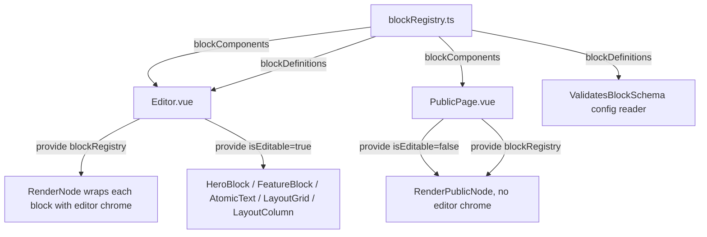

# Learning & Architectural Guide: Rebuilding Nexura

Welcome! Rebuilding a multi-tenant page-builder platform like Nexura is one of the best ways to master PHP, Laravel, database design, and modern frontend integration (Inertia, Vue 3, Tailwind v4). 

This guide breaks down the core architecture, explains how key components interact, and lays out a phased learning roadmap to rebuild the platform with modularity and scalability in mind.

---

## Core Architecture & Tech Stack

Nexura is a **single-database, multi-tenant web page builder**. Editors build pages by composing nested blocks via drag-and-drop; tenants serve public visitors on `{subdomain}.domain.localhost` subdomains.

```mermaid
graph TD
    Client[Web Browser] -->|subdomain request| Identify[IdentifyTenant Middleware]
    Identify -->|currentTenant bound| Routes[routes/web.php]
    Routes -->|Authed /editor| InertiaEditor[Editor.vue via Inertia v3]
    Routes -->|Public /{slug?}| InertiaPublic[PublicPage.vue via Inertia v3]
    InertiaEditor & InertiaPublic --> BlockRegistry[blockRegistry.ts + block .vue components]
    InertiaEditor -->|useHttp POST /editor/save| Controllers
    Controllers -->|TenantScope| DB[(pages.draft_config / published_config)]
    InertiaPublic --> DB
```

### 1. Request Pipeline — Tenant Identification on Every Request

Nexura uses subdomain-as-tenant routing on a single shared database.

* `IdentifyTenant` middleware runs before every tenant-scoped request:
  1. Reads the `{tenant}` route parameter (the subdomain prefix).
  2. Runs `Tenant::where('subdomain', $subdomain)->firstOrFail()` (instant 404 for unknown tenants).
  3. Binds the resolved `Tenant` model into the container as `app('currentTenant')`.
  4. Shares the tenant with Blade views.

* `TenantScope` is a global Eloquent scope on `Page`. Whenever `app()->bound('currentTenant')`, it injects `WHERE tenant_id = currentTenant->id`. Every `Page::find()`, `Page::all()`, etc. on tenant routes therefore returns only the tenant's pages.

### 2. Database Schema & Isolation

Tables:
* `users` → standard Laravel user.
* `tenants` → `id`, `user_id` (unique FK, one tenant per user), `subdomain` (unique+indexed).
* `pages` → `id`, `tenant_id` (FK cascade), `slug`, `title`, `is_homepage`, `sort_order`, `draft_config` (JSON), `published_config` (JSON). Composite unique on `[tenant_id, slug]`.

Two JSON columns on `pages` carry the AST for a single page. They are cast to `array` at the Eloquent layer so server-side code works with plain PHP arrays.

### 3. Frontend Architecture (Inertia + Vue 3)

Nexura uses **one frontend stack** for both editor and storefront — there is no Blade/Alpine split, no iframe, no `postMessage` bridge.

* **Inertia v3** (`@inertiajs/inertia-laravel`) serves Vue components as if they were Blade views. The controller `Inertia::render('Tenant/Editor', [...])` and navigation stays inside a Vue SPA with no full page reloads.
* **Vue 3 Composition API** (`<script setup>` throughout).
* **Tailwind CSS v4** with native container-query support — the editor canvas declares `container-type: inline-size`, and block templates use the `@md:` container-query variant to scale typography to the simulated device width.
* **vuedraggable** handles drag-and-drop reordering directly on the reactive Vue state array (`blocks.value`), with `allowedChildren` predicates honoring `config('blocks.php')`'s nesting matrix.

---

## Frontend Builder Architecture (the heart of the app)

The editor and the public page share the same Vue block components, gated by an injected `isEditable` flag:



`RenderNode` is the recursive canvas wrapper unique to the editor: it adds the drag handle, the hover border, the click-select that stores into `canvasSelection.selectedNode`, and an `onErrorCaptured` boundary.

`RenderPublicNode` mirrors it but omits the editor chrome. Both use the same `<component :is="blockRegistry[node.type]" :block-props="node.props">` lookup.

---

## Step-by-Step Learning & Rebuilding Roadmap

### Phase 1: Database & Seeders (The Data Foundation)

* **Concepts**: Laravel migrations, Eloquent relationships (BelongsTo, HasMany), global query scopes, seeders & factories.
* **Action Steps**:
  1. Configure your database in `.env`.
  2. Create migrations for `users` (Laravel default), `tenants` (`user_id` unique FK + `subdomain` unique), `pages` (`tenant_id` FK, `slug`, `title`, `is_homepage`, `sort_order`, `draft_config/published_config` JSON nullable).
  3. Write `TenantFactory` (with `withHomePage` state) and `PageFactory` to seed a tenant whose `home` page already contains a single HeroBlock — that gives you something to load as soon as you reach the editor phase.

### Phase 2: Tenant Routing & Middleware

* **Concepts**: Route groups, route model binding, HTTP middleware, Eloquent global scopes.
* **Action Steps**:
  1. Build `IdentifyTenant` middleware that pulls the `{tenant}` subdomain, looks up `Tenant`, binds `app('currentTenant')`, and shares with Blade.
  2. Register central routes on `app.central_domain` (welcome, auth, central dashboard redirecting to tenant subdomain).
  3. Register tenant routes on `{tenant}.central_domain` wrapped in `IdentifyTenant`:
     * Authed `/editor` group with `GET /editor`, `POST /editor/save`, `POST /editor/publish`, `/editor/pages` CRUD.
     * Public catch-all `GET /{slug?}` declared **after** the `/editor` routes.
  4. Add `TenantScope` and attach from `Page::booted`.

### Phase 3: The Block Component System

* **Concepts**: Vue 3 Composition API, `defineProps`, `provide`/`inject`, Tailwind v4 container queries, CSS custom properties.
* **Action Steps**:
  1. Create `resources/js/lib/blockRegistry.ts` exporting `blockComponents` and `blockDefinitions`.
  2. Build `HeroBlock.vue`, `FeatureBlock.vue`, `AtomicText.vue`, `LayoutGrid.vue`, `LayoutColumn.vue`. Each declares `nodeId` + `blockProps` props and animates from `blockProps` (which is the `node.props` dictionary).
  3. Use Tailwind's `@md:` variant for visual responsiveness (e.g. `HeroBlock` headline).
  4. Emit CSS custom properties from `blockProps` (e.g. `--grid-columns`) so the layout container breathes.

### Phase 4: The Editor Canvas

* **Concepts**: Recursive Vue components, vuedraggable, `provide`/`inject`, `onErrorCaptured`.
* **Action Steps**:
  1. Build `RenderNode.vue` wrapping every block with the drag handle, click-select, and a recursive `<draggable v-model="node.children">` whose `put` predicate consults `allowedChildren`.
  2. Build `Editor.vue`:
     * Seed `blocks = ref(page.draft_config || [defaultHero])`.
     * `provide('canvasSelection', {selectedNode, selectNode})`.
     * Render root `<draggable v-model="blocks" item-key="id">` with `<RenderNode>` per item.
     * Render inspector form by iterating `activeBlockDefinition.inspectorFields` and binding `v-model="selectedNode.props.<key>"`.

### Phase 5: Auto-Save & Publish Pipeline

* **Concepts**: Inertia v3 `useHttp`, request cancellation, deep watchers, DB transactions.
* **Action Steps**:
  1. Add `TenantPageSaveController::store` (validates `/editor/save`, runs `ValidatesBlockSchema` against `draft_config`, updates `pages.draft_config`). Attach `ValidatesBlockSchema` as a Laravel `Rule` reading `config('blocks.types')` and `config('blocks.nesting')`.
  2. Add `TenantPageSaveController::publish` (transaction: copy `draft_config -> published_config`).
  3. Back in the editor, instantiate `useHttp({page_id, draft_config})`.
  4. Add deep `watch(blocks)` that snapshots the previous state, aggregates undo, and queues a debounced save via `queueSave`.
  5. Track `currentSaveVisit` and `.cancel()` it before issuing a new request — this makes the autosaver race-condition-safe.

### Phase 6: Public Storefront

* **Concepts**: Shared component reuse, read-only `isEditable: false` mode, SSR-friendliness, error boundaries.
* **Action Steps**:
  1. Build `TenantPublicSiteController::show` (resolve `currentTenant`, find page by slug or `is_homepage`, 404 on missing/empty, `Inertia::render('Tenant/PublicPage', ...)`).
  2. Build `PublicPage.vue` that provides `blockRegistry` and `isEditable: false`, then renders `<RenderPublicNode v-for>` over `page.published_config`.
  3. Build `RenderPublicNode.vue` mirroring `RenderNode.vue` minus editor chrome — recursive, with `onErrorCaptured` to keep a single broken block from blowing up the page.

### Phase 7: Tests, Validation, Hardening

* **Concepts**: Pest v4, custom validation rules, factories with states, feature tests.
* **Action Steps**:
  1. Write factories (`TenantFactory::withHomePage`, `PageFactory::published`) seeding the unified `{id,type,props,children}` shape.
  2. Write Pest feature tests covering:
     * Schema validation (valid, missing id, unknown type, missing props, malformed children, nesting violation).
     * Editor access (guest redirect, owner access, cross-tenant 403, save, cross-tenant save 403, publish, recursive AST save).
     * Page CRUD (list, create, slug uniqueness per tenant, update, homepage reassignment, delete).
     * Public storefront (homepage renders, sub-page slug routing, unknown subdomain 404).

---

## Best Practices for Modularity & Extensibility

1. **Single-source Block Registry**: Keep all block metadata (`label`, `icon`, `category`, `defaultProps`, `inspectorFields`, `allowedChildren`) in `blockRegistry.ts`. The editor inspector, `addBlock`, drag-put predicates, and server-side `ValidatesBlockSchema` all read the same source of truth.
2. **Unified Schema**: Never branch data by `type`. Every block has `{id, type, props, children}` and all styling/content lives flat inside `props`. This makes the editor predictable and the validator easy to write.
3. **Debounce + Cancellation**: Editor mutates are highly chatty (every keystroke). Debounce saves and use Inertia's `.cancel()` to suppress superseded in-flight requests — never let two saves resolve out of order.
4. **Race-Free Undo/Redo**: Snapshot via `JSON.parse(JSON.stringify(blocks.value))`, set an `isTraveling` flag while restoring, and unblock on `nextTick` so the deep watcher doesn't push intermediate states.
5. **Error Boundaries**: `onErrorCaptured` around each block keeps a broken component from taking down the whole canvas or storefront.
6. **Container Queries for the Preview**: Use `.canvas-runtime { container-type: inline-size }` plus a `maxWidth` driven by a `viewMode` toggle. Block components then use Tailwind's `@md:` / `@lg:` variants to scale to the simulated device — the editor genuinely previews mobile, tablet, desktop.
7. **Server-Side Validation of the Shape**: The client enforces UX (drag-put predicates, inspector field generators), but the server must always re-validate the AST. `ValidatesBlockSchema` reading `config/blocks.php)` is the actual source of truth — a tampered POST cannot smuggle in unregistered types or wrong nesting.
