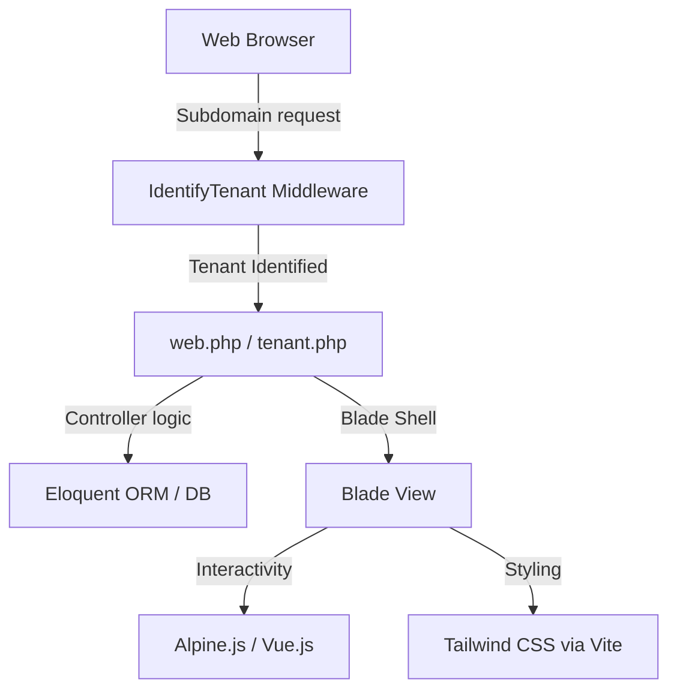

# Learning & Architectural Guide: Rebuilding Nexura

Welcome! Rebuilding a multi-tenant platform like Nexura is one of the best ways to master PHP, Laravel, database design, and modern frontend integration (Vite, Vue, Alpine, Tailwind). 

This guide breaks down the core architecture of Nexura, details how key components work together, and lays out a step-by-step learning roadmap to rebuild the platform with modularity and scalability in mind.

---

## 🏗️ Core Architecture & Tech Stack

Nexura uses a modern, hybrid PHP/JS stack:

### 1. The Request Pipeline (Multi-Tenancy)
Nexura is a **multi-tenant system using a single shared database**.
* Organizers have a unique `subdomain` (e.g., `alchemist`).
* [IdentifyTenant.php](file:///c:/Users/Z.BOOK/Desktop/things/code/nexura-dashboarrd-1/app/Http/Middleware/IdentifyTenant.php) runs before any request reaches the controllers:
  1. It inspects the host name (e.g., `alchemist.localhost`).
  2. Extracts the subdomain prefix (`alchemist`).
  3. Queries the `Organizer` model.
  4. Stores the organizer instance inside the request object and shares it with the Blade views (`$currentOrganizer`).

### 2. The Database Schema & Isolation
To keep the application modular and secure:
* **Tenant Isolation**: Every table belonging to a tenant (like `events`, `tickets`, `orders`) has an `organizer_id` foreign key.
* **Global Query Scopes**: In Laravel, you can apply a query scope that automatically appends `WHERE organizer_id = X` to every query on tenant-specific models, preventing data leaks.

### 3. Frontend Architecture (Hybrid Blade + Alpine + Vue)
* **Blade Templates**: Serve as the layout engine. They are perfect for SEO-friendly, fast-loading public pages (like the storefront and landing page).
* **Alpine.js**: Used for lightweight client-side interactions (like the slide-in ticket modal or dropdowns) without compiling complex JavaScript frameworks.
* **Vue.js**: Used for highly interactive areas, such as the organizer dashboard tools (drag-and-drop builders, complex analytics charts).

---

## 🛠️ Step-by-Step Learning & Rebuilding Roadmap

To learn effectively, do not build everything at once. Rebuild the application in **phases**, focusing on one layer of the MVC pattern at a time.

### Phase 1: Database & Seeders (The Data Foundation)
Start by defining how your application's entities relate to one another.
* **Concepts to Learn**: Laravel Migrations, Eloquent Relationships (One-to-Many, Many-to-Many), Seeders, and Factories.
* **Action Steps**:
  1. Set up your database in `.env`.
  2. Create migrations for `User`, `Organizer` (business details, subdomains), `Event` (title, date, description), `Ticket` (price, capacity), and `Order` (buyer info, status).
  3. Write a `TestOrganizerSeeder` to populate mock data (like the Alchemist store and events) so you have data to preview immediately.

### Phase 2: Tenant Routing & Middleware (The Core Traffic Controller)
Understand how Laravel handles incoming URLs.
* **Concepts to Learn**: Web Routing, Route Groups, and HTTP Middleware.
* **Action Steps**:
  1. Write a middleware similar to [IdentifyTenant.php](file:///c:/Users/Z.BOOK/Desktop/things/code/nexura-dashboarrd-1/app/Http/Middleware/IdentifyTenant.php) to catch subdomains.
  2. Register this middleware in Laravel's bootstrap/app configuration.
  3. Create two route files/groups:
     - **Main Landings**: `localhost` (home, login, register, onboarding).
     - **Tenant Shops**: `*.localhost` (storefronts, ticket buying).

### Phase 3: The Public Storefront (The Blade & Alpine View)
Focus on building a beautiful, responsive user interface.
* **Concepts to Learn**: Blade Component Layouts, Tailwind CSS utilities, Alpine.js directives (`x-data`, `x-show`, `x-on`).
* **Action Steps**:
  1. Create a base layout template containing headers, footers, and Google Fonts.
  2. Build the event catalog view, displaying cards for current active events.
  3. Use Alpine.js to create a sliding panel when someone clicks "Buy Tickets".
  4. Make sure that when someone changes ticket quantities, the total price updates instantly on the screen.

### Phase 4: The Organizer Dashboard (The Business Layer)
This is where organizers manage their business.
* **Concepts to Learn**: Laravel Controllers, Form Request Validation, Authentication, and File Uploads.
* **Action Steps**:
  1. Build the dashboard sidebar navigation and main panels.
  2. Create a secure form to create new events (requiring validation: start date must be in the future, fields cannot be blank, etc.).
  3. Add a page to view orders placed by customers, with export capabilities (CSV/Excel).

### Phase 5: Transactions & Webhooks (The Integration Layer)
Learn how to interact with external services securely.
* **Concepts to Learn**: Service Classes, API integrations, Webhooks, and Event Listeners.
* **Action Steps**:
  1. Create a `PaymentService` to handle payment processing (e.g., M-Pesa API, Stripe, or simulation).
  2. Implement an **Instant Payment Notification (IPN)** webhook listener. When a transaction succeeds, this endpoint will update the order status in the database to `paid` and trigger ticket generation.

---

## 🎨 Best Practices for Modularity & Extensibility

As you write code, keep these design patterns in mind to prevent the codebase from turning into a "monolith of spaghetti":

1. **Service Pattern (Keep Controllers Thin)**
   * Avoid putting payment logic or email-sending logic inside controllers.
   * Create dedicated classes in `app/Services/` (e.g., `PaymentService`, `TicketPdfGenerator`). Controllers should only handle input collection and returning responses.

2. **Repository/Action Pattern (Reusability)**
   * Use action classes for single-responsibility tasks (e.g., `CreateOrderAction`, `PublishEventAction`). This makes it easy to trigger the same logic from a web controller, an API endpoint, or an Artisan console command.

3. **Keep Frontend Modular with Blade Components**
   * Instead of repeating HTML code for cards, inputs, and buttons, extract them into reusable Blade components in `resources/views/components/` (e.g., `<x-event-card :event="$event" />`).

4. **Event-Driven Architecture**
   * Use Laravel Events and Listeners. When an order is completed, fire a `OrderPaid` event.
   * Create separate listeners that hook into this event (e.g., `SendTicketEmail`, `UpdateInventory`, `NotifyOrganizer`). This makes it incredibly easy to add new features later (like SMS alerts) without changing the checkout code.
