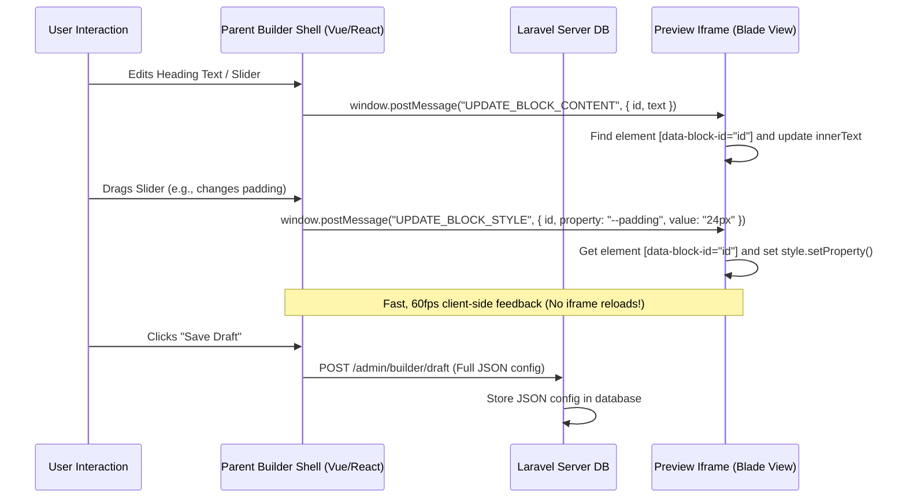

# Rebuilding Nexura: Web Editor & Multi-Tenancy Blueprint

When building a lightweight web page editor with multi-tenancy from scratch, you want to avoid the common pitfalls of complex editors: slow page refreshes, broken live styling, and messy state syncs.

This guide identifies key gaps in traditional designs, details the logical architecture of a clean implementation, and outlines a step-by-step roadmap to start building fresh.

---

## 🔍 Gaps in Current Architectures (What to Avoid)

1. **The "Full Iframe Reload" Trap**: Changing a font size or text color should never trigger a full iframe reload. Full reloads disrupt the user experience and create a lagging builder.
2. **Static Tailwind Compilation vs. Dynamic Styles**: Tailwind utility classes are compiled at build time. When users select custom colors or paddings, you cannot easily map these dynamically unless you use **CSS Custom Properties (CSS Variables)**.
3. **Missing DOM Anchors (`data-id`)**: If components and blocks lack clean root wrappers with unique IDs (e.g., `<div data-block-id="xyz">`), the parent editor cannot target them for live CSS patching or highlight bounds.
4. **Oversized Update Payloads**: Transferring massive, nested configuration JSON objects on every keypress creates substantial overhead. Updates should send minimal delta events (`{ target: blockId, property: 'color', value: '#fff' }`).

---

## 🗺️ Logical Architecture Diagram

Here is how the parent page builder shell and the preview iframe interact during editing:



---

## 🗄️ Database Logical Mapping

For absolute modularity, your `organizers` table handles subdomain identification, and references a `published_config` and `draft_config` to store layout data.

| Table | Field | Type | Purpose | Example |
| :--- | :--- | :--- | :--- | :--- |
| **organizers** | `id` | UUID / Int | Primary Key | `1` |
| | `business_name` | String | Fallback brand text | `"Alchemist"` |
| | `subdomain` | String | Subdomain URL resolver | `"alchemist"` |
| | `draft_config` | JSON | Active editing configuration | `{ "theme": "luxe", "sections": [...] }` |
| | `published_config` | JSON | Active live configuration | `{ "theme": "luxe", "sections": [...] }` |

---

## 🚀 How to Start Building Fresh (Step-by-Step)

### Step 1: Initialize the Multi-Tenant Routing
Create a route structure that isolates the admin editor and preview from the public.

```php
// routes/tenant.php (loaded for subdomain.localhost)
Route::middleware(['web', 'identify.tenant'])->group(function () {
    // 1. The public storefront (renders published_config)
    Route::get('/', [StorefrontController::class, 'show'])->name('tenant.storefront');

    // 2. Preview mode (renders draft_config + injects IPC script)
    Route::get('/preview-mode', [BuilderController::class, 'preview'])->name('tenant.builder.preview');

    // 3. The Builder Admin Workspace (loads the parent Vue/Alpine shell)
    Route::middleware(['auth', 'can.manage.tenant'])->prefix('admin')->group(function () {
        Route::get('/builder', [BuilderController::class, 'edit'])->name('tenant.builder.edit');
        Route::post('/builder/draft', [BuilderController::class, 'saveDraft'])->name('tenant.builder.save-draft');
    });
});
```

### Step 2: Write the Preview Frame (Blade + CSS Variables)
This is the preview document loaded inside the iframe. Ensure every component and block has a wrapper containing `data-block-id` and uses CSS variables for live-styling:

```html
<!-- resources/views/themes/blocks/heading.blade.php -->
<div 
    data-block-id="{{ $block['id'] }}" 
    data-block-type="heading"
    class="builder-block heading-block font-bold text-gray-900"
    style="
        --font-size: {{ $block['styles']['font_size'] ?? '2rem' }};
        --text-align: {{ $block['styles']['text_align'] ?? 'left' }};
        font-size: var(--font-size);
        text-align: var(--text-align);
    "
>
    {{ $block['content'] }}
</div>
```

### Step 3: Implement the Live Update Script (Iframe Side)
Inject a script inside the preview mode page (`/preview-mode`) to intercept events sent from the parent shell. This eliminates the need for iframe reloads:

```html
<!-- In your preview base template, only loaded during editing -->
<script>
window.addEventListener('message', function(event) {
    const { type, payload } = event.data;
    if (!type || !payload) return;

    // Find the DOM node inside the iframe
    const element = document.querySelector(`[data-block-id="${payload.id}"]`);
    if (!element) return;

    switch (type) {
        case 'UPDATE_BLOCK_CONTENT':
            element.innerText = payload.content;
            break;
            
        case 'UPDATE_BLOCK_STYLE':
            // Directly set CSS variables dynamically
            element.style.setProperty(payload.property, payload.value);
            break;
            
        case 'HIGHLIGHT_BLOCK':
            document.querySelectorAll('.builder-block').forEach(el => el.classList.remove('ring-2', 'ring-blue-500'));
            element.classList.add('ring-2', 'ring-blue-500');
            break;
    }
});
</script>
```

### Step 4: The Editor Sidebar (Vue/Alpine Side)
Your editing sidebar runs on the parent window. When a user drags a slider or inputs text, it triggers `postMessage` immediately for lag-free visual updates, and updates its local reactive config state.

```javascript
// Inside your Vue sidebar controller input:
onStyleChange(blockId, styleProperty, newValue) {
    // 1. Instantly update preview in iframe
    const iframe = document.getElementById('builder-frame');
    iframe.contentWindow.postMessage({
        type: 'UPDATE_BLOCK_STYLE',
        payload: {
            id: blockId,
            property: styleProperty, // e.g., '--font-size'
            value: newValue          // e.g., '2.5rem'
        }
    }, '*');

    // 2. Save it locally in the configuration object
    const block = findBlockById(blockId);
    block.styles[styleProperty] = newValue;
}
```
*Note: Debounce your AJAX `POST /admin/builder/draft` requests so you only save to the database when the user stops typing/dragging for a second, preserving server performance.*
