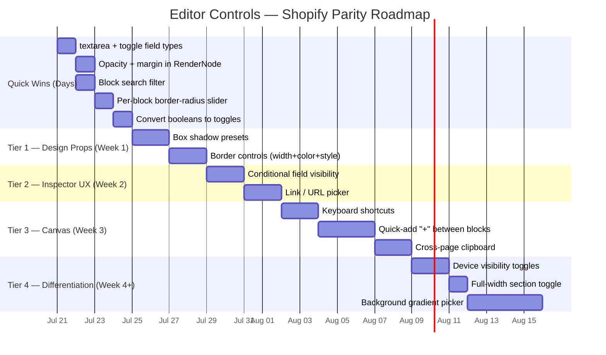

# Editor Controls Audit — Shopify Parity Report

> Benchmark: Shopify Online Store 2.0 Theme Editor  
> Scope: Inspector field types, block toolbar, canvas interactions, per-block design controls, sidebar panels  
> Codebase snapshot: 2026-07-19

---

## 1 — Current State Inventory

### 1.1 Inspector Field Types (10 total)

| Type | Renders As | Used By |
|---|---|---|
| `text` | Single-line `<input>` | Headlines, URLs, labels, body copy across all blocks |
| `color` | Native `<input type="color">` + hex readout | Background color, divider color |
| `theme-color` | Token swatches + palette + custom hex (`ThemeColorControl`) | Text colors (headline, body, bar, announcement) |
| `font-size` | Preset buttons + px slider + responsive input (`FontSizeControl`) | AtomicText font size |
| `range` | Slider with live value readout | Padding, thickness, spacer height, overlay opacity, min-height |
| `number` | Numeric input with min/max | Content width |
| `select` | `<select>` dropdown | Object fit, alignment, font family, font weight, variants |
| `columns` | Segmented button group (1/2/3/4/6) | LayoutGrid columns, MenuBlock columns |
| `media` | Image preview + "Choose Image" + remove | Image src, avatar, background image, poster |
| `repeater` | Collapsible card list with sub-fields + reorder | FAQ items, pricing plans, form fields, menu items, products |

### 1.2 Block Toolbar Actions (8 total)
Move up · Move down · Duplicate · Copy · Paste (conditional) · Wrap in Column · Delete (with confirm)

### 1.3 Sidebar Panels

| Panel | Description |
|---|---|
| **Block Library** | Tabbed (Blocks / Presets) with draggable items grouped by category |
| **Layers Tree** | Collapsible nesting tree with drag reorder, auto-expand on selection |
| **Content Inspector** | Dynamic form from `inspectorFields` + hardcoded Animation section |
| **Inspector Panel** | Breadcrumb navigation, block actions strip, page info section |
| **Section Pattern Inspector** | Pattern selector for `SectionBlock` ("Change layout") |
| **Product Grid Inspector** | Dedicated full inspector for `ProductGridBlock` |

### 1.4 Topbar Controls
Undo/Redo · Device preview (Desktop/Tablet/Mobile) · Save state indicator · Live link · Page switcher · Sidebar/Inspector panel toggles · Workspace modes (Pages/Navigation/Theme) · Media · Publish

### 1.5 Animation System
- **Entrance on scroll**: fade-up, fade-in, scale-in, slide-left, slide-right
- **Delay options**: 0ms, 100ms, 200ms, 300ms, 450ms
- Applied via `v-reveal` directive in [RenderPublicNode.vue](file:///c:/Users/Z.BOOK/Desktop/things/code/web-builder/resources/js/components/BuilderBlocks/RenderPublicNode.vue) using `IntersectionObserver`
- Respects `prefers-reduced-motion`
- Editor canvas stays static (animation is live-site only)

### 1.6 Global Theme System (7 CSS variables)
`--theme-primary` · `--theme-secondary` · `--theme-bg` · `--theme-text` · `--theme-border-radius` · `--theme-font-heading` · `--theme-font-body`

### 1.7 Blocks (22 types)
`SectionBlock` · `HeroBlock` · `FeatureBlock` · `AtomicText` · `LayoutGrid` · `LayoutColumn` · `ButtonBlock` · `DividerBlock` · `SpacerBlock` · `ImageBlock` · `RichTextBlock` · `VideoEmbedBlock` · `FAQBlock` · `TestimonialBlock` · `PricingTableBlock` · `ContactFormBlock` · `AnnouncementBlock` · `ImageWithTextBlock` · `CollectionListBlock` · `ProductGridBlock` · `ProductDetailBlock` · `CartBlock` · `NewsletterBlock` · `TrustValuesBlock` · `MenuBlock`

---

## 2 — Gap Analysis vs Shopify

### 2.1 Universal Design Properties

These are properties that Shopify exposes on *every* section/block. In your system, they should live in [RenderNode.vue](file:///c:/Users/Z.BOOK/Desktop/things/code/web-builder/resources/js/components/BuilderBlocks/RenderNode.vue) + [RenderPublicNode.vue](file:///c:/Users/Z.BOOK/Desktop/things/code/web-builder/resources/js/components/BuilderBlocks/RenderPublicNode.vue), not per-block.

| Property | Shopify | Your Editor | Gap |
|---|---|---|---|
| **Border** (width, color, style) | ✅ Per-section via schema | ❌ None | Major — borders are a core design primitive |
| **Box shadow** | ✅ Via theme settings | ❌ None | Major — shadows provide depth and visual hierarchy |
| **Opacity** | ✅ Range slider | ❌ None | Cannot fade blocks for layering or overlays |
| **Margin (top/bottom)** | ✅ Spacing settings | ⚠️ Only DividerBlock has `margin` | Cannot control vertical spacing between blocks |
| **Per-block border-radius** | ✅ Custom settings | ⚠️ Only ImageBlock has `borderRadius` as free text | Theme default only; no slider |

> [!IMPORTANT]
> **Architecture recommendation**: Add these as "universal design fields" appended to every block's `inspectorFields` in [blocks.php](file:///c:/Users/Z.BOOK/Desktop/things/code/web-builder/config/blocks.php) (or merged server-side). Apply them in the `RenderNode` / `RenderPublicNode` wrapper `style` binding — the same pattern already used for `padding` and `backgroundColor`.

```js
// Proposed RenderNode/RenderPublicNode style expansion
{
  padding: (node.props?.padding ?? 0) + 'px',
  backgroundColor: resolvedBgColor,
  // ↓ NEW universal design props ↓
  marginTop: (node.props?.marginTop ?? 0) + 'px',
  marginBottom: (node.props?.marginBottom ?? 0) + 'px',
  borderRadius: node.props?.borderRadius || 'inherit',
  border: buildBorderString(node.props),       // width + color + style
  boxShadow: resolveShadow(node.props?.shadow), // preset → CSS value
  opacity: (node.props?.opacity ?? 100) / 100,
}
```

### 2.2 Inspector Field Type Gaps

| Capability | Shopify | Your Editor | Gap |
|---|---|---|---|
| **Textarea (multi-line)** | ✅ `textarea` input type | ❌ Only single-line `<input>` | FAQ answers, product descriptions, body copy are cramped |
| **Toggle / boolean** | ✅ `checkbox` schema type | ❌ Uses `select` with Yes/No | Clumsy for boolean props (isPopular, required, stackOnMobile) |
| **Link / URL picker** | ✅ `url` type with page autocomplete | ❌ Plain `text` input | No internal page linking, no URL validation |
| **Conditional visibility (`visible_if`)** | ✅ Settings hide/show based on sibling values | ❌ All fields always visible | Inspector is cluttered for complex blocks |

### 2.3 Canvas & Interaction Gaps

| Capability | Shopify | Your Editor | Gap |
|---|---|---|---|
| **Keyboard shortcuts** | ✅ Ctrl+Z, Ctrl+Y, Delete, Ctrl+C/V | ⚠️ Undo/redo only via topbar buttons | No keyboard-driven editing |
| **Quick-add "+" between blocks** | ✅ "Add section" dividers between sections | ❌ Must use sidebar block library | No in-canvas insertion affordance |
| **Inline text editing** | ❌ Shopify edits text in sidebar | ⚠️ Only RichTextBlock has Tiptap inline editing | HeroBlock headline, FeatureBlock title edit only via sidebar |
| **Cross-page block clipboard** | ✅ Copy/paste across pages (Horizon) | ⚠️ Clipboard works within one page session only | Cannot copy a section from Page A to Page B |
| **Block search in library** | ✅ Search bar in section picker | ❌ No search/filter input | With 22+ blocks, finding the right one requires scrolling |

### 2.4 Layout & Section Gaps

| Capability | Shopify | Your Editor | Gap |
|---|---|---|---|
| **Full-width / boxed toggle** | ✅ Section-level width setting | ⚠️ Only SectionBlock has `contentWidth` range | No visual "full bleed" toggle |
| **Background gradient** | ✅ `color_background` with gradient stops | ❌ Only solid color or image | Cannot create gradient backgrounds |
| **Device visibility** | ✅ "Hide on mobile" per-section | ❌ None | Cannot hide blocks on specific breakpoints |

---

## 3 — Prioritized Recommendations

### 🔴 Tier 1 — Universal Design Props (High Impact, Applies to All Blocks)

These should be implemented in [RenderNode.vue](file:///c:/Users/Z.BOOK/Desktop/things/code/web-builder/resources/js/components/BuilderBlocks/RenderNode.vue) and [RenderPublicNode.vue](file:///c:/Users/Z.BOOK/Desktop/things/code/web-builder/resources/js/components/BuilderBlocks/RenderPublicNode.vue) as wrapper styles, not per-block.

| # | Enhancement | Implementation | Effort |
|---|---|---|---|
| 1 | **Margin (top/bottom)** | Two `range` fields (0–120px) in blocks.php, applied in RenderNode style | ⚡ Quick |
| 2 | **Opacity** | One `range` field (0–100), applied as `opacity: value/100` | ⚡ Quick |
| 3 | **Per-block border-radius** | One `range` field (0–40px), overrides theme `--theme-border-radius` | ⚡ Quick |
| 4 | **Box shadow presets** | `select` field with none/sm/md/lg/xl mapped to CSS box-shadow strings | Medium |
| 5 | **Border** | Three fields: `borderWidth` (range), `borderColor` (color), `borderStyle` (select: solid/dashed/dotted) | Medium |

### 🟡 Tier 2 — Inspector UX (Missing Field Types)

These require new control components in [ContentInspector.vue](file:///c:/Users/Z.BOOK/Desktop/things/code/web-builder/resources/js/components/Editor/ContentInspector.vue) and type updates in [blockRegistry.ts](file:///c:/Users/Z.BOOK/Desktop/things/code/web-builder/resources/js/lib/blockRegistry.ts).

| # | Enhancement | Implementation | Effort |
|---|---|---|---|
| 6 | **`textarea` field type** | Render `<textarea>` when field.type === 'textarea'. Update FAQ answer, successMessage, body copy fields | ⚡ Quick |
| 7 | **`toggle` field type** | Render styled switch component. Convert `stackOnNarrow`, `isPopular`, `required`, `openInNewTab` | ⚡ Quick |
| 8 | **Conditional field visibility** | Add `visibleIf` to `InspectorField` schema. Inspector wraps field in `v-if` checking sibling prop value | Medium |
| 9 | **`link` field type** | Text input + dropdown of tenant pages. Convert button URL, link URL fields | Medium |

### 🟢 Tier 3 — Canvas Interactions

| # | Enhancement | Implementation | Effort |
|---|---|---|---|
| 10 | **Keyboard shortcuts** | Canvas-level `@keydown` on [EditorCanvasViewport.vue](file:///c:/Users/Z.BOOK/Desktop/things/code/web-builder/resources/js/components/Editor/EditorCanvasViewport.vue): Ctrl+Z/Y → undo/redo, Del → delete, Ctrl+C/V → copy/paste | Medium |
| 11 | **Block search in library** | Text filter input above block grid in [BlockLibrary.vue](file:///c:/Users/Z.BOOK/Desktop/things/code/web-builder/resources/js/components/Editor/BlockLibrary.vue), computed filter on definitions | ⚡ Quick |
| 12 | **Quick-add "+" between blocks** | Render hoverable `+` insert button between `RenderNode` elements. Click opens block picker popover | Medium |
| 13 | **Cross-page clipboard** | Store copied block tree in `sessionStorage` keyed by tenant. Paste action reads from storage | Medium |

### 🔵 Tier 4 — Differentiation

| # | Enhancement | Implementation | Effort |
|---|---|---|---|
| 14 | **Device visibility** | `hideOnMobile`, `hideOnTablet`, `hideOnDesktop` toggle fields; RenderNode/RenderPublicNode adds responsive CSS classes | Medium |
| 15 | **Background gradient** | Extend `color` field with gradient mode (direction + 2 stops) or new `gradient` field type | High |
| 16 | **Full-width section toggle** | `sectionWidth` select (boxed = max-width / full = 100%) on SectionBlock | ⚡ Quick |
| 17 | **Inline text editing for headings** | Add Tiptap single-line editor to HeroBlock headline and FeatureBlock title (same pattern as RichTextBlock) | High |

---

## 4 — What You Already Have That Shopify Doesn't

Your editor has several capabilities that are ahead of or different from Shopify's standard theme editor:

| Feature | Your Editor | Shopify |
|---|---|---|
| **Scroll entrance animations** | ✅ 5 types + delay + `prefers-reduced-motion` | ❌ Not built-in |
| **Layers tree panel** | ✅ Full collapsible tree with drag reorder | ⚠️ Flat section list only |
| **Section pattern switching** | ✅ Visual pattern picker with live swap | ❌ Must rebuild from scratch |
| **Theme color token picker** | ✅ Brand tokens + full palette + custom hex | ⚠️ Limited to theme scheme colors |
| **Font size control** | ✅ Preset buttons + slider + responsive clamp() | ❌ Fixed scale only |
| **Product Grid inspector** | ✅ Full dedicated inspector with card presets, hover effects, responsive columns, content toggles | ⚠️ Requires app blocks or custom Liquid |
| **Inline rich text editing** | ✅ Tiptap with color, bold, italic, lists | ❌ Text edited in sidebar only |

---

## 5 — Quick Wins (< 1 day each)

These require minimal code changes and immediately improve the editor experience:

| # | What | Where | Lines of Code |
|---|---|---|---|
| 1 | **Add `textarea` inspector type** | [ContentInspector.vue](file:///c:/Users/Z.BOOK/Desktop/things/code/web-builder/resources/js/components/Editor/ContentInspector.vue) — add `v-else-if="field.type === 'textarea'"` branch rendering `<textarea>` | ~10 lines |
| 2 | **Add `toggle` inspector type** | ContentInspector.vue — add `v-else-if="field.type === 'toggle'"` branch rendering a styled checkbox/switch | ~15 lines |
| 3 | **Add opacity to RenderNode** | [blocks.php](file:///c:/Users/Z.BOOK/Desktop/things/code/web-builder/config/blocks.php) — shared field definition. [RenderNode.vue](file:///c:/Users/Z.BOOK/Desktop/things/code/web-builder/resources/js/components/BuilderBlocks/RenderNode.vue) + [RenderPublicNode.vue](file:///c:/Users/Z.BOOK/Desktop/things/code/web-builder/resources/js/components/BuilderBlocks/RenderPublicNode.vue) — 1 line each in style binding | ~5 lines |
| 4 | **Add margin-top/bottom ranges** | blocks.php — 2 shared fields. RenderNode + RenderPublicNode — 2 lines each | ~10 lines |
| 5 | **Add block search filter** | [BlockLibrary.vue](file:///c:/Users/Z.BOOK/Desktop/things/code/web-builder/resources/js/components/Editor/BlockLibrary.vue) — 1 `ref`, 1 `computed`, 1 `<input>` | ~12 lines |
| 6 | **Convert booleans to `toggle`** | blocks.php — change `stackOnNarrow`, `openInNewTab` from `select` to `toggle` | ~6 lines |
| 7 | **Add per-block border-radius slider** | blocks.php — shared field. RenderNode + RenderPublicNode — 1 line each | ~5 lines |

---

## 6 — New Inspector Field Types Summary

```
Current (10):  text | color | theme-color | font-size | range | number
               | select | columns | media | repeater

Proposed (+4): textarea | toggle | link | shadow
```

| New Type | Renders As | Unlocks |
|---|---|---|
| `textarea` | Multi-line `<textarea rows="3">` | Long text: FAQ answers, descriptions, success messages |
| `toggle` | Styled switch `<input type="checkbox">` | Boolean props: isPopular, required, stackOnNarrow, openInNewTab |
| `link` | Text input + internal page dropdown | URL fields with page-aware autocomplete |
| `shadow` | Preset dropdown (none/sm/md/lg/xl) | Per-block box shadows |

---

## 7 — Suggested Phased Roadmap


