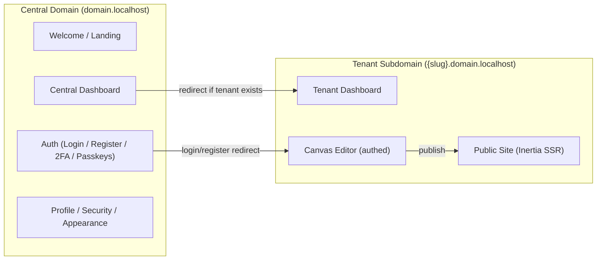
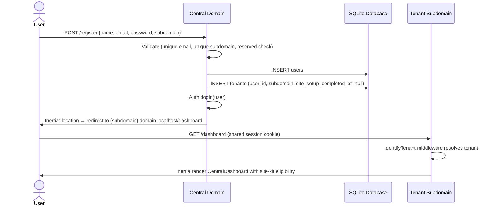
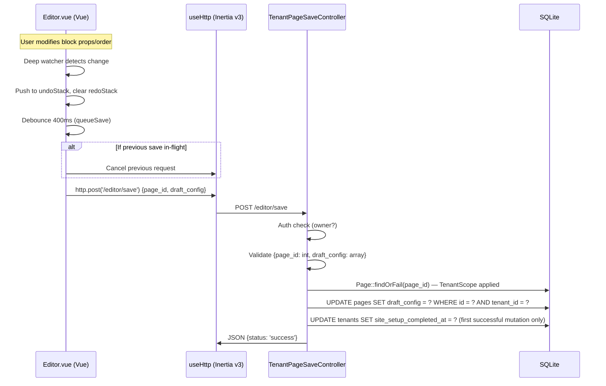
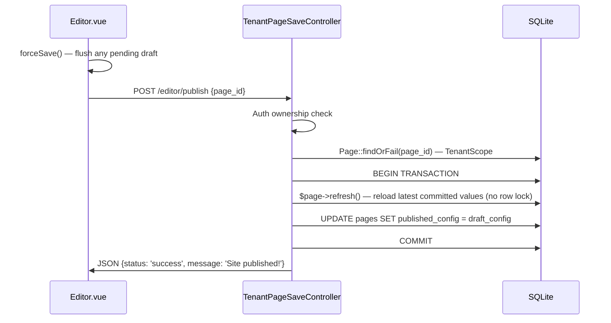
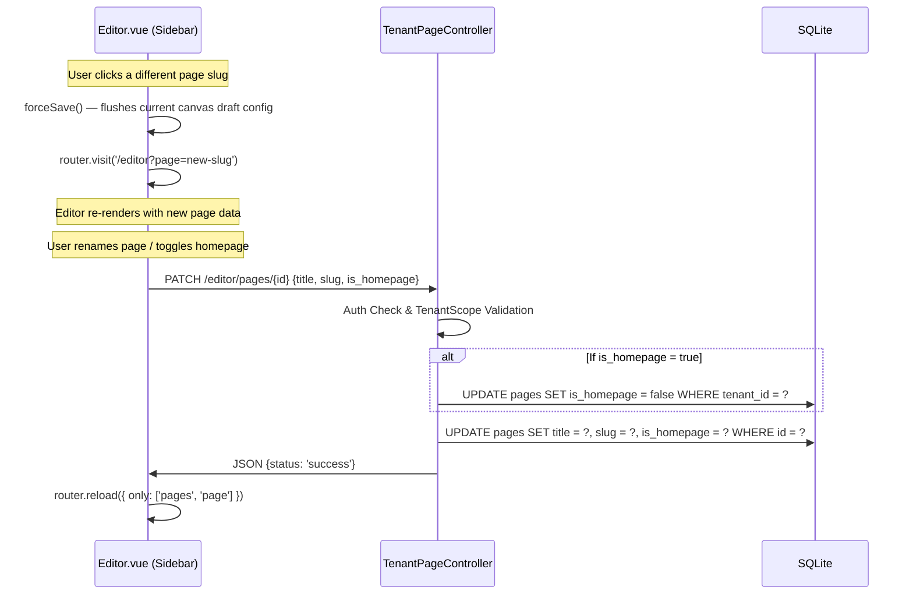

# Web Builder — Ground-Truth Project Specification

> Last reconciled with the active codebase on 2026-07-14. Implemented behavior is documented, and known implementation/documentation mismatches are called out explicitly.

---

## 1. System Architecture & Tech Stack

### 1.1 High-Level Architecture

The application is a **multi-tenant website builder** using a **single-database, subdomain-based tenancy** model. It splits into two logical routing planes:

| Plane | Domain Pattern | Responsibility |
|---|---|---|
| **Central** | `domain.localhost` | Landing page, auth (login/register/2FA/passkeys), central dashboard, user settings |
| **Tenant** | `{subdomain}.domain.localhost` | Per-tenant drag-and-drop canvas editor (authed), public site rendering (unauthenticated) |



### 1.2 Backend Stack

| Component | Technology | Version |
|---|---|---|
| **Language** | PHP | 8.4 |
| **Framework** | Laravel | 13.7+ |
| **Database** | SQLite (default, single-file) | — |
| **Session Store** | Database (`sessions` table) | — |
| **Cache Store** | Database | — |
| **Queue Connection** | Database | — |
| **Auth** | Laravel Fortify v1 | Passwords, 2FA (TOTP), Passkeys (WebAuthn) |
| **Server-Side Rendering Bridge** | Inertia.js (Laravel adapter) | v3 |
| **Static Analysis** | Larastan | v3 |
| **Code Formatter** | Laravel Pint | v1 |
| **Testing** | Pest | v4 |

### 1.3 Frontend Stack

| Component | Technology | Version |
|---|---|---|
| **Framework** | Vue 3 (Composition API + `<script setup>`) | 3.5+ |
| **Client SPA Bridge** | `@inertiajs/vue3` | v3 |
| **Build Tool** | Vite | 8.0 |
| **CSS Framework** | Tailwind CSS | v4 |
| **Drag-and-Drop** | `vuedraggable` | 4.1 |
| **Rich Text Editor** | TipTap (`@tiptap/vue-3`, StarterKit) | 3.27+ |
| **UI Primitives** | Reka UI | 2.9+ |
| **Icons** | Lucide Vue | 1.17+ |
| **Utilities** | VueUse, clsx, tailwind-merge, class-variance-authority | — |
| **Notifications** | vue-sonner | 2.0 |
| **TypeScript** | TypeScript | 5.2+ |
| **Route Generation** | Laravel Wayfinder (Vite plugin) | v0 |
| **Fonts** | Instrument Sans via Bunny Fonts CDN | — |

### 1.4 Application Bootstrap

Configured in [app.php](file:///c:/Users/Z.BOOK/Desktop/things/code/web-builder/bootstrap/app.php):

- **Routing**: Single `web.php` route file, no dedicated API routes
- **Global Web Middleware** (in order):
  1. `HandleAppearance` — shares `appearance` cookie value to all views
  2. `HandleInertiaRequests` — shares `auth.user`, `name`, `sidebarOpen` to all Inertia pages
  3. `AddLinkHeadersForPreloadedAssets` — Vite preload hints
- **Unencrypted Cookies**: `appearance`, `sidebar_state`
- **Exception Handling**: JSON responses for `api/*` paths

### 1.5 Session & Cookie Strategy

Cross-subdomain auth is achieved via a wildcard session cookie:

```
SESSION_DOMAIN=.domain.localhost
```

This allows `domain.localhost` and `*.domain.localhost` to share the same session, enabling a user logged in on the central domain to be recognized on tenant subdomains without re-authentication.

Account settings and logout remain central-domain actions. Tenant dashboards receive their absolute central URLs and the current CSRF token as Inertia props, then use full browser navigation for settings and a native POST form for logout. These cross-subdomain transitions must not use Inertia visits because an Inertia visit is an XHR tied to the current origin.

### 1.6 Inertia Page Layout Resolution

Defined in [app.ts](file:///c:/Users/Z.BOOK/Desktop/things/code/web-builder/resources/js/app.ts):

| Page Name Pattern | Layout(s) Applied |
|---|---|
| `Welcome` | None (standalone) |
| `Tenant/*` | None (standalone layout: editor / public pages) |
| `auth/*` | `AuthLayout` |
| `settings/*` | `AppLayout` → `SettingsLayout` (nested) |
| Everything else | `AppLayout` |

A client-side `router.on('before')` listener auto-appends the port number for local development subdomain routing.

---

## 2. Core Domain & Entities

### 2.1 Entity Relationship Diagram

```mermaid
erDiagram
    User ||--o| Tenant : "owns (1:1)"
    Tenant ||--o{ Page : "has many"
    Tenant ||--o{ Media : "has many"
    Tenant ||--o{ ContactSubmission : "has many"

    User {
        bigint id PK
        string name
        string email UK
        timestamp email_verified_at
        string password
        string two_factor_secret
        string two_factor_recovery_codes
        timestamp two_factor_confirmed_at
        string remember_token
        timestamps created_at
        timestamps updated_at
    }

    Tenant {
        bigint id PK
        bigint user_id FK_UK "unique, cascades on delete"
        string subdomain UK "indexed"
        json theme_config "nullable"
        json navigation_config "nullable"
        timestamps created_at
        timestamps updated_at
    }

    Page {
        bigint id PK
        bigint tenant_id FK "cascades on delete"
        string slug
        string title "nullable"
        boolean is_homepage "default: false"
        integer sort_order "default: 0"
        json draft_config "nullable"
        json published_config "nullable"
        timestamps created_at
        timestamps updated_at
    }

    Media {
        bigint id PK
        bigint tenant_id FK "cascades on delete"
        string filename
        string disk "default: public"
        string path
        string mime_type
        unsignedBigInteger size
        unsignedSmallInteger width "nullable"
        unsignedSmallInteger height "nullable"
        string thumb_path "nullable"
        timestamps created_at
        timestamps updated_at
    }

    ContactSubmission {
        bigint id PK
        bigint tenant_id FK "cascades on delete"
        bigint page_id FK "nullable, nullOnDelete"
        json form_data
        string ip_address "nullable"
        timestamps created_at
        timestamps updated_at
    }
```

> **Compound Unique Constraint**: `pages(tenant_id, slug)` — prevents duplicate slugs within a tenant.

### 2.2 Model Details

#### [User](file:///c:/Users/Z.BOOK/Desktop/things/code/web-builder/app/Models/User.php)

- Extends `Authenticatable`, implements `PasskeyUser`
- Traits: `HasFactory`, `Notifiable`, `PasskeyAuthenticatable`, `TwoFactorAuthenticatable`
- Uses PHP 8 attribute-based `#[Fillable]` and `#[Hidden]`
- Relationship: `hasOne(Tenant)`
- Casts: `email_verified_at` → datetime, `password` → hashed, `two_factor_confirmed_at` → datetime

#### [Tenant](file:///c:/Users/Z.BOOK/Desktop/things/code/web-builder/app/Models/Tenant.php)

- Traits: `HasFactory`
- Fillable: `user_id`, `subdomain`, `theme_config`, `navigation_config`
- Casts: `theme_config` → array, `navigation_config` → array
- Relationships: `belongsTo(User)`, `hasMany(Page)`, `hasMany(Media)`, `hasMany(ContactSubmission)`
- Accessor: `name` → derives display name from subdomain (e.g., `my-site` → `My Site`)
- **Strict 1:1 with User** enforced at the database level via `unique` constraint on `user_id`

#### [Page](file:///c:/Users/Z.BOOK/Desktop/things/code/web-builder/app/Models/Page.php)

- Traits: `HasFactory`
- Fillable: `tenant_id`, `slug`, `title`, `is_homepage`, `sort_order`, `draft_config`, `published_config`
- Casts: `is_homepage` → boolean, `draft_config` → array, `published_config` → array
- Relationship: `belongsTo(Tenant)`
- `ContactSubmission` defines the inverse `belongsTo(Page)` relationship, but `Page` does not currently define `hasMany(ContactSubmission)`
- **Global Scope**: [TenantScope](file:///c:/Users/Z.BOOK/Desktop/things/code/web-builder/app/Models/Scopes/TenantScope.php) auto-filters all queries by `tenant_id` when `app('currentTenant')` is bound

#### [Media](file:///c:/Users/Z.BOOK/Desktop/things/code/web-builder/app/Models/Media.php)

- Traits: `HasFactory`
- Fillable: `tenant_id`, `filename`, `disk`, `path`, `mime_type`, `size`, `width`, `height`, `thumb_path`
- Casts: `size` → integer, `width` → integer, `height` → integer
- Appends: `url`, `thumb_url` (accessors using `Storage::disk()->url()`)
- Relationship: `belongsTo(Tenant)`
- **Global Scope**: [TenantScope](file:///c:/Users/Z.BOOK/Desktop/things/code/web-builder/app/Models/Scopes/TenantScope.php)

#### [ContactSubmission](file:///c:/Users/Z.BOOK/Desktop/things/code/web-builder/app/Models/ContactSubmission.php)

- Traits: `HasFactory`
- Fillable: `tenant_id`, `page_id`, `form_data`, `ip_address`
- Casts: `form_data` → array
- Relationships: `belongsTo(Tenant)`, `belongsTo(Page)`
- **Global Scope**: [TenantScope](file:///c:/Users/Z.BOOK/Desktop/things/code/web-builder/app/Models/Scopes/TenantScope.php)

### 2.3 Tenant Isolation Model

The system uses a **container-binding tenant isolation** pattern:

1. **Middleware** ([IdentifyTenant](file:///c:/Users/Z.BOOK/Desktop/things/code/web-builder/app/Http/Middleware/IdentifyTenant.php)):
   - Extracts subdomain from route parameter `{tenant}`
   - Resolves `Tenant` model via `firstOrFail()` (404 on invalid subdomain)
   - Binds to `app()->instance('currentTenant', $tenant)`
   - Shares tenant with all Blade views
   - Forgets the route parameter so controllers receive clean signatures

2. **Global Scope** ([TenantScope](file:///c:/Users/Z.BOOK/Desktop/things/code/web-builder/app/Models/Scopes/TenantScope.php)):
   - Applied to the `Page` model via `booted()`
   - Checks `app()->bound('currentTenant')` and appends `WHERE tenant_id = ?`
   - Guarantees that `Page::findOrFail($id)` will 404 for cross-tenant access

### 2.4 Block Configuration Schema (JSON)

Pages store their layout as an **ordered tree of block nodes** in `draft_config` / `published_config`. Each node follows this schema:

```typescript
interface BlockNode {
  id: string;        // e.g. "hero-1719832456789"
  type: string;      // See full registry list below
  props: {           // Type-specific properties
    padding?: number;
    backgroundColor?: string;
    // + type-specific props (headline, title, content, src, html, url, items, plans, fields, etc.)
  };
  children?: BlockNode[];  // Recursive nesting (used by LayoutGrid, LayoutColumn)
}
```

#### Implemented Block Types (15 total)

| Block Type | Leaf/Container | Key Props |
|---|---|---|
| `HeroBlock` | Leaf | `headline`, `subheadline`, `padding`, `backgroundColor` |
| `FeatureBlock` | Leaf | `title`, `body`, `padding`, `backgroundColor` |
| `AtomicText` | Leaf | `content`, `fontSize`, `color`, `padding`, `backgroundColor` |
| `LayoutGrid` | Container | `columns`, `gap`, `padding`, `backgroundColor` + `children[]` (auto-creates 3 LayoutColumns on insert) |
| `LayoutColumn` | Container | `span`, `padding`, `width`, `height`, `gap`, `backgroundColor` + `children[]` |
| `ButtonBlock` | Leaf | `label`, `variant` (primary/secondary/outline), `url`, `size` (sm/md/lg) |
| `DividerBlock` | Leaf | `thickness` (1-8), `color`, `margin` (0-60) |
| `SpacerBlock` | Leaf | `height` (4-200) |
| `ImageBlock` | Leaf | `src`, `alt`, `objectFit`, `borderRadius`, `width`, `height`, `padding`, `backgroundColor` |
| `RichTextBlock` | Leaf | `html`, `padding`, `backgroundColor`; TipTap provides the editor UI and the public renderer outputs the stored HTML |
| `VideoEmbedBlock` | Leaf | `url`, `provider` (youtube/vimeo/loom/raw), `aspectRatio` (16/9, 4/3, 1/1), `padding`, `backgroundColor` |
| `FAQBlock` | Leaf | `items[]` (question/answer pairs), `padding`, `backgroundColor` |
| `TestimonialBlock` | Leaf | `quote`, `authorName`, `authorRole`, `avatarSrc`, `padding`, `backgroundColor` |
| `PricingTableBlock` | Leaf | `plans[]` (title/price/period/features/ctaText/ctaUrl/isPopular), `padding`, `backgroundColor` |
| `ContactFormBlock` | Leaf | `fields[]` (type/label/placeholder/required), `submitLabel`, `successMessage`, `padding`, `backgroundColor` |

---

## 3. API & Service Endpoints

### 3.1 Central Domain Routes (`domain.localhost`)

All routes in [web.php](file:///c:/Users/Z.BOOK/Desktop/things/code/web-builder/routes/web.php) and [settings.php](file:///c:/Users/Z.BOOK/Desktop/things/code/web-builder/routes/settings.php):

| Method | Path | Name | Controller / Handler | Auth | Description |
|---|---|---|---|---|---|
| `GET` | `/` | `home` | Closure → Inertia `Welcome` | — | Landing page |
| `GET` | `/register` | `register` | [CentralRegisteredUserController::create](file:///c:/Users/Z.BOOK/Desktop/things/code/web-builder/app/Http/Controllers/Auth/CentralRegisteredUserController.php#L21) | guest | Registration form |
| `POST` | `/register` | `register.store` | [CentralRegisteredUserController::store](file:///c:/Users/Z.BOOK/Desktop/things/code/web-builder/app/Http/Controllers/Auth/CentralRegisteredUserController.php#L33) | guest | Creates User + Tenant + default Page, redirects to editor |
| `GET` | `/login` | `login` | [CentralAuthenticatedSessionController::create](file:///c:/Users/Z.BOOK/Desktop/things/code/web-builder/app/Http/Controllers/Auth/CentralAuthenticatedSessionController.php#L23) | guest | Login form |
| `POST` | `/login` | `login.store` | [CentralAuthenticatedSessionController::store](file:///c:/Users/Z.BOOK/Desktop/things/code/web-builder/app/Http/Controllers/Auth/CentralAuthenticatedSessionController.php#L34) | guest | Authenticates, handles 2FA challenge, redirects to editor or dashboard |
| `POST` | `/logout` | `logout` | [CentralAuthenticatedSessionController::destroy](file:///c:/Users/Z.BOOK/Desktop/things/code/web-builder/app/Http/Controllers/Auth/CentralAuthenticatedSessionController.php#L116) | — | Logs out, invalidates session |
| `GET` | `/dashboard` | `central.dashboard` | Closure → redirect or Inertia `CentralDashboard` | auth, verified | If user has tenant → redirect to tenant dashboard; else render CentralDashboard |
| `GET` | `/settings/profile` | `profile.edit` | [ProfileController::edit](file:///c:/Users/Z.BOOK/Desktop/things/code/web-builder/app/Http/Controllers/Settings/ProfileController.php#L20) | auth | Profile settings page |
| `PATCH` | `/settings/profile` | `profile.update` | [ProfileController::update](file:///c:/Users/Z.BOOK/Desktop/things/code/web-builder/app/Http/Controllers/Settings/ProfileController.php#L31) | auth | Update name/email |
| `DELETE` | `/settings/profile` | `profile.destroy` | [ProfileController::destroy](file:///c:/Users/Z.BOOK/Desktop/things/code/web-builder/app/Http/Controllers/Settings/ProfileController.php#L49) | auth, verified | Delete account |
| `GET` | `/settings/security` | `security.edit` | [SecurityController::edit](file:///c:/Users/Z.BOOK/Desktop/things/code/web-builder/app/Http/Controllers/Settings/SecurityController.php#L19) | auth, verified, require-password | Security settings (2FA, passkeys) |
| `PUT` | `/settings/password` | `user-password.update` | [SecurityController::update](file:///c:/Users/Z.BOOK/Desktop/things/code/web-builder/app/Http/Controllers/Settings/SecurityController.php#L56) | auth, verified, throttle:6,1 | Update password |
| `GET` | `/settings/appearance` | `appearance.edit` | Inertia static render | auth, verified | Appearance settings |
| `GET` | `/.well-known/passkey-endpoints` | `well-known.passkeys` | Closure → JSON | — | WebAuthn discovery |

#### Fortify-Managed Routes (registered automatically via `FortifyServiceProvider`)

Fortify auto-registers routes scoped to `config('fortify.domain')` = `domain.localhost`:

| Feature | Routes |
|---|---|
| Password Reset | `GET /forgot-password`, `POST /forgot-password`, `GET /reset-password/{token}`, `POST /reset-password` |
| Email Verification | `GET /email/verify`, `GET /email/verify/{id}/{hash}`, `POST /email/verification-notification` |
| 2FA | `POST /two-factor-authentication`, `DELETE /two-factor-authentication`, `GET /two-factor-challenge`, `POST /two-factor-challenge`, `POST /two-factor-recovery-codes`, `GET /two-factor-qr-code`, `GET /two-factor-secret-key`, `POST /confirmed-two-factor-authentication` |
| Passkeys | `POST /passkeys`, `DELETE /passkeys/{passkey}`, `POST /passkey-authentication-options`, `POST /passkey-login` |
| Confirm Password | `GET /confirm-password`, `POST /confirm-password` |

### 3.2 Tenant Subdomain Routes (`{subdomain}.domain.localhost`)

All routes protected by [IdentifyTenant](file:///c:/Users/Z.BOOK/Desktop/things/code/web-builder/app/Http/Middleware/IdentifyTenant.php) middleware:

| Method | Path | Name | Controller / Handler | Auth | Description |
|---|---|---|---|---|---|---|
| `GET` | `/dashboard` | `dashboard` | Closure → Inertia `CentralDashboard` (with tenant + theme_config props) | auth | Tenant-scoped dashboard |
| `GET` | `/designs` | `tenant.designs.index` | `TenantDesignLibraryController::index` | auth | Browse site kits and render homepage previews through the shared public block renderer |
| `POST` | `/designs/site-kits/{kit}/apply` | `tenant.designs.apply-kit` | `TenantDesignLibraryController::store` | auth | Apply a site kit to an eligible workspace (transactional: creates pages, applies style, completes setup) |
| `POST` | `/designs/start-from-scratch` | `tenant.designs.start-from-scratch` | `TenantDesignLibraryController::startFromScratch` | auth | Opt out of the kit flow and mark setup complete without creating content |
| `PATCH` | `/theme` | `tenant.theme.update` | [TenantThemeController::update](file:///c:/Users/Z.BOOK/Desktop/things/code/web-builder/app/Http/Controllers/TenantThemeController.php#L22) | auth | Save theme settings (colors, typography, borderRadius) |
| `GET` | `/editor` | `tenant.editor` | [TenantEditorController::edit](file:///c:/Users/Z.BOOK/Desktop/things/code/web-builder/app/Http/Controllers/TenantEditorController.php#L10) | auth | Canvas editor (accepts optional `?page={slug}`, resolves active or homepage, passes pages + urls props) |
| `POST` | `/editor/save` | `tenant.page.save` | [TenantPageSaveController::store](file:///c:/Users/Z.BOOK/Desktop/things/code/web-builder/app/Http/Controllers/TenantPageSaveController.php#L12) | auth | Save draft_config (JSON endpoint) |
| `POST` | `/editor/publish` | `tenant.page.publish` | [TenantPageSaveController::publish](file:///c:/Users/Z.BOOK/Desktop/things/code/web-builder/app/Http/Controllers/TenantPageSaveController.php#L43) | auth | Promote draft → published (DB transaction) |
| `GET` | `/editor/pages` | `tenant.pages.index` | [TenantPageController::index](file:///c:/Users/Z.BOOK/Desktop/things/code/web-builder/app/Http/Controllers/TenantPageController.php#L10) | auth | List all tenant pages |
| `POST` | `/editor/pages` | `tenant.pages.store` | [TenantPageController::store](file:///c:/Users/Z.BOOK/Desktop/things/code/web-builder/app/Http/Controllers/TenantPageController.php#L28) | auth | Create a new page |
| `PATCH` | `/editor/pages/{page}` | `tenant.pages.update` | [TenantPageController::update](file:///c:/Users/Z.BOOK/Desktop/things/code/web-builder/app/Http/Controllers/TenantPageController.php#L62) | auth | Update page details (title, slug, homepage, sort) |
| `DELETE` | `/editor/pages/{page}` | `tenant.pages.destroy` | [TenantPageController::destroy](file:///c:/Users/Z.BOOK/Desktop/things/code/web-builder/app/Http/Controllers/TenantPageController.php#L105) | auth | Delete a page (enforces homepage protection) |
| `GET` | `/editor/media` | `tenant.media.index` | [TenantMediaController::index](file:///c:/Users/Z.BOOK/Desktop/things/code/web-builder/app/Http/Controllers/TenantMediaController.php#L16) | auth | List all media for the tenant (newest first) |
| `POST` | `/editor/media` | `tenant.media.store` | [TenantMediaController::store](file:///c:/Users/Z.BOOK/Desktop/things/code/web-builder/app/Http/Controllers/TenantMediaController.php#L32) | auth | Upload a media file (validates type, size) |
| `DELETE` | `/editor/media/{media}` | `tenant.media.destroy` | [TenantMediaController::destroy](file:///c:/Users/Z.BOOK/Desktop/things/code/web-builder/app/Http/Controllers/TenantMediaController.php#L65) | auth | Delete media file and thumbnail from storage |
| `PATCH` | `/editor/navigation` | `tenant.navigation.update` | [TenantNavigationController::update](file:///c:/Users/Z.BOOK/Desktop/things/code/web-builder/app/Http/Controllers/TenantNavigationController.php#L13) | auth | Save header/footer navigation config |
| `POST` | `/contact` | `tenant.contact.store` | [TenantContactController::store](file:///c:/Users/Z.BOOK/Desktop/things/code/web-builder/app/Http/Controllers/TenantContactController.php#L14) | — | Submit contact form (rate-limited: 5/min per IP) |
| `GET` | `/{slug?}` | `tenant.page.public` | [TenantPublicSiteController::show](file:///c:/Users/Z.BOOK/Desktop/things/code/web-builder/app/Http/Controllers/TenantPublicSiteController.php#L9) | — | Public site rendering via Inertia Vue (defaults to homepage resolved by `is_homepage` flag) |

### 3.3 Authorization Model

Authorization is **controller-level, not policy-based**:

- **Editor Access, Page CRUD, Media CRUD, Navigation & Theme Settings**: `auth()->id() !== $tenant->user_id` → 403 for all authenticated tenant operations
- **Save/Publish/CRUD**: Same ownership check + `TenantScope` on `Page::findOrFail()` / routing constraints ensures cross-tenant isolation
- **Media Deletion**: Double-checks `$media->tenant_id !== $tenant->id` even after ownership gate
- **Public Site**: No auth required; only reads `published_config`
- **Contact Form**: No auth required; rate-limited per IP (5 attempts/minute)

### 3.4 Request Validation

| Endpoint | Validation Rules |
|---|---|---|
| `POST /register` | `name`: required string max:255; `email`: required unique email; `password`: required confirmed + defaults; `subdomain`: required 3-63 chars, unique, lowercase alphanumeric+hyphens, not in reserved list |
| `POST /editor/save` | `page_id`: required integer; `draft_config`: required array + validated recursively via `ValidatesBlockSchema` (checks id, type, props, children, nesting rules) |
| `POST /editor/publish` | `page_id`: required integer |
| `POST /editor/pages` | `title`: required string max:255; `slug`: required lowercase alphanumeric+hyphens unique per tenant |
| `PATCH /editor/pages/{page}` | `title`: sometimes required string max:255; `slug`: sometimes required lowercase alphanumeric+hyphens unique per tenant; `is_homepage`: sometimes required boolean; `sort_order`: sometimes required integer |
| `PATCH /theme` | `colors.*`: regex `/^#[0-9a-fA-F]{6}$/`; `typography.*Font`: must be in curated Google Fonts list; `borderRadius`: must be in `['0px','4px','8px','16px','9999px']` |
| `POST /editor/media` | `file`: required, file, image, max:5120 KB, mimes:jpeg,png,gif,webp,svg |
| `PATCH /editor/navigation` | `navigation_config`: required array; `navigation_config.header`: required array; `navigation_config.footer`: required array |
| `POST /contact` | `page_id`: nullable integer exists:pages,id; `data`: required array (rate-limited: 5/min per IP) |

> [!WARNING]
> The current `exists:pages,id` validation is not tenant-scoped because it uses the database validation rule rather than an Eloquent query with `TenantScope`. A submitted `page_id` can therefore reference another tenant's page. This must be corrected with a tenant-qualified existence rule or an explicitly tenant-scoped page lookup.

**Reserved Subdomains**: `www`, `admin`, `api`, `mail`, `blog`, `domain`, `central`, `app`, `webmaster`, `host`, `system`, `editor`

---

## 4. State Management & Data Flow

### 4.1 Registration Flow



New registrations intentionally create no pages, theme configuration, or navigation configuration. They remain eligible for an initial site kit until one is applied, a "Start from scratch" action completes setup, or a successful page/theme/navigation mutation marks setup complete. Direct editor access by an eligible empty tenant redirects to `/designs` instead of creating content during a GET request. The `/designs` page offers two exit paths: "Use this design" applies the selected kit transactionally, and "Start from scratch" marks setup complete with an empty workspace so the user can create pages in the editor.

### 4.2 Editor Auto-Save Flow (Draft Persistence)



Key characteristics:
- **Debounced**: 400ms of user inactivity before save fires
- **Race-safe**: Previous in-flight saves are cancelled
- **Drag-pause**: Saves are suppressed during active drag operations; a force-save fires on drag end
- **Undo/Redo**: Client-side stack with state snapshots; undo/redo also triggers a queued save

### 4.3 Publish Flow (Draft → Live Promotion)



### 4.4 Public Site Rendering Flow

```mermaid
sequenceDiagram
    actor Visitor
    participant Tenant as Tenant Subdomain
    participant MW as IdentifyTenant Middleware
    participant Controller as TenantPublicSiteController
    participant DB as SQLite
    participant Vue as Inertia / Vue SSR

    Visitor->>Tenant: GET /{slug?} (empty slug resolves the designated homepage, then falls back to "home")
    Tenant->>MW: Extract subdomain, resolve Tenant
    MW->>DB: Tenant::where('subdomain', $sub)->firstOrFail()
    MW->>MW: Bind app('currentTenant')
    MW->>Controller: pass request
    Controller->>DB: Page::where('slug', $slug)->firstOrFail() — TenantScope auto-applied
    Controller->>Controller: Check published_config !== null (else 404)
    Controller->>Vue: Inertia::render('Tenant/PublicPage', {tenant, page})
    Vue->>Vue: RenderPublicNode recursively renders block tree via <component :is>
    Vue->>Visitor: Inertia response; SSR HTML is produced only when the SSR build and server are running
```

> [!IMPORTANT]
> Public sites are rendered via **Inertia** using the exact same Vue component definition tree as the editor (`RenderPublicNode.vue`). This eliminates the Blade/Vue block-template drift vector. The repository is configured for Inertia SSR, but production SSR output requires the SSR bundle and server process to be built, started, and monitored by the deployment environment.

### 4.5 Unified Rendering Architecture

The block configuration is rendered in a unified rendering pipeline governed by context:

| Context | Renderer | Technology | Dispatcher Component | Source |
|---|---|---|---|---|
| **Editor (authed)** | Vue components via `RenderNode` | Vue 3 + vuedraggable | [RenderNode.vue](file:///c:/Users/Z.BOOK/Desktop/things/code/web-builder/resources/js/components/BuilderBlocks/RenderNode.vue) | `draft_config` |
| **Public Site (visitor)** | Vue components via Inertia; SSR-capable | Vue 3 client rendering or SSR when the SSR server is active | [RenderPublicNode.vue](file:///c:/Users/Z.BOOK/Desktop/things/code/web-builder/resources/js/components/BuilderBlocks/RenderPublicNode.vue) | `published_config` |

The [blockRegistry.ts](file:///c:/Users/Z.BOOK/Desktop/things/code/web-builder/resources/js/lib/blockRegistry.ts) file maps type strings to Vue components. Block definitions (defaultProps, inspectorFields, labels, icons, categories) are dynamically resolved from `config/blocks.php` shared via Inertia's `blocksConfig` prop. The full registry of 15 block types: `HeroBlock`, `FeatureBlock`, `AtomicText`, `LayoutGrid`, `LayoutColumn`, `ButtonBlock`, `DividerBlock`, `SpacerBlock`, `ImageBlock`, `RichTextBlock`, `VideoEmbedBlock`, `FAQBlock`, `TestimonialBlock`, `PricingTableBlock`, `ContactFormBlock`.

In addition to individual block types, [blockPresets.ts](file:///c:/Users/Z.BOOK/Desktop/things/code/web-builder/resources/js/lib/blockPresets.ts) defines 3 pre-designed multi-block templates (Hero with CTA, Features Grid, FAQ Accordion Row) that can be inserted as a group from the block library sidebar.

The [RenderNode.vue](file:///c:/Users/Z.BOOK/Desktop/things/code/web-builder/resources/js/components/BuilderBlocks/RenderNode.vue) component drives the editor canvas:
- Uses Vue's `<component :is>` dynamic component resolution against the component registry map.
- Wraps block instances in interactive outlines, hover drag handles (the entire [BlockToolbar](file:///c:/Users/Z.BOOK/Desktop/things/code/web-builder/resources/js/components/BuilderBlocks/BlockToolbar.vue) area doubles as the `.drag-handle`), and nests child structures in `vuedraggable` templates.
- Renders a floating [BlockToolbar](file:///c:/Users/Z.BOOK/Desktop/things/code/web-builder/resources/js/components/BuilderBlocks/BlockToolbar.vue) on hover/select with actions: duplicate, delete (two-click confirmation), move up/down, copy to clipboard, paste, wrap in container. All actions are provided via `provide('blockActions', ...)` from `Editor.vue`.
- Employs a Vue `onErrorCaptured` error boundary that intercepts dynamic rendering crashes, logs diagnostics to the console, and displays a localized block-level placeholder box to ensure editor stability.
- Directs `Editor.vue` to render dynamic inspector controls (color, sliders, ranges, fields) dynamically based on the active block definition in the registry.

The [RenderPublicNode.vue](file:///c:/Users/Z.BOOK/Desktop/things/code/web-builder/resources/js/components/BuilderBlocks/RenderPublicNode.vue) component drives the public layout page:
- Uses the same `<component :is>` mapping to resolve the exact same block component files.
- Renders static, lightweight block layouts and children nodes recursively without drag-and-drop or select wrappers.
- Employs a public Vue `onErrorCaptured` error boundary to catch dynamic rendering failures locally on live pages without crashing the entire page.

#### Nesting Constraints & Block Validation Pipeline

The block addition and validation pipeline enforces structural constraints and parent-child nesting rules:
- **Central Registries**: Blocks are registered centrally on the backend in [blocks.php](file:///c:/Users/Z.BOOK/Desktop/things/code/web-builder/config/blocks.php) in two locations: inline `allowedChildren` on `LayoutGrid` and `LayoutColumn` definitions, and a top-level `nesting` key that mirrors these rules for the `ValidatesBlockSchema` rule.
- **Drag-and-Drop Constraints**: [RenderNode.vue](file:///c:/Users/Z.BOOK/Desktop/things/code/web-builder/resources/js/components/BuilderBlocks/RenderNode.vue) tags nodes with dynamic `:data-type` attributes and passes a `put()` validation function to `vuedraggable` which checks dynamic parent-child whitelists resolved from the backend configuration shared via Inertia's `blocksConfig` prop.
- **Insertion Safeguards**: Clicking library block buttons inside `Editor.vue` checks constraints resolved from the backend configuration shared via Inertia's `blocksConfig` prop and falls back to root list insertion if nesting permissions are violated.
- **Backend Security**: The recursive validator [ValidatesBlockSchema.php](file:///c:/Users/Z.BOOK/Desktop/things/code/web-builder/app/Rules/ValidatesBlockSchema.php) references `config('blocks.nesting')` and definitions to strictly validate block types and nesting schemas on all save operations.

### 4.6 Shared State via Inertia

[HandleInertiaRequests](file:///c:/Users/Z.BOOK/Desktop/things/code/web-builder/app/Http/Middleware/HandleInertiaRequests.php) shares globally on every page visit:

```php
[
    'name'         => config('app.name'),
    'auth.user'    => $request->user(),
    'sidebarOpen'  => // cookie-based boolean
    'blocksConfig' => // config('blocks') array
]
```

### 4.7 Site-Wide Theming Pipeline

Tenant-level theme configuration (`theme_config` JSON column on `tenants` table, cast to `array` via the `Tenant` model) cascades design tokens to all pages through CSS custom properties.

**Theme shape (JSON)**:

```json
{
  "colors": {
    "primary": "#4f46e5",
    "secondary": "#0ea5e9",
    "background": "#ffffff",
    "text": "#0f172a"
  },
  "typography": {
    "headingFont": "Instrument Sans",
    "bodyFont": "Instrument Sans"
  },
  "borderRadius": "8px"
}
```

**Defaults**: "Modern Indigo" palette, `Instrument Sans` for both headings/body, `8px` corner roundness.

**Pipeline**:

1. **Persistence** — `PATCH /theme` (`TenantThemeController`) validates hex colors, curated Google Fonts, and radius presets, then performs a shallow top-level merge with the existing configuration. Supplying a partial nested `colors` or `typography` object replaces that entire nested object rather than recursively merging its keys.
2. **Propagation (Editor)** — `TenantEditorController::edit` includes `theme_config` in the `tenant` prop. `Editor.vue` passes the getter to the `useTheme()` composable from [theme.ts](file:///c:/Users/Z.BOOK/Desktop/things/code/web-builder/resources/js/lib/theme.ts), which binds the resulting `cssVars` computed onto `.canvas-runtime`.
3. **Propagation (Public)** — `TenantPublicSiteController::show` includes `theme_config` in the `tenant` prop. `PublicPage.vue` binds `cssVars` to its root `<div>`.
4. **Google Fonts injection** — `useTheme()` watches the heading/body font names, deduplicates them, constructs a Google Fonts CSS2 URL (wght@400;500;600;700), and returns `fontUrl`. To prevent Flash of Unstyled Text (FOUT), this URL is rendered server-side inside Inertia’s `<Head>` component in [PublicPage.vue](file:///c:/Users/Z.BOOK/Desktop/things/code/web-builder/resources/js/pages/Tenant/PublicPage.vue) and [Editor.vue](file:///c:/Users/Z.BOOK/Desktop/things/code/web-builder/resources/js/pages/Tenant/Editor.vue). In the browser context, it reactively injects and updates a single `<link rel="stylesheet" id="theme-google-fonts">` element in `document.head`.
5. **CSS custom properties emitted**:

| Token | Maps to |
|---|---|
| `--theme-primary` | `theme_config.colors.primary` |
| `--theme-secondary` | `theme_config.colors.secondary` |
| `--theme-bg` | `theme_config.colors.background` |
| `--theme-text` | `theme_config.colors.text` |
| `--theme-border-radius` | `theme_config.borderRadius` |
| `--theme-font-heading` | `theme_config.typography.headingFont` |
| `--theme-font-body` | `theme_config.typography.bodyFont` |

Block components opt into the theme by referencing these tokens (e.g., `var(--theme-primary)`). Most block rendering paths use the theme tokens, while a few legacy creation/default paths still persist raw white or text-color values that the renderers normalize for compatibility:
- **ButtonBlock** uses `var(--theme-primary)` / `var(--theme-secondary)` for variant backgrounds and `var(--theme-border-radius)` for button corners
- **HeroBlock** and **FeatureBlock** use `var(--theme-text)` for text colors and `var(--theme-font-heading)` for heading fonts
- **AtomicText** maps its component default and the legacy `#0f172a` value to `--theme-text`; the backend definition still needs to be normalized to use the token directly
- **ImageBlock** uses `var(--theme-border-radius)` for border radius and `var(--theme-primary)` for placeholder accent
- **TestimonialBlock, PricingTableBlock, ContactFormBlock** use `var(--theme-font-body)`, `var(--theme-text)`, `var(--theme-primary)`, and `var(--theme-border-radius)` throughout their templates
- All blocks that render styled containers reference `var(--theme-font-body)` and `var(--theme-text)`

### 4.8 Rate Limiting

Configured in [FortifyServiceProvider](file:///c:/Users/Z.BOOK/Desktop/things/code/web-builder/app/Providers/FortifyServiceProvider.php):

| Limiter | Rate | Key |
|---|---|---|
| `login` | 5/minute | email + IP |
| `two-factor` | 5/minute | session login ID |
| `passkeys` | 10/minute | credential ID or session + IP |
| `user-password.update` | 6/minute | built-in throttle middleware |
| `contact-form` | 5/minute per IP | tenant ID + IP (inlined in TenantContactController) |

### 4.9 Security Hardening

| Mechanism | Implementation |
|---|---|
| Tenant data isolation | Global `TenantScope` + controller ownership checks |
| Password hashing | Bcrypt (12 rounds) |
| Production password policy | min:12, mixed case, letters, numbers, symbols, uncompromised (Have I Been Pwned) |
| Session security | Database-backed, HTTP-only, JSON serialization |
| Destructive DB commands | Prohibited in production (`DB::prohibitDestructiveCommands`) |
| Immutable dates | `CarbonImmutable` globally |
| CSRF | Standard Laravel CSRF via Inertia |
| Reserved subdomains | Blocked at registration validation |

### 4.10 Page Switching & Settings Flow

The multi-page lifecycle manages dynamic canvas reloading and metadata updates:



Key characteristics:
- **Save Guard**: Active modifications are fully flushed and persisted to the current page via `forceSave()` before transition, preventing user edits from being discarded.
- **Single Homepage Rule**: When setting a page as `is_homepage = true`, the backend automatically unsets `is_homepage` from any previously designated homepage in a query scoped to the active tenant.
- **Homepage Deletion Guard**: Page deletion requires confirmation; if the page is the designated homepage, the deletion request is blocked on the backend with a `422 Unprocessable` response, preventing tenants from being orphaned without a landing page.
- **Normalized Prop Format**: The block structures are strictly normalized to a flat `props` key format. The registration seeder follows this schema to ensure freshly created tenants load successfully in the editor without schema drift.

### 4.11 Media Management

The editor includes a full media management pipeline via `TenantMediaController`:

1. **Upload**: `POST /editor/media` accepts image files (jpeg, png, gif, webp, svg; max 5MB), stores them under `public/media/{tenant_id}/`, creates a `Media` record, and dispatches `OptimizeMediaJob` to a queued worker.
2. **Optimization**: `OptimizeMediaJob` detects dimensions via `getimagesize()`, generates a 150×150 cover-style JPEG thumbnail using GD, and updates the `Media` record with `width`, `height`, and `thumb_path`.
3. **Listing**: `GET /editor/media` returns all media for the tenant (newest first) with computed `url` and `thumb_url` accessors.
4. **Deletion**: `DELETE /editor/media/{media}` removes the file, thumbnail, and database record — double-guarded by ownership check.
5. **Media Picker**: `MediaPicker.vue` is a modal component embedded in the editor that displays uploaded media in a grid, supports inline upload (drag-and-drop or file selector), and returns the selected image URL to the calling inspector field.
6. **Block Integration**: `ImageBlock`, `TestimonialBlock` (avatar), and any block with a `'media'`-type inspector field can open the media picker via the `@open-media-picker` event in `ContentInspector.vue`.

### 4.12 Navigation Configuration

The editor includes a navigation editor for site-wide header/footer chrome outside the block tree:

1. **Storage**: Stored as `navigation_config` JSON on the `Tenant` model with two top-level keys: `header` (logo visibility, nav items, CTA button) and `footer` (copyright text).
2. **Save API**: `PATCH /editor/navigation` validates and persists via `TenantNavigationController`.
3. **Editor UI**: `NavigationSettings.vue` panel in the editor sidebar provides controls for managing the navigation structure.
4. **Rendering**: `TenantEditorController` and `TenantPublicSiteController` include `navigation_config` in their tenant props. `SiteHeader.vue` and `SiteFooter.vue` consume that configuration in both the editor canvas and public page.
5. **Regression coverage**: `TenantNavigationTest` verifies API persistence and confirms that saved navigation is present in both editor and public Inertia responses.

### 4.13 Contact Form Submissions

The public contact form block submits to `POST /contact` (no auth required):
1. **Rate Limited**: 5 attempts per minute per IP address (inlined in `TenantContactController`).
2. **Storage**: Creates a `ContactSubmission` record with `tenant_id`, optional `page_id`, submitted `form_data` (array), and `ip_address`.
3. **Response**: Returns JSON success with the submission record.

### 4.14 Design Catalog, Shared Page Layouts, and Site Kits

The design catalog is an additive composition layer over the existing page, block, theme, and navigation infrastructure. It must not introduce a second renderer, block registry, page model, or publishing workflow.

The catalog is defined in `config/designs.php` and has three independently extensible collections:

- **Styles** provide a named `theme_config` and optional `navigation_config` starting point.
- **Shared page layouts** provide reusable page blueprints such as a standard About or Contact page. Each layout contains the same `{ id, type, props, children }` block AST already accepted by `Page::draft_config`.
- **Site kits** combine one style with an ordered set of page definitions that reference shared page-layout keys. A site kit describes a complete starting site for an industry; it is not a new runtime entity.

Applying a shared page layout or site kit always deep-clones its block tree and assigns fresh block IDs before persisting it to ordinary tenant pages. After application, every generated page is independent: editing a catalog definition cannot mutate existing tenant content, and editing one tenant page cannot affect another tenant or the source layout.

The first content release is limited to exactly three professional industry site kits: **Restaurant**, **Retail**, and **Hotel**. Their page inventories, visual directions, copy, assets, and functional claims must be explicitly approved before catalog content is added. The schema itself must remain straightforward to extend with more kits and layouts later.

The approved initial inventories are:

- **Restaurant** — Home, Menu, About, and Reservations, with a warm editorial theme.
- **Retail** — Home, Shop, About, and Contact, with a modern minimal editorial theme.
- **Hotel** — Home, Rooms, Amenities, and Contact, with a refined hospitality theme.

Restaurant reservations and Hotel stay requests use the existing contact-submission pipeline as enquiries; they do not promise live availability or confirmed bookings. Retail Shop is a presentation layout and does not provide inventory, cart, checkout, or payment behavior.

Every initial page layout contains an `ImageBlock` with an empty `src` and descriptive replacement guidance. The editor displays the existing editable placeholder, and the block's existing media-picker integration lets users replace it with an uploaded image. No parallel asset source or image persistence path is introduced.

Safety rules:

1. Initial site-kit selection is available only to a new or explicitly verified empty workspace.
2. Eligibility is decided on the server. The client must not infer safety from the current page payload.
3. Applying a kit must occur in a database transaction and must never overwrite an existing non-empty workspace.
4. Generated content is written to `draft_config`. It is not made public until the existing publish flow copies the draft to `published_config`.
5. All catalog block trees must pass the same `ValidatesBlockSchema` rule used by editor saves.
6. `spec.md`, `AGENTS.md`, and `gaps.md` must be updated whenever the catalog schema or application flow changes.

Workspace eligibility is stored as nullable `tenants.site_setup_completed_at` and also requires that the tenant has no pages, `theme_config`, or `navigation_config`. Historical tenants are backfilled as completed. Successful page create/update/delete/save/publish, theme updates, and navigation updates permanently complete setup; media operations do not because kit application does not remove the media library.

The `/designs` Inertia page receives validated kit summaries and only each kit's homepage block tree for preview. It renders that tree with the existing `RenderPublicNode`, block registry, theme composable, header, and footer. Desktop, tablet, and mobile modes resize the same preview runtime. Empty kit images use the existing `ImageBlock` with a preview-only placeholder flag; public pages still render nothing for an empty source.

Implementation status: the catalog contract, validation foundation, three styles, twelve page layouts, three site-kit manifests, dashboard design library, shared-renderer responsive previews, server eligibility lifecycle, transactional kit application (deep-clone ID regeneration, draft-only pages, style/navigation application, DB transaction with rollback), and the "Start from scratch" escape hatch are all implemented.
# Additive Commerce Architecture

Commerce is an optional tenant capability beside the existing page builder. `CommerceConnection` stores administrator-provisioned provider identity and encrypted credentials. `CommerceTemplate` stores independently publishable commerce section trees without altering Page configuration or the legacy renderer.

Commerce templates use `{ schemaVersion: 1, sections: CommerceSectionNode[] }`. Sections have a unique ID, registered type, settings, ordered blocks, and a disabled flag. Provider adapters normalize products, variants, money, collections, facets, carts, and checkout sessions before they reach storefront components.

Commerce editing uses dedicated authenticated template routes and a separate Inertia editor. Its registry contains announcement, hero, image/text, rich text, collection, product, newsletter, and trust sections. Draft saves and publishing never call the existing page editor endpoints.

Published commerce templates render through dedicated `/collections/{handle}`, `/products/{handle}`, and `/cart` routes. Provider reads are normalized and cached per tenant. A failed live read may use a stale cache only with purchasing disabled; the legacy CMS wildcard route remains unchanged and last in route precedence.
