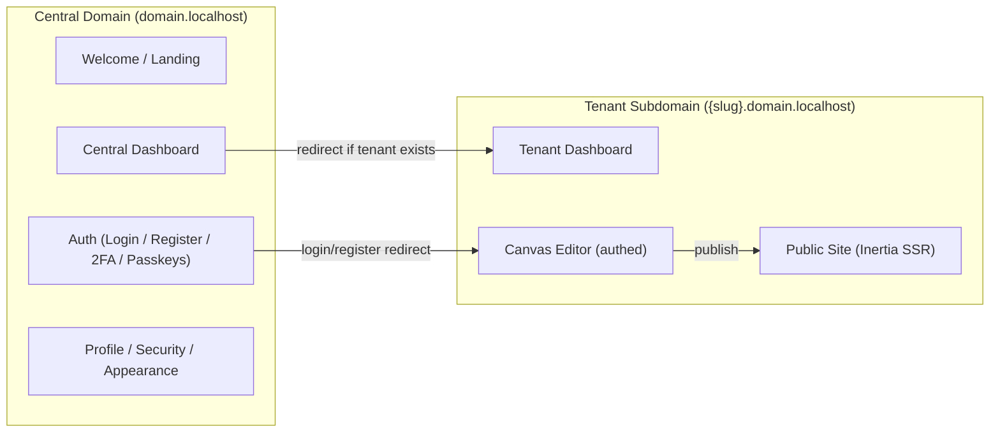
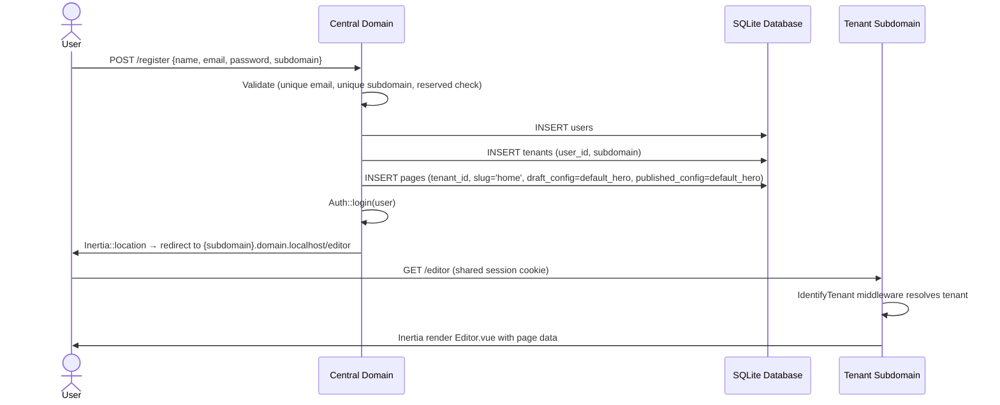
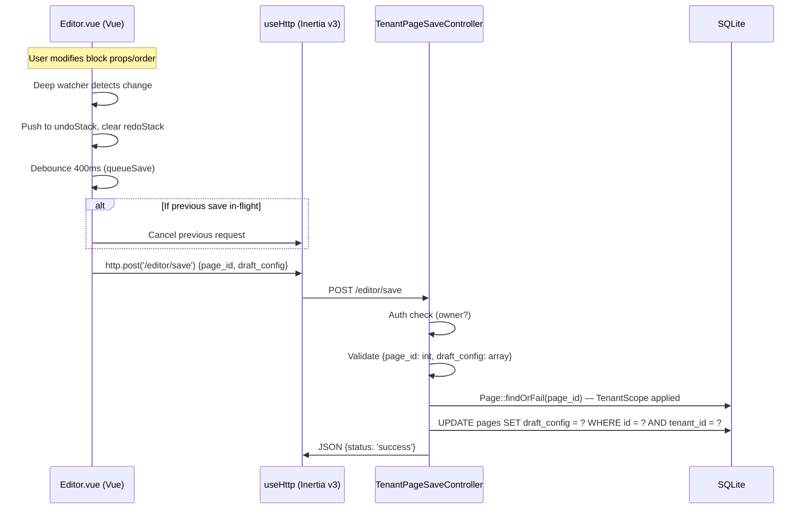
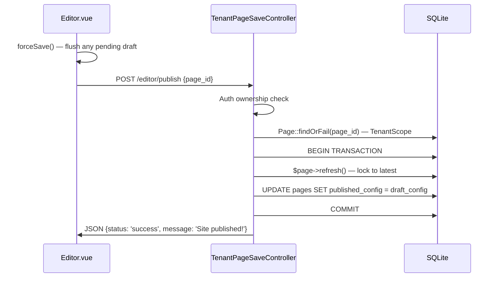
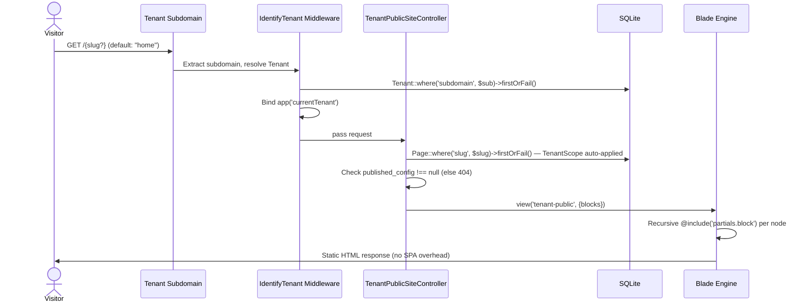
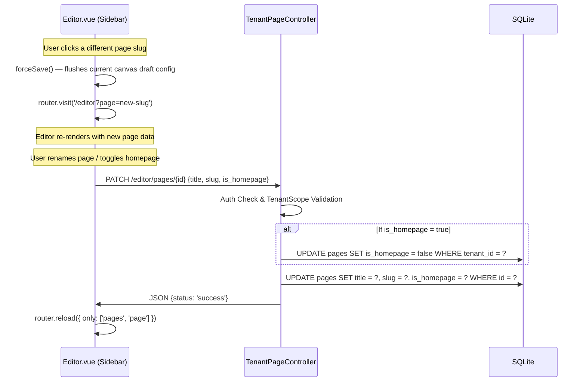

# Web Builder — Ground-Truth Project Specification

> Reverse-engineered from the active codebase on 2026-07-05. Only implemented, non-commented-out code is documented.

---

## 1. System Architecture & Tech Stack

### 1.1 High-Level Architecture

The application is a **multi-tenant website builder** using a **single-database, subdomain-based tenancy** model. It splits into two logical routing planes:

| Plane | Domain Pattern | Responsibility |
|---|---|---|
| **Central** | `domain.localhost` | Landing page, auth (login/register/2FA/passkeys), central dashboard, user settings |
| **Tenant** | `{subdomain}.domain.localhost` | Per-tenant drag-and-drop canvas editor (authed), public site rendering (unauthenticated) |



### 1.2 Backend Stack

| Component | Technology | Version |
|---|---|---|
| **Language** | PHP | 8.4 |
| **Framework** | Laravel | 13.7+ |
| **Database** | SQLite (default, single-file) | — |
| **Session Store** | Database (`sessions` table) | — |
| **Cache Store** | Database | — |
| **Queue Connection** | Database | — |
| **Auth** | Laravel Fortify v1 | Passwords, 2FA (TOTP), Passkeys (WebAuthn) |
| **Server-Side Rendering Bridge** | Inertia.js (Laravel adapter) | v3 |
| **Static Analysis** | Larastan | v3 |
| **Code Formatter** | Laravel Pint | v1 |
| **Testing** | Pest | v4 |

### 1.3 Frontend Stack

| Component | Technology | Version |
|---|---|---|
| **Framework** | Vue 3 (Composition API + `<script setup>`) | 3.5+ |
| **Client SPA Bridge** | `@inertiajs/vue3` | v3 |
| **Build Tool** | Vite | 8.0 |
| **CSS Framework** | Tailwind CSS | v4 |
| **Drag-and-Drop** | `vuedraggable` | 4.1 |
| **UI Primitives** | Reka UI | 2.9+ |
| **Icons** | Lucide Vue | 1.17+ |
| **Utilities** | VueUse, clsx, tailwind-merge, class-variance-authority | — |
| **Notifications** | vue-sonner | 2.0 |
| **TypeScript** | TypeScript | 5.2+ |
| **Route Generation** | Laravel Wayfinder (Vite plugin) | v0 |
| **Fonts** | Instrument Sans via Bunny Fonts CDN | — |

### 1.4 Application Bootstrap

Configured in [app.php](file:///c:/Users/Z.BOOK/Desktop/things/code/web-builder/bootstrap/app.php):

- **Routing**: Single `web.php` route file, no dedicated API routes
- **Global Web Middleware** (in order):
  1. `HandleAppearance` — shares `appearance` cookie value to all views
  2. `HandleInertiaRequests` — shares `auth.user`, `name`, `sidebarOpen` to all Inertia pages
  3. `AddLinkHeadersForPreloadedAssets` — Vite preload hints
- **Unencrypted Cookies**: `appearance`, `sidebar_state`
- **Exception Handling**: JSON responses for `api/*` paths

### 1.5 Session & Cookie Strategy

Cross-subdomain auth is achieved via a wildcard session cookie:

```
SESSION_DOMAIN=.domain.localhost
```

This allows `domain.localhost` and `*.domain.localhost` to share the same session, enabling a user logged in on the central domain to be recognized on tenant subdomains without re-authentication.

### 1.6 Inertia Page Layout Resolution

Defined in [app.ts](file:///c:/Users/Z.BOOK/Desktop/things/code/web-builder/resources/js/app.ts):

| Page Name Pattern | Layout(s) Applied |
|---|---|
| `Welcome` | None (standalone) |
| `Tenant/*` | None (standalone layout: editor / public pages) |
| `auth/*` | `AuthLayout` |
| `settings/*` | `AppLayout` → `SettingsLayout` (nested) |
| Everything else | `AppLayout` |

A client-side `router.on('before')` listener auto-appends the port number for local development subdomain routing.

---

## 2. Core Domain & Entities

### 2.1 Entity Relationship Diagram

```mermaid
erDiagram
    User ||--o| Tenant : "owns (1:1)"
    Tenant ||--o{ Page : "has many"

    User {
        bigint id PK
        string name
        string email UK
        timestamp email_verified_at
        string password
        string two_factor_secret
        string two_factor_recovery_codes
        timestamp two_factor_confirmed_at
        string remember_token
        timestamps created_at
        timestamps updated_at
    }

    Tenant {
        bigint id PK
        bigint user_id FK_UK "unique, cascades on delete"
        string subdomain UK "indexed"
        json theme_config "nullable"
        timestamps created_at
        timestamps updated_at
    }

    Page {
        bigint id PK
        bigint tenant_id FK "cascades on delete"
        string slug
        string title "nullable"
        boolean is_homepage "default: false"
        integer sort_order "default: 0"
        json draft_config "nullable"
        json published_config "nullable"
        timestamps created_at
        timestamps updated_at
    }
```

> **Compound Unique Constraint**: `pages(tenant_id, slug)` — prevents duplicate slugs within a tenant.

### 2.2 Model Details

#### [User](file:///c:/Users/Z.BOOK/Desktop/things/code/web-builder/app/Models/User.php)

- Extends `Authenticatable`, implements `PasskeyUser`
- Traits: `HasFactory`, `Notifiable`, `PasskeyAuthenticatable`, `TwoFactorAuthenticatable`
- Uses PHP 8 attribute-based `#[Fillable]` and `#[Hidden]`
- Relationship: `hasOne(Tenant)`
- Casts: `email_verified_at` → datetime, `password` → hashed, `two_factor_confirmed_at` → datetime

#### [Tenant](file:///c:/Users/Z.BOOK/Desktop/things/code/web-builder/app/Models/Tenant.php)

- Traits: `HasFactory`
- Fillable: `user_id`, `subdomain`, `theme_config`
- Casts: `theme_config` → array
- Relationships: `belongsTo(User)`, `hasMany(Page)`
- Accessor: `name` → derives display name from subdomain (e.g., `my-site` → `My Site`)
- **Strict 1:1 with User** enforced at the database level via `unique` constraint on `user_id`

#### [Page](file:///c:/Users/Z.BOOK/Desktop/things/code/web-builder/app/Models/Page.php)

- Traits: `HasFactory`
- Fillable: `tenant_id`, `slug`, `title`, `is_homepage`, `sort_order`, `draft_config`, `published_config`
- Casts: `is_homepage` → boolean, `draft_config` → array, `published_config` → array
- Relationship: `belongsTo(Tenant)`
- **Global Scope**: [TenantScope](file:///c:/Users/Z.BOOK/Desktop/things/code/web-builder/app/Models/Scopes/TenantScope.php) auto-filters all queries by `tenant_id` when `app('currentTenant')` is bound

### 2.3 Tenant Isolation Model

The system uses a **container-binding tenant isolation** pattern:

1. **Middleware** ([IdentifyTenant](file:///c:/Users/Z.BOOK/Desktop/things/code/web-builder/app/Http/Middleware/IdentifyTenant.php)):
   - Extracts subdomain from route parameter `{tenant}`
   - Resolves `Tenant` model via `firstOrFail()` (404 on invalid subdomain)
   - Binds to `app()->instance('currentTenant', $tenant)`
   - Shares tenant with all Blade views
   - Forgets the route parameter so controllers receive clean signatures

2. **Global Scope** ([TenantScope](file:///c:/Users/Z.BOOK/Desktop/things/code/web-builder/app/Models/Scopes/TenantScope.php)):
   - Applied to the `Page` model via `booted()`
   - Checks `app()->bound('currentTenant')` and appends `WHERE tenant_id = ?`
   - Guarantees that `Page::findOrFail($id)` will 404 for cross-tenant access

### 2.4 Block Configuration Schema (JSON)

Pages store their layout as an **ordered tree of block nodes** in `draft_config` / `published_config`. Each node follows this schema:

```typescript
interface BlockNode {
  id: string;        // e.g. "hero-1719832456789"
  type: string;      // Registry key: "HeroBlock" | "FeatureBlock" | "AtomicText" | "LayoutGrid" | "LayoutColumn" | "ButtonBlock" | "DividerBlock" | "SpacerBlock"
  props: {           // Type-specific properties
    padding?: number;
    backgroundColor?: string;
    // + type-specific props (headline, title, content, columns, span, label, variant, thickness, height, etc.)
  };
  children?: BlockNode[];  // Recursive nesting (used by LayoutGrid, LayoutColumn)
}
```

#### Implemented Block Types

| Block Type | Leaf/Container | Key Props |
|---|---|---|
| `HeroBlock` | Leaf | `headline`, `subheadline`, `padding`, `backgroundColor` |
| `FeatureBlock` | Leaf | `title`, `body`, `padding`, `backgroundColor` |
| `AtomicText` | Leaf | `content`, `fontSize`, `color`, `padding`, `backgroundColor` |
| `LayoutGrid` | Container | `columns`, `gap`, `padding`, `width`, `height` + `children[]` |
| `LayoutColumn` | Container | `span` (grid or flex-basis), `padding`, `width`, `height`, `gap` + `children[]` |
| `ButtonBlock` | Leaf | `label`, `variant` (primary/secondary/outline), `url`, `size` (sm/md/lg) |
| `DividerBlock` | Leaf | `thickness` (1-8), `color`, `margin` (0-60) |
| `SpacerBlock` | Leaf | `height` (4-200) |

---

## 3. API & Service Endpoints

### 3.1 Central Domain Routes (`domain.localhost`)

All routes in [web.php](file:///c:/Users/Z.BOOK/Desktop/things/code/web-builder/routes/web.php) and [settings.php](file:///c:/Users/Z.BOOK/Desktop/things/code/web-builder/routes/settings.php):

| Method | Path | Name | Controller / Handler | Auth | Description |
|---|---|---|---|---|---|
| `GET` | `/` | `home` | Closure → Inertia `Welcome` | — | Landing page |
| `GET` | `/register` | `register` | [CentralRegisteredUserController::create](file:///c:/Users/Z.BOOK/Desktop/things/code/web-builder/app/Http/Controllers/Auth/CentralRegisteredUserController.php#L21) | guest | Registration form |
| `POST` | `/register` | `register.store` | [CentralRegisteredUserController::store](file:///c:/Users/Z.BOOK/Desktop/things/code/web-builder/app/Http/Controllers/Auth/CentralRegisteredUserController.php#L33) | guest | Creates User + Tenant + default Page, redirects to editor |
| `GET` | `/login` | `login` | [CentralAuthenticatedSessionController::create](file:///c:/Users/Z.BOOK/Desktop/things/code/web-builder/app/Http/Controllers/Auth/CentralAuthenticatedSessionController.php#L23) | guest | Login form |
| `POST` | `/login` | `login.store` | [CentralAuthenticatedSessionController::store](file:///c:/Users/Z.BOOK/Desktop/things/code/web-builder/app/Http/Controllers/Auth/CentralAuthenticatedSessionController.php#L34) | guest | Authenticates, handles 2FA challenge, redirects to editor or dashboard |
| `POST` | `/logout` | `logout` | [CentralAuthenticatedSessionController::destroy](file:///c:/Users/Z.BOOK/Desktop/things/code/web-builder/app/Http/Controllers/Auth/CentralAuthenticatedSessionController.php#L116) | — | Logs out, invalidates session |
| `GET` | `/dashboard` | `central.dashboard` | Closure → redirect or Inertia `CentralDashboard` | auth, verified | If user has tenant → redirect to tenant dashboard; else render CentralDashboard |
| `GET` | `/settings/profile` | `profile.edit` | [ProfileController::edit](file:///c:/Users/Z.BOOK/Desktop/things/code/web-builder/app/Http/Controllers/Settings/ProfileController.php#L20) | auth | Profile settings page |
| `PATCH` | `/settings/profile` | `profile.update` | [ProfileController::update](file:///c:/Users/Z.BOOK/Desktop/things/code/web-builder/app/Http/Controllers/Settings/ProfileController.php#L31) | auth | Update name/email |
| `DELETE` | `/settings/profile` | `profile.destroy` | [ProfileController::destroy](file:///c:/Users/Z.BOOK/Desktop/things/code/web-builder/app/Http/Controllers/Settings/ProfileController.php#L49) | auth, verified | Delete account |
| `GET` | `/settings/security` | `security.edit` | [SecurityController::edit](file:///c:/Users/Z.BOOK/Desktop/things/code/web-builder/app/Http/Controllers/Settings/SecurityController.php#L19) | auth, verified, require-password | Security settings (2FA, passkeys) |
| `PUT` | `/settings/password` | `user-password.update` | [SecurityController::update](file:///c:/Users/Z.BOOK/Desktop/things/code/web-builder/app/Http/Controllers/Settings/SecurityController.php#L56) | auth, verified, throttle:6,1 | Update password |
| `GET` | `/settings/appearance` | `appearance.edit` | Inertia static render | auth, verified | Appearance settings |
| `GET` | `/.well-known/passkey-endpoints` | `well-known.passkeys` | Closure → JSON | — | WebAuthn discovery |

#### Fortify-Managed Routes (registered automatically via `FortifyServiceProvider`)

Fortify auto-registers routes scoped to `config('fortify.domain')` = `domain.localhost`:

| Feature | Routes |
|---|---|
| Password Reset | `GET /forgot-password`, `POST /forgot-password`, `GET /reset-password/{token}`, `POST /reset-password` |
| Email Verification | `GET /email/verify`, `GET /email/verify/{id}/{hash}`, `POST /email/verification-notification` |
| 2FA | `POST /two-factor-authentication`, `DELETE /two-factor-authentication`, `GET /two-factor-challenge`, `POST /two-factor-challenge`, `POST /two-factor-recovery-codes`, `GET /two-factor-qr-code`, `GET /two-factor-secret-key`, `POST /confirmed-two-factor-authentication` |
| Passkeys | `POST /passkeys`, `DELETE /passkeys/{passkey}`, `POST /passkey-authentication-options`, `POST /passkey-login` |
| Confirm Password | `GET /confirm-password`, `POST /confirm-password` |

### 3.2 Tenant Subdomain Routes (`{subdomain}.domain.localhost`)

All routes protected by [IdentifyTenant](file:///c:/Users/Z.BOOK/Desktop/things/code/web-builder/app/Http/Middleware/IdentifyTenant.php) middleware:

| Method | Path | Name | Controller / Handler | Auth | Description |
|---|---|---|---|---|---|
| `GET` | `/dashboard` | `dashboard` | Closure → Inertia `CentralDashboard` (with tenant prop) | auth | Tenant-scoped dashboard |
| `GET` | `/editor` | `tenant.editor` | [TenantEditorController::edit](file:///c:/Users/Z.BOOK/Desktop/things/code/web-builder/app/Http/Controllers/TenantEditorController.php#L10) | auth | Canvas editor (accepts optional `?page={slug}`, resolves active or homepage, passes pages prop) |
| `POST` | `/editor/save` | `tenant.page.save` | [TenantPageSaveController::store](file:///c:/Users/Z.BOOK/Desktop/things/code/web-builder/app/Http/Controllers/TenantPageSaveController.php#L12) | auth | Save draft_config (JSON endpoint) |
| `POST` | `/editor/publish` | `tenant.page.publish` | [TenantPageSaveController::publish](file:///c:/Users/Z.BOOK/Desktop/things/code/web-builder/app/Http/Controllers/TenantPageSaveController.php#L43) | auth | Promote draft → published (DB transaction) |
| `GET` | `/editor/pages` | `tenant.pages.index` | [TenantPageController::index](file:///c:/Users/Z.BOOK/Desktop/things/code/web-builder/app/Http/Controllers/TenantPageController.php#L10) | auth | List all tenant pages |
| `POST` | `/editor/pages` | `tenant.pages.store` | [TenantPageController::store](file:///c:/Users/Z.BOOK/Desktop/things/code/web-builder/app/Http/Controllers/TenantPageController.php#L28) | auth | Create a new page |
| `PATCH` | `/editor/pages/{page}` | `tenant.pages.update` | [TenantPageController::update](file:///c:/Users/Z.BOOK/Desktop/things/code/web-builder/app/Http/Controllers/TenantPageController.php#L62) | auth | Update page details (title, slug, homepage, sort) |
| `DELETE` | `/editor/pages/{page}` | `tenant.pages.destroy` | [TenantPageController::destroy](file:///c:/Users/Z.BOOK/Desktop/things/code/web-builder/app/Http/Controllers/TenantPageController.php#L105) | auth | Delete a page (enforces homepage protection) |
| `GET` | `/{slug?}` | `tenant.page.public` | [TenantPublicSiteController::show](file:///c:/Users/Z.BOOK/Desktop/things/code/web-builder/app/Http/Controllers/TenantPublicSiteController.php#L9) | — | Public site rendering via Blade (defaults to designated homepage resolved by `is_homepage` flag) |

### 3.3 Authorization Model

Authorization is **controller-level, not policy-based**:

- **Editor Access & Page CRUD**: `auth()->id() !== $tenant->user_id` → 403
- **Save/Publish/CRUD**: Same ownership check + `TenantScope` on `Page::findOrFail()` / routing constraints ensures cross-tenant isolation
- **Public Site**: No auth required; only reads `published_config`

### 3.4 Request Validation

| Endpoint | Validation Rules |
|---|---|
| `POST /register` | `name`: required string max:255; `email`: required unique email; `password`: required confirmed + defaults; `subdomain`: required 3-63 chars, unique, lowercase alphanumeric+hyphens, not in reserved list |
| `POST /editor/save` | `page_id`: required integer; `draft_config`: required array + validated recursively via `ValidatesBlockSchema` |
| `POST /editor/publish` | `page_id`: required integer |
| `POST /editor/pages` | `title`: required string max:255; `slug`: required lowercase alphanumeric+hyphens unique per tenant |
| `PATCH /editor/pages/{page}` | `title`: sometimes required string max:255; `slug`: sometimes required lowercase alphanumeric+hyphens unique per tenant; `is_homepage`: sometimes required boolean; `sort_order`: sometimes required integer |

**Reserved Subdomains**: `www`, `admin`, `api`, `mail`, `blog`, `domain`, `central`, `app`, `webmaster`, `host`, `system`, `editor`

---

## 4. State Management & Data Flow

### 4.1 Registration Flow



### 4.2 Editor Auto-Save Flow (Draft Persistence)



Key characteristics:
- **Debounced**: 400ms of user inactivity before save fires
- **Race-safe**: Previous in-flight saves are cancelled
- **Drag-pause**: Saves are suppressed during active drag operations; a force-save fires on drag end
- **Undo/Redo**: Client-side stack with state snapshots; undo/redo also triggers a queued save

### 4.3 Publish Flow (Draft → Live Promotion)



### 4.4 Public Site Rendering Flow



> [!IMPORTANT]
> Public sites are rendered via **Inertia Server-Side Rendering (SSR)** using the exact same Vue component definition tree as the editor. This ensures 100% template alignment between the editor canvas and the live site, eliminating the double-definition code drift vector while still delivering speed-optimized pre-rendered HTML layouts for SEO and visitors.

### 4.5 Unified Rendering Architecture

The block configuration is rendered in a unified rendering pipeline governed by context:

| Context | Renderer | Technology | Dispatcher Component | Source |
|---|---|---|---|---|
| **Editor (authed)** | Vue components via `RenderNode` | Vue 3 + vuedraggable | [RenderNode.vue](file:///c:/Users/Z.BOOK/Desktop/things/code/web-builder/resources/js/components/BuilderBlocks/RenderNode.vue) | `draft_config` |
| **Public Site (visitor)** | Vue components via Inertia SSR | Vue 3 Server Rendering | [RenderPublicNode.vue](file:///c:/Users/Z.BOOK/Desktop/things/code/web-builder/resources/js/components/BuilderBlocks/RenderPublicNode.vue) | `published_config` |

The [blockRegistry.ts](file:///c:/Users/Z.BOOK/Desktop/things/code/web-builder/resources/js/lib/blockRegistry.ts) file acts as the single source-of-truth definition registry for all supported block types (e.g., `HeroBlock`, `FeatureBlock`, `AtomicText`, `LayoutGrid`, `LayoutColumn`, `ButtonBlock`, `DividerBlock`, `SpacerBlock`). It governs default configurations, category tags, and editable inspector properties.

The [RenderNode.vue](file:///c:/Users/Z.BOOK/Desktop/things/code/web-builder/resources/js/components/BuilderBlocks/RenderNode.vue) component drives the editor canvas:
- Uses Vue's `<component :is>` dynamic component resolution against the component registry map.
- Wraps block instances in interactive outlines, hover drag handles (the entire [BlockToolbar](file:///c:/Users/Z.BOOK/Desktop/things/code/web-builder/resources/js/components/BuilderBlocks/BlockToolbar.vue) area doubles as the `.drag-handle`), and nests child structures in `vuedraggable` templates.
- Renders a floating [BlockToolbar](file:///c:/Users/Z.BOOK/Desktop/things/code/web-builder/resources/js/components/BuilderBlocks/BlockToolbar.vue) on hover/select with actions: duplicate, delete (two-click confirmation), move up/down, copy to clipboard, paste, wrap in container. All actions are provided via `provide('blockActions', ...)` from `Editor.vue`.
- Employs a Vue `onErrorCaptured` error boundary that intercepts dynamic rendering crashes, logs diagnostics to the console, and displays a localized block-level placeholder box to ensure editor stability.
- Directs `Editor.vue` to render dynamic inspector controls (color, sliders, ranges, fields) dynamically based on the active block definition in the registry.

The [RenderPublicNode.vue](file:///c:/Users/Z.BOOK/Desktop/things/code/web-builder/resources/js/components/BuilderBlocks/RenderPublicNode.vue) component drives the public layout page:
- Uses the same `<component :is>` mapping to resolve the exact same block component files.
- Renders static, lightweight block layouts and children nodes recursively without drag-and-drop or select wrappers.
- Employs a public Vue `onErrorCaptured` error boundary to catch dynamic rendering failures locally on live pages without crashing the entire page.

#### Nesting Constraints & Block Validation Pipeline

The block addition and validation pipeline enforces structural constraints and parent-child nesting rules:
- **Central Registries**: Blocks are registered centrally on the backend in [blocks.php](file:///c:/Users/Z.BOOK/Desktop/things/code/web-builder/config/blocks.php) (including default starting seeder layouts under `default_layout` and form fields under `definitions`).
- **Drag-and-Drop Constraints**: [RenderNode.vue](file:///c:/Users/Z.BOOK/Desktop/things/code/web-builder/resources/js/components/BuilderBlocks/RenderNode.vue) tags nodes with dynamic `:data-type` attributes and passes a `put()` validation function to `vuedraggable` which checks dynamic parent-child whitelists resolved from the backend configuration shared via Inertia's `blocksConfig` prop.
- **Insertion Safeguards**: Clicking library block buttons inside `Editor.vue` checks constraints resolved from the backend configuration shared via Inertia's `blocksConfig` prop and falls back to root list insertion if nesting permissions are violated.
- **Backend Security**: The recursive validator [ValidatesBlockSchema.php](file:///c:/Users/Z.BOOK/Desktop/things/code/web-builder/app/Rules/ValidatesBlockSchema.php) references `config('blocks.nesting')` and definitions to strictly validate block types and nesting schemas on all save operations.

### 4.6 Shared State via Inertia

[HandleInertiaRequests](file:///c:/Users/Z.BOOK/Desktop/things/code/web-builder/app/Http/Middleware/HandleInertiaRequests.php) shares globally on every page visit:

```php
[
    'name'         => config('app.name'),
    'auth.user'    => $request->user(),
    'sidebarOpen'  => // cookie-based boolean
    'blocksConfig' => // config('blocks') array
]
```

### 4.7 Rate Limiting

Configured in [FortifyServiceProvider](file:///c:/Users/Z.BOOK/Desktop/things/code/web-builder/app/Providers/FortifyServiceProvider.php):

| Limiter | Rate | Key |
|---|---|---|
| `login` | 5/minute | email + IP |
| `two-factor` | 5/minute | session login ID |
| `passkeys` | 10/minute | credential ID or session + IP |
| `user-password.update` | 6/minute | built-in throttle middleware |

### 4.8 Security Hardening

| Mechanism | Implementation |
|---|---|
| Tenant data isolation | Global `TenantScope` + controller ownership checks |
| Password hashing | Bcrypt (12 rounds) |
| Production password policy | min:12, mixed case, letters, numbers, symbols, uncompromised (Have I Been Pwned) |
| Session security | Database-backed, HTTP-only, JSON serialization |
| Destructive DB commands | Prohibited in production (`DB::prohibitDestructiveCommands`) |
| Immutable dates | `CarbonImmutable` globally |
| CSRF | Standard Laravel CSRF via Inertia |
| Reserved subdomains | Blocked at registration validation |

### 4.9 Page Switching & Settings Flow

The multi-page lifecycle manages dynamic canvas reloading and metadata updates:



Key characteristics:
- **Save Guard**: Active modifications are fully flushed and persisted to the current page via `forceSave()` before transition, preventing user edits from being discarded.
- **Single Homepage Rule**: When setting a page as `is_homepage = true`, the backend automatically unsets `is_homepage` from any previously designated homepage in a query scoped to the active tenant.
- **Homepage Deletion Guard**: Page deletion requires confirmation; if the page is the designated homepage, the deletion request is blocked on the backend with a `422 Unprocessable` response, preventing tenants from being orphaned without a landing page.
- **Normalized Prop Format**: The block structures are strictly normalized to a flat `props` key format. The registration seeder follows this schema to ensure freshly created tenants load successfully in the editor without schema drift.

